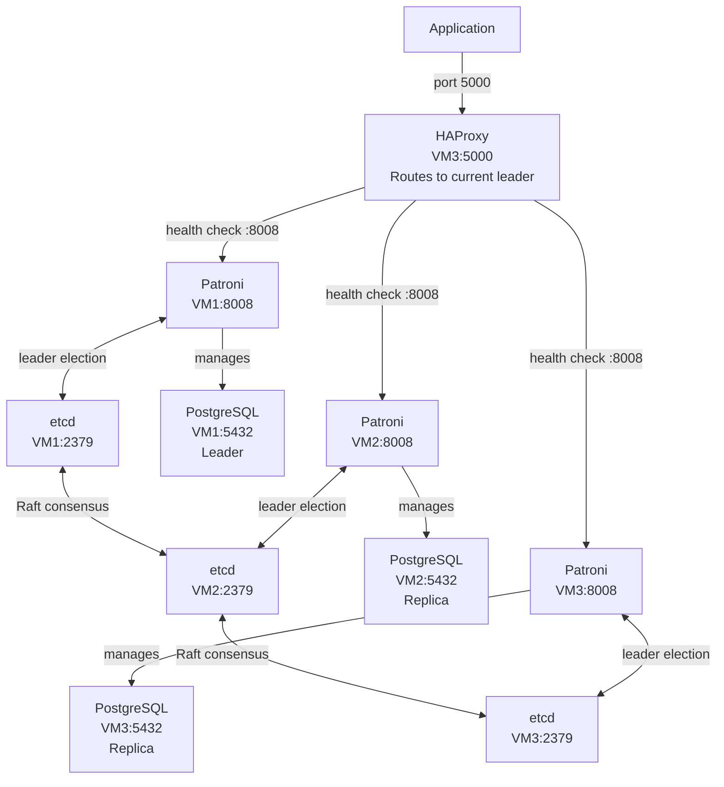
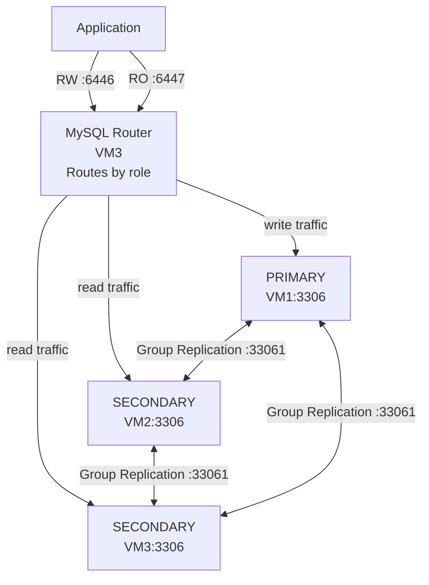
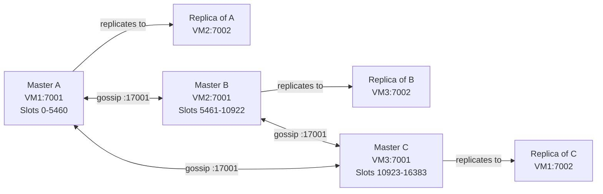
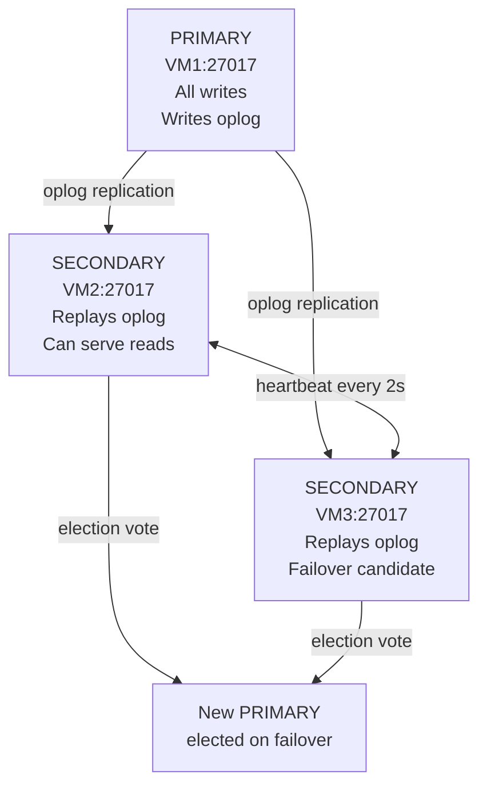
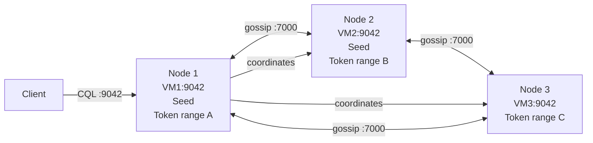
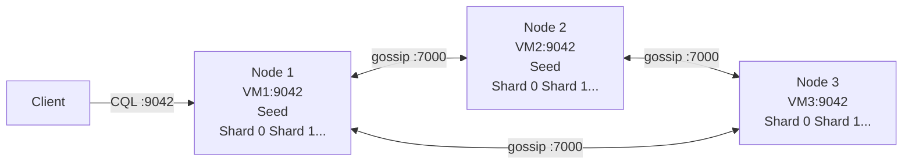

# Database Cluster Setup — Overview Guide

A high-level reference covering cluster architecture, node types, and setup phases for six database systems. Each section follows the same structure so you can compare across DBs at a glance.

**OS reference:**
- PostgreSQL, MySQL, ScyllaDB → Rocky Linux 9
- Redis, MongoDB, Cassandra → Ubuntu 24.04 LTS

---

## Table of Contents

1. [PostgreSQL HA Cluster](#1-postgresql-ha-cluster)
2. [MySQL InnoDB Cluster](#2-mysql-innodb-cluster)
3. [Redis Cluster](#3-redis-cluster)
4. [MongoDB Replica Set](#4-mongodb-replica-set)
5. [Apache Cassandra](#5-apache-cassandra)
6. [ScyllaDB](#6-scylladb)
7. [Quick Comparison](#7-quick-comparison)

---

## 1. PostgreSQL HA Cluster

**OS: Rocky Linux 9**

### What it is
PostgreSQL has no built-in clustering. High availability is built by combining multiple tools: **Patroni** manages leader election and automatic failover, **etcd** is the distributed consensus store Patroni uses to elect a leader, **HAProxy** is the single connection endpoint for applications, and **pgBackRest** or **Percona** handles backup and point-in-time recovery. Without these tools, failover must be done manually.

### Server Setup
| VM | Role | Components | Ports |
|---|---|---|---|
| VM1 | DB node 1 | PostgreSQL + Patroni + etcd + pgBackRest | 5432 (PG), 8008 (Patroni API), 2379/2380 (etcd) |
| VM2 | DB node 2 | PostgreSQL + Patroni + etcd + pgBackRest | 5432 (PG), 8008 (Patroni API), 2379/2380 (etcd) |
| VM3 | DB node 3 + LB | PostgreSQL + Patroni + etcd + HAProxy + pgBackRest | 5432 (PG), 8008 (Patroni API), 2379/2380 (etcd), 5000 (HAProxy) |

Applications connect only to HAProxy on port 5000. HAProxy checks each Patroni REST API to know which node is the current leader, then routes all traffic there.

### Architecture



### How it works
- **etcd** runs on all 3 VMs and forms a Raft consensus cluster. It holds a distributed lock — whichever Patroni node acquires the lock becomes the PostgreSQL leader.
- **Patroni** runs alongside PostgreSQL on every VM. It monitors the database process, manages replication setup, and competes for the etcd lock. If the leader's PostgreSQL crashes, Patroni releases the lock and the others race to acquire it — winner promotes its PostgreSQL to leader.
- **HAProxy** polls each Patroni REST API every few seconds. Only the current leader returns HTTP 200 on `/master` — HAProxy routes all write traffic there. Replicas return HTTP 503.
- **pgBackRest** archives WAL files continuously and runs scheduled base backups, enabling point-in-time recovery (PITR).

### Setup Phases

| Phase | What happens | Why | Key actions |
|---|---|---|---|
| **0 — Concept** | Understand why PG needs external tools, what each component does, how they interact | PostgreSQL alone cannot detect its own failure or elect a new leader — you need to know which tool solves which problem before touching any config | Read, understand the tool stack |
| **1 — Environment** | Install PostgreSQL, Patroni, etcd, HAProxy, pgBackRest on all VMs | All components must be present before any configuration can begin | `dnf install` each component, add repos where needed |
| **2 — etcd cluster** | Configure and start etcd on all 3 VMs, verify they form a healthy consensus cluster | etcd must be running and healthy before Patroni starts — Patroni immediately tries to connect to etcd on startup | Edit `etcd.conf`, `systemctl start etcd`, `etcdctl member list` |
| **3 — Patroni config** | Write `patroni.yml` on each VM — etcd endpoints, PostgreSQL settings, replication credentials, node name | Patroni needs to know where etcd is, how to connect to PostgreSQL, and what credentials replicas use to sync | Edit `patroni.yml` (3 files, one per VM) |
| **4 — Start Patroni** | Start Patroni on all nodes — it initializes PostgreSQL on the leader, then clones it to replicas automatically via `pg_basebackup` | Patroni bootstraps the entire cluster — you do not run `initdb` or set up replication manually | `systemctl start patroni` on all VMs |
| **5 — Verify cluster** | Check Patroni reports one leader and two replicas, verify streaming replication lag | Confirms the cluster is correctly formed and replicas are actively syncing | `patronictl list`, `patronictl topology` |
| **6 — HAProxy config** | Configure HAProxy to health-check each Patroni API and route traffic to the leader | Applications need a single stable endpoint — HAProxy abstracts the changing leader so apps never need reconfiguration after failover | Edit `haproxy.cfg`, `systemctl start haproxy` |
| **7 — pgBackRest setup** | Configure backup repo, create stanza, run first base backup, enable WAL archiving | Without backups, data loss from disk failure or accidental deletion cannot be recovered | `pgbackrest stanza-create`, `pgbackrest backup --type=full` |
| **8 — Test replication** | Write data on leader, verify it appears on replicas | Confirms replication is actually working end-to-end | `psql` on leader, `SELECT` on replica |
| **9 — Failover test** | Stop leader, watch Patroni elect new leader, verify HAProxy reroutes | The whole point of this stack is automatic failover — must be verified before calling setup complete | `patronictl failover` or `systemctl stop patroni` on leader |
| **10 — Recovery test** | Restore from pgBackRest backup and verify data | Backups are useless if restores do not work — always test recovery | `pgbackrest restore`, verify data |
| **11 — Reboot test** | Reboot each VM, verify all services start in correct order and cluster is healthy | Services must start in the right order on boot — etcd first, then Patroni | `patronictl list`, HAProxy stats |

---

## 2. MySQL InnoDB Cluster

**OS: Rocky Linux 9**

### What it is
MySQL's native high-availability solution built into MySQL 8.0+. Combines **MySQL Group Replication** (sync mechanism using Paxos consensus), **MySQL Shell** (management interface to bootstrap and manage the cluster), and **MySQL Router** (connection router). Unlike PostgreSQL, no external consensus tool is needed — Group Replication handles leader election internally.

### Server Setup
| VM | Role | Ports |
|---|---|---|
| VM1 | PRIMARY | 3306 (MySQL), 33061 (Group Replication) |
| VM2 | SECONDARY | 3306 (MySQL), 33061 (Group Replication) |
| VM3 | SECONDARY + Router | 3306 (MySQL), 33061 (Group Replication), 6446 (Router RW), 6447 (Router RO) |

MySQL Router on VM3 exposes two ports: 6446 routes to the current PRIMARY (read-write), 6447 load-balances across SECONDARYs (read-only).

### Architecture



### How it works
- **Group Replication** uses Paxos consensus. Every write is sent to all members — a majority must certify and apply it before the transaction commits. With 3 members, majority = 2, so losing one member still keeps the cluster writable.
- **MySQL Shell** (`mysqlsh`) is used only during setup to bootstrap the cluster, add members, and run pre-checks. It is not needed for normal operation.
- **MySQL Router** reads cluster metadata at startup and monitors which node is PRIMARY. After failover, it detects the new PRIMARY within seconds and reroutes traffic automatically.

### Difference from basic streaming replication

| | Streaming Replication | InnoDB Cluster |
|---|---|---|
| Consensus | None — async | Paxos — majority must agree before commit |
| Failover | Manual | Automatic via Group Replication |
| Write guarantee | Primary commits before replica receives | Majority must acknowledge before commit |
| Management tool | `mysql` CLI | MySQL Shell (`mysqlsh`) |
| Connection routing | Manual or external LB | MySQL Router — auto-discovers topology |

### Setup Phases

| Phase | What happens | Why | Key actions |
|---|---|---|---|
| **0 — Concept** | Understand Group Replication, Paxos consensus, how MySQL Router discovers topology | Streaming replication and InnoDB Cluster behave very differently — misunderstanding this leads to wrong expectations about consistency and failover | Read, understand |
| **1 — Environment** | Install MySQL 8.0 and MySQL Shell on all 3 VMs | Both must be present before cluster operations begin | `dnf install mysql-server mysql-shell`, start and secure MySQL |
| **2 — Pre-checks** | Run `dba.checkInstanceConfiguration()` on each node | Group Replication has strict requirements — binary logging format, GTID mode, specific `my.cnf` parameters. Pre-checks identify everything that needs fixing before cluster creation | `mysqlsh`, `dba.checkInstanceConfiguration()` |
| **3 — Configuration** | Apply required `my.cnf` settings — `server_id`, binary log format, GTID mode, Group Replication plugin | Without these settings MySQL Shell refuses to add the instance to the cluster | Edit `my.cnf` (3 files, unique `server_id` per VM), restart MySQL |
| **4 — Create cluster** | Bootstrap the InnoDB Cluster from VM1 using MySQL Shell | Creates the Group Replication group and registers VM1 as initial PRIMARY | `dba.createCluster('myCluster')` |
| **5 — Add members** | Add VM2 and VM3 via MySQL Shell | Shell handles the full join — clones PRIMARY's data to the new member and configures replication automatically | `cluster.addInstance()` for each VM |
| **6 — Verify** | Check cluster status from MySQL Shell | Confirms all 3 members are online, roles are correct, and Group Replication is healthy | `cluster.status()` |
| **7 — MySQL Router** | Bootstrap MySQL Router on VM3 | Router reads cluster metadata once during setup, then monitors the cluster autonomously | `mysqlrouter --bootstrap root@VM1:3306`, `systemctl start mysqlrouter` |
| **8 — Test routing** | Connect via Router ports 6446 and 6447, verify correct routing | Confirms the Router correctly separates read-write and read-only traffic | `mysql -h VM3 -P 6446`, `mysql -h VM3 -P 6447` |
| **9 — Failover test** | Stop PRIMARY, watch automatic re-election, verify Router reroutes | Validates Group Replication elects a new PRIMARY and Router detects it without manual action | `systemctl stop mysqld` on PRIMARY, `cluster.status()`, reconnect via Router |
| **10 — Reboot test** | Reboot each VM, verify MySQL and Router start and cluster reforms | Services must auto-start and rejoin the group on boot | `cluster.status()`, Router port test |

---

## 3. Redis Cluster

**OS: Ubuntu 24.04 LTS**

### What it is
Redis's native distributed mode. Data is sharded across multiple masters using 16384 hash slots. Each master has a replica on a different machine. No external tools needed — Redis handles cluster formation, slot assignment, replication, and failover entirely internally.

### Server Setup
| VM | Nodes | Ports |
|---|---|---|
| VM1 | Master A + Replica of C | 7001, 7002 |
| VM2 | Master B + Replica of A | 7001, 7002 |
| VM3 | Master C + Replica of B | 7001, 7002 |

3 VMs × 2 ports = 6 nodes. Each VM runs two Redis processes on different ports. Master and its own replica are always on different VMs so a single VM failure never loses both copies.

### Architecture



### How it works
- A client connects to any node. Redis computes `CRC16(key) % 16384` to find the slot. If the key is on a different node, Redis returns a `MOVED` redirect. With `-c` flag the client follows redirects automatically.
- Nodes exchange health, slot ownership, and state every second via gossip on `data_port + 10000`.
- If a master does not respond for `cluster-node-timeout` milliseconds, remaining nodes vote and promote its replica.
- When the failed master returns, it rejoins as a replica of the new master — no automatic failback.

### Setup Phases

| Phase | What happens | Why | Key actions |
|---|---|---|---|
| **0 — Concept** | Understand hash slots, master-replica cross-VM placement, gossip protocol | Need to understand why 6 nodes are needed and why master and replica cannot share a VM before writing any config | Read, understand |
| **1 — Environment** | Install Redis, stop default service, verify network | Ubuntu auto-starts Redis on port 6379 after install — must be stopped to avoid port conflicts | `apt install redis-server`, `systemctl stop redis-server`, ping test |
| **2 — Directories** | Create separate config, data, and log directories for each instance | Two instances per VM need isolated file paths — shared directories cause one to overwrite the other's data | `mkdir` under `/etc/redis/cluster/`, `/var/lib/redis/`, `/var/log/redis/` |
| **3 — Configuration** | Write `redis.conf` for each of the 6 instances | Each instance needs its own config specifying port, IP, data directory, and cluster settings. Without `cluster-enabled yes` Redis runs standalone | Edit 6 config files (2 per VM) |
| **4 — Permissions** | Set ownership of all Redis directories to the `redis` user | Systemd runs Redis as the `redis` user — root-owned directories cause permission errors and the service fails to start | `chown -R redis:redis` on all Redis directories |
| **5 — Firewall** | Open client ports 7001/7002 and gossip ports 17001/17002 | Gossip ports are required for nodes to discover each other and exchange health status — without them the cluster cannot form | `ufw allow` for all 4 ports |
| **6 — Start instances** | Launch all 6 Redis processes | All instances must be running before cluster creation — the create command contacts every node | `redis-server /path/to/redis.conf` × 2 per VM |
| **7 — Create cluster** | Run cluster create command once from VM1 | Contacts all 6 nodes, assigns hash slot ranges to masters, and pairs each master with a replica on a different VM | `redis-cli --cluster create ... --cluster-replicas 1 -a password` |
| **8 — Verify** | Check cluster state, node roles, slot coverage | Confirms all slots are assigned and all nodes are connected before writing data | `cluster info`, `cluster nodes` |
| **9 — Test sharding** | Write keys, observe automatic redirects | Verifies data is actually distributed and the redirect mechanism works | `redis-cli -c`, `SET`, `GET` |
| **10 — Failover test** | Kill a master, watch replica promote, restart and observe rejoin as replica | Validates automatic promotion — the core HA feature | `kill $(cat pidfile)`, `cluster nodes` from surviving node |
| **11 — Systemd** | Create service files for both instances on each VM | Without systemd services Redis does not start after a VM reboot | `/etc/systemd/system/redis-700x.service` |
| **12 — Boot fix** | Create `tmpfiles.d` rule so `/run/redis/` is recreated on every boot | `/run/` is a RAM-backed tmpfs wiped on reboot — Redis needs `/run/redis/` for its PID file and fails on first boot attempt without this rule | `/etc/tmpfiles.d/redis.conf` |
| **13 — Reboot test** | Reboot a VM, verify Redis auto-starts and cluster recovers | Confirms systemd service, tmpfiles rule, and cluster rejoin all work after a cold start | `systemctl status`, `cluster info` |

---

## 4. MongoDB Replica Set

**OS: Ubuntu 24.04 LTS**

### What it is
MongoDB's standard high-availability setup. All nodes hold a complete copy of the same data. One node is PRIMARY (all writes), others are SECONDARY (replicate from PRIMARY, can serve reads). If PRIMARY goes down, remaining nodes hold an automatic election and promote a SECONDARY. No sharding — this is about redundancy and availability, not distributing data.

### Server Setup
| VM | Node | Port |
|---|---|---|
| VM1 | PRIMARY | 27017 |
| VM2 | SECONDARY | 27017 |
| VM3 | SECONDARY | 27017 |

3 VMs × 1 port = 3 nodes. Same port on each VM because each runs only one `mongod` process — unlike Redis, there is no reason for two instances per VM when all nodes hold the same data.

### Architecture



### How it works
- All writes go to PRIMARY. PRIMARY records every operation in the **oplog** — a fixed-size capped collection that acts as a replication stream.
- SECONDARY nodes continuously tail the oplog and apply the same operations to stay in sync.
- Nodes exchange heartbeats every 2 seconds. If a SECONDARY does not hear from PRIMARY for 10 seconds, it calls an election. The most up-to-date SECONDARY wins.
- Minimum 3 voting members ensures a majority (2 of 3) can always be reached. With only 2 nodes, losing one leaves just 1 — not a majority — so no election succeeds.

### Setup Phases

| Phase | What happens | Why | Key actions |
|---|---|---|---|
| **0 — Concept** | Understand PRIMARY/SECONDARY roles, oplog, election mechanism | Elections require majority voting — without this the role of 3 members and the arbiter concept won't make sense | Read, understand |
| **1 — Environment** | Add MongoDB repo, install `mongod`, verify network | MongoDB is not in Ubuntu's default repo — the official repo must be added or an outdated community package gets installed | Add MongoDB repo, `apt install mongodb-org`, ping test |
| **2 — Configuration** | Edit `mongod.conf` on each VM — replica set name, bind IP, data directory | All members must share the same `replicaSetName` — a mismatch prevents nodes from joining each other | Edit `mongod.conf` (3 files, one per VM) |
| **3 — Firewall** | Open MongoDB port | Nodes need to reach each other on 27017 for heartbeats and oplog streaming | `ufw allow 27017/tcp` |
| **4 — Start mongod** | Start MongoDB on all 3 VMs | All instances must be running before the replica set is initiated | `systemctl start mongod` |
| **5 — Initiate replica set** | Connect to VM1, run `rs.initiate()` with all 3 members | This forms the replica set — MongoDB contacts the other members, establishes oplog sync, and elects a PRIMARY | `rs.initiate()` with member config |
| **6 — Verify** | Check replica set status — confirm roles and replication lag | `rs.status()` shows each member's state and how far behind replicas are | `rs.status()` |
| **7 — Create users** | Create admin and replication users | Without auth, any network client can connect and modify data | `db.createUser()` |
| **8 — Test replication** | Write on PRIMARY, read from SECONDARY, verify data appears | Confirms replication is actually streaming — not just reported as running | Write on PRIMARY, `db.setSecondaryOk()`, read on SECONDARY |
| **9 — Failover test** | Step down PRIMARY, watch election, verify new PRIMARY | Validates automatic failover — the entire value of a replica set | `rs.stepDown()`, `rs.status()` |
| **10 — Systemd** | Confirm `mongod` is enabled to start on boot | Usually enabled by the installer but should be verified | `systemctl enable mongod` |
| **11 — Reboot test** | Reboot a VM, verify node rejoins the replica set | Node must discover the replica set and resync automatically after a cold start | `systemctl status mongod`, `rs.status()` |

---

## 5. Apache Cassandra

**OS: Ubuntu 24.04 LTS**

### What it is
A masterless, peer-to-peer distributed database. Every node is equal — no PRIMARY or master. Data is distributed using consistent hashing on the partition key. Replication Factor (RF) controls how many nodes store each row. Any node can serve any request; the receiving node becomes the **coordinator** and routes internally.

### Server Setup
| VM | Node type | Ports |
|---|---|---|
| VM1 | Node 1 — Seed | 9042 (CQL client), 7000 (inter-node gossip) |
| VM2 | Node 2 — Seed | 9042 (CQL client), 7000 (inter-node gossip) |
| VM3 | Node 3 — Normal | 9042 (CQL client), 7000 (inter-node gossip) |

3 VMs × 1 node. One instance per VM — running two on one VM is impractical because each JVM process needs 2–4 GB RAM.

### Architecture



### How it works
- Each row's partition key is hashed to a token. Each node owns a token range. With RF=3, every row is written to 3 nodes — no single node is the sole owner.
- **Seed nodes** are listed in `cassandra.yaml` as bootstrap contact points — new nodes contact seeds to discover the cluster. Seeds are not special after the cluster is formed.
- **Consistency Level** is set per query: `ONE` (any 1 node), `QUORUM` (majority), `ALL` (all replicas).
- No election when a node fails — the coordinator routes around it using remaining replicas. On recovery the node catches up via repair.

### Setup Phases

| Phase | What happens | Why | Key actions |
|---|---|---|---|
| **0 — Concept** | Understand masterless ring, consistent hashing, replication factor, consistency levels | Cassandra's model is fundamentally different — understanding it prevents misuse of consistency levels and incorrect keyspace design | Read, understand |
| **1 — Environment** | Add Cassandra repo, install Java 11, install Cassandra, verify network | Cassandra runs on the JVM — Java must be installed first. Wrong Java version causes startup failures | Add repo, `apt install openjdk-11-jdk cassandra`, ping test |
| **2 — Configuration** | Edit `cassandra.yaml` — cluster name, seeds list, `listen_address`, `rpc_address`, snitch | All nodes must share the same `cluster_name` or they refuse to join. `listen_address` must be the VM's own IP | Edit `cassandra.yaml` (3 files, one per VM) |
| **3 — Start cluster** | Start Cassandra sequentially — each node contacts seeds and joins the ring | Starting nodes too quickly causes bootstrap collisions — start VM1 first, wait for `UN` status, then start others | `systemctl start cassandra` sequentially |
| **4 — Verify ring** | Check all nodes are Up/Normal and token distribution is even | `nodetool status` shows each node's state. Uneven token ranges mean some nodes handle more data than others | `nodetool status`, `nodetool ring` |
| **5 — Create keyspace** | Create keyspace with replication strategy and factor | Keyspace defines how many data copies exist and where — wrong RF means less redundancy than expected | `CREATE KEYSPACE ... WITH replication = {'class': 'SimpleStrategy', 'replication_factor': 3}` |
| **6 — Create tables and insert data** | Create tables, insert rows, verify from any node | Tests that the coordinator correctly routes requests regardless of which node you connect to | `cqlsh`, `CREATE TABLE`, `INSERT`, `SELECT` from each node |
| **7 — Test consistency levels** | Query with `ONE`, `QUORUM`, `ALL` and observe behavior | Makes the consistency tradeoffs concrete — you cannot tune Cassandra correctly without understanding this | `CONSISTENCY ONE`, `CONSISTENCY QUORUM`, run queries |
| **8 — Node failure test** | Stop one node, query with `QUORUM` — cluster serves requests using remaining 2 | Proves RF=3 with `QUORUM` tolerates 1 node loss — the key availability claim of Cassandra | `systemctl stop cassandra`, CQL query |
| **9 — Repair** | Run repair after the node recovers | Node missed writes while down — repair synchronizes data to remove inconsistencies | `nodetool repair` |
| **10 — Reboot test** | Reboot a VM, verify node rejoins ring automatically | Confirms systemd starts Cassandra on boot and the node rejoins gossip correctly | `nodetool status` from another node |

---

## 6. ScyllaDB

**OS: Rocky Linux 9**

### What it is
A drop-in replacement for Cassandra rewritten in C++ using the **Seastar** async framework. Cluster architecture, CQL interface, and `nodetool` commands are identical to Cassandra. The key difference is internal: **shard-per-core** model — each CPU core runs its own independent shard with its own memory, eliminating JVM GC pauses and cross-thread lock contention. Significantly lower latency and higher throughput per node.

### Server Setup
3 VMs × 1 node — same topology as Cassandra.

| VM | Node type | Ports |
|---|---|---|
| VM1 | Node 1 — Seed | 9042 (CQL), 7000 (gossip), 10000 (Scylla REST API) |
| VM2 | Node 2 — Seed | 9042 (CQL), 7000 (gossip), 10000 (Scylla REST API) |
| VM3 | Node 3 — Normal | 9042 (CQL), 7000 (gossip), 10000 (Scylla REST API) |

### Architecture



Inside each node, requests route to the correct CPU shard via `CRC32(partition_key) % num_cores`. Each shard operates independently with no shared state.

### Cassandra vs ScyllaDB

| | Cassandra | ScyllaDB |
|---|---|---|
| Language | Java | C++ |
| GC pauses | Yes (JVM) | No |
| Threading | Shared thread pool | Shard-per-core, fully isolated |
| Config file | `cassandra.yaml` | `scylla.yaml` (near-identical) |
| CQL shell | `cqlsh` | `cqlsh` (identical) |
| Node tool | `nodetool` | `nodetool` (identical) |
| Monitoring | — | `scyllatop` (per-shard stats) |
| Hardware tuning | Manual | `scylla_setup` auto-optimizes |

### Setup Phases

| Phase | What happens | Why | Key actions |
|---|---|---|---|
| **0 — Concept** | Understand shard-per-core model and how it differs from Cassandra's JVM threading | Without this context the `scylla_setup` step and SMP settings won't make sense | Read, understand |
| **1 — Environment** | Add ScyllaDB repo, install ScyllaDB, run `scylla_setup` | `scylla_setup` must run before first start — it configures kernel parameters and disk I/O scheduler that ScyllaDB requires | Add ScyllaDB repo, `dnf install scylla`, `scylla_setup` |
| **2 — Configuration** | Edit `scylla.yaml` — cluster name, seeds, `listen_address`, SMP count | Same structure as `cassandra.yaml`. SMP sets how many cores ScyllaDB uses — one shard per core | Edit `scylla.yaml` (3 files, one per VM) |
| **3 — Firewall** | Open CQL, gossip, and REST API ports | REST API port 10000 is used by `scyllatop` and monitoring — not needed by clients but valuable for observability | `firewall-cmd --add-port` for 9042, 7000, 10000 |
| **4 — Start cluster** | Start ScyllaDB on all nodes sequentially | Same reasoning as Cassandra — let first node stabilize before starting others | `systemctl start scylla-server` sequentially |
| **5 — Verify ring** | Check all nodes joined and shard activity is visible | `nodetool status` confirms membership. `scyllatop` confirms shard-per-core model is active | `nodetool status`, `scyllatop` |
| **6 — Keyspace and data** | Create keyspace and tables using CQL — identical to Cassandra | Verifies CQL compatibility and data operations work correctly | `cqlsh`, `CREATE KEYSPACE`, `INSERT`, `SELECT` |
| **7 — Compatibility test** | Connect using a standard Cassandra driver | ScyllaDB's value as a Cassandra replacement depends on this — confirms no driver changes needed | Connect with Cassandra driver from Python or Java |
| **8 — Node failure test** | Stop one node, verify remaining nodes serve with `QUORUM` | Same test as Cassandra — confirms RF and consistency behavior is identical | `systemctl stop scylla-server`, CQL query |
| **9 — Repair** | Run repair after node recovery | Missed writes during downtime must be synchronized | `nodetool repair` |
| **10 — Reboot test** | Reboot a VM, verify node auto-rejoins | Confirms `scylla-server` starts correctly on Rocky Linux boot | `nodetool status` from another node |

---

## 7. Quick Comparison

### Core Identity

| DB | Type | Primary Use Case | OS (this setup) |
|---|---|---|---|
| **PostgreSQL** | Relational (SQL) | Complex queries, transactions, financial data, reporting — where ACID and strong consistency matter most | Rocky Linux 9 |
| **MySQL** | Relational (SQL) | Web applications, e-commerce, general purpose — widely supported, simple to use | Rocky Linux 9 |
| **Redis** | In-memory Key-Value | Caching, session storage, real-time leaderboard, pub/sub, rate limiting — where microsecond latency is required | Ubuntu 24.04 |
| **MongoDB** | Document (NoSQL) | Flexible schema data, JSON-like documents, rapid development — where structure changes frequently | Ubuntu 24.04 |
| **Cassandra** | Wide-column (NoSQL) | Time-series data, IoT, write-heavy workloads, massive scale — where millions of writes per second are needed | Ubuntu 24.04 |
| **ScyllaDB** | Wide-column (NoSQL) | Same as Cassandra but where even lower latency is needed — a drop-in Cassandra replacement with better performance | Rocky Linux 9 |

---

### Cluster Architecture

| DB | Cluster Type | Nodes | Master? | Data Distribution |
|---|---|---|---|---|
| **PostgreSQL** | Replicated + HA | 3 | Yes — one leader, others are replicas | Same data on all nodes — for redundancy, not scaling |
| **MySQL** | Group Replication | 3 | Yes — one PRIMARY, others are SECONDARY | Same data on all nodes — kept consistent via Paxos |
| **Redis** | Sharded + Replicated | 6 (3M + 3R) | Yes — one master per shard | Data split into 16384 slots distributed across 3 masters |
| **MongoDB** | Replicated | 3 | Yes — one PRIMARY, others are SECONDARY | Same data on all nodes — for redundancy |
| **Cassandra** | Peer-to-peer Ring | 3 | No — all nodes equal | Distributed via consistent hashing, RF=3 means 3 copies |
| **ScyllaDB** | Peer-to-peer Ring | 3 | No — all nodes equal | Same as Cassandra — consistent hashing, RF=3 |

---

### Failover and Consistency

| DB | Failover | Approximate time | Data Consistency | External tools needed |
|---|---|---|---|---|
| **PostgreSQL** | Automatic via Patroni | ~10–30 seconds | Strong — full ACID support | Patroni + etcd + HAProxy + pgBackRest |
| **MySQL** | Automatic via Group Replication | ~5–10 seconds | Strong — Paxos, majority must agree before commit | MySQL Shell + MySQL Router |
| **Redis** | Automatic via cluster vote | ~5–15 seconds | Eventual — async replication, minor data loss possible on failover | None |
| **MongoDB** | Automatic election | ~10–15 seconds | Configurable — `writeConcern: majority` gives strong consistency | None |
| **Cassandra** | Not needed — RF handles it | No downtime | Tunable — ONE / QUORUM / ALL per query | None |
| **ScyllaDB** | Not needed — RF handles it | No downtime | Tunable — identical to Cassandra | None |

---

### When to Choose Which

| Use case | Best choice | Why |
|---|---|---|
| Banking, finance, ERP | PostgreSQL | Full ACID, complex joins, stored procedures, mature ecosystem |
| Web app, CMS, e-commerce | MySQL | Widely supported, simple setup, huge community |
| Caching, session, rate limiting | Redis | In-memory, microsecond latency, built-in data structures |
| Product catalog, user profiles | MongoDB | Flexible document schema, easy to evolve over time |
| IoT sensor data, logs, time-series | Cassandra | Write-optimized, linear scalability, no single point of failure |
| Cassandra workload + lower latency | ScyllaDB | C++ engine, no JVM GC, shard-per-core — same API, better performance |

---

### Advantages and Disadvantages

| DB | Advantages | Disadvantages |
|---|---|---|
| **PostgreSQL** | Full ACID, rich SQL, powerful extensions (PostGIS, TimescaleDB), very mature | Limited horizontal scaling, sharding is complex, clustering requires external tools |
| **MySQL** | Simple, fast reads, huge community, wide hosting support | Less feature-rich than PostgreSQL, Group Replication setup is complex, slow on large joins |
| **Redis** | Extremely fast (in-memory), simple commands, versatile data types | Data lives in RAM so costly at scale, persistence is optional so data loss risk exists, cross-slot operations not supported in cluster |
| **MongoDB** | Flexible schema, easy horizontal scaling, JSON-friendly, fast to develop with | Weak joins, higher memory usage, multi-document ACID transactions are expensive |
| **Cassandra** | No single point of failure, linear write scalability, native multi-datacenter support | Slow on read-heavy workloads, complex data modeling required, JVM tuning is difficult, no joins |
| **ScyllaDB** | All Cassandra advantages plus lower latency and less hardware required | Less mature than Cassandra, smaller community, some Cassandra features not yet supported |

---

### SQL vs NoSQL at a Glance

```
SQL (Relational)              NoSQL
──────────────────            ──────────────────────────────────
PostgreSQL                    Key-Value   →  Redis
MySQL                         Document    →  MongoDB
                              Wide-column →  Cassandra, ScyllaDB

Schema defined upfront        Schema flexible, can evolve freely
ACID is straightforward       Consistency traded for availability/speed
Vertical scaling is simpler   Horizontal scaling is simpler
Complex queries are easy       Simple queries are fast, complex ones are hard
```

---

*Reference guide — Rocky Linux 9 / Ubuntu 24.04 LTS — Lab/Learning environment*
