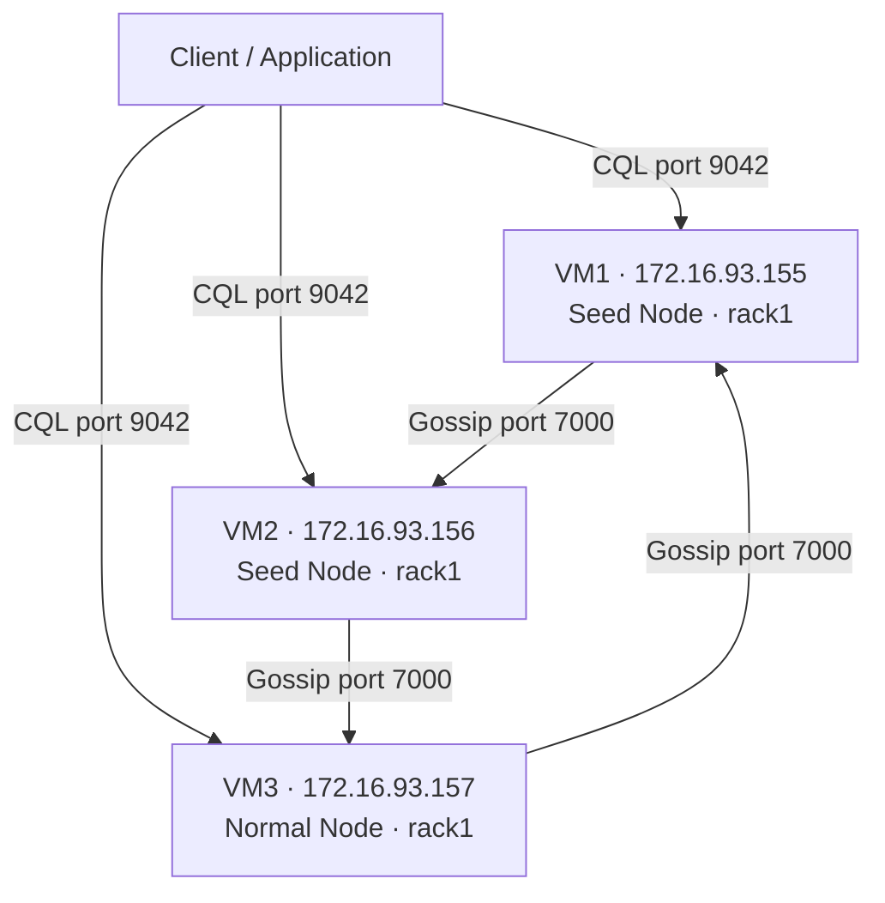

# ScyllaDB 3-Node Cluster Setup Guide
### Rocky Linux 9 · VMware · ScyllaDB 2025.4

---

## Table of Contents

1. [Architecture Overview](#architecture-overview)
2. [Environment](#environment)
3. [Step 1 — System Preparation](#step-1--system-preparation)
4. [Step 2 — ScyllaDB Installation](#step-2--scylladb-installation)
5. [Step 3 — Hardware Tuning with scylla_setup](#step-3--hardware-tuning-with-scylla_setup)
6. [Step 4 — Cluster Configuration](#step-4--cluster-configuration)
7. [Step 5 — Bootstrap the Cluster](#step-5--bootstrap-the-cluster)
8. [Step 6 — Password Setup and Auth Hardening](#step-6--password-setup-and-auth-hardening)
9. [Step 7 — Keyspace, Table, and Data Test](#step-7--keyspace-table-and-data-test)
10. [Step 8 — scyllatop Monitoring](#step-8--scyllatop-monitoring)
11. [Step 9 — Cassandra Driver Compatibility Test](#step-9--cassandra-driver-compatibility-test)
12. [Step 10 — Node Failure Test](#step-10--node-failure-test)
13. [Troubleshooting](#troubleshooting)

---

## Architecture Overview

ScyllaDB uses a **masterless ring topology** — every node is equal, there is no primary/replica distinction like in MongoDB. Data is distributed across the ring using consistent hashing. Each node owns a range of the token ring.



**Seed nodes** (VM1, VM2) are the first contact points for new nodes joining the cluster. They are not special in any other way — once the cluster is formed, all nodes are equal.

**Replication Factor 3** means every piece of data is stored on all 3 nodes. If one node goes down, data is still fully available from the other two.

---

## Environment

| Property | Value |
|----------|-------|
| OS | Rocky Linux 9.7 |
| Virtualization | VMware (local machine) |
| Host RAM | 32 GB |
| ScyllaDB Version | 2025.4.5 |
| Nodes | 3 VMs |

| VM | Username | IP | Role |
|----|----------|----|------|
| VM1 | scylla-vm1 | 172.16.93.155 | Seed Node |
| VM2 | scylla-vm2 | 172.16.93.156 | Seed Node |
| VM3 | scylla-vm3 | 172.16.93.157 | Normal Node |

Each VM: **3 GB RAM · 20 GB disk · 2 vCPU**

**Ports used:**

| Port | Protocol | Purpose |
|------|----------|---------|
| 9042 | TCP | CQL — client connections |
| 7000 | TCP | Inter-node gossip |
| 10000 | TCP | REST API — nodetool uses this |
| 9180 | TCP | Prometheus metrics — scyllatop uses this |
| 19042 | TCP | Shard-aware CQL |

---

## Step 1 — System Preparation

**Applies to: all three VMs (VM1, VM2, VM3)**

### 1.1 — System Update and Prerequisites

```bash
sudo dnf update -y
sudo dnf install -y curl wget vim net-tools bash-completion
```

`net-tools` provides `netstat` for port verification later. `bash-completion` enables tab completion in ScyllaDB CLI tools.

### 1.2 — Add /etc/hosts Entries

ScyllaDB nodes need to resolve each other. Add entries to `/etc/hosts` so you can use short names for `ping` checks. ScyllaDB config itself always uses IP addresses.

```bash
sudo tee -a /etc/hosts <<EOF

# ScyllaDB Cluster Nodes
172.16.93.155   scylla-node1
172.16.93.156   scylla-node2
172.16.93.157   scylla-node3
EOF
```

Verify connectivity:
```bash
ping -c 2 scylla-node2   # run from VM1
ping -c 2 scylla-node1   # run from VM2
```

### 1.3 — Open Firewall Ports

Rocky Linux uses `firewall-cmd`, not `ufw`.

```bash
sudo firewall-cmd --permanent --add-port=9042/tcp
sudo firewall-cmd --permanent --add-port=9142/tcp
sudo firewall-cmd --permanent --add-port=7000/tcp
sudo firewall-cmd --permanent --add-port=7001/tcp
sudo firewall-cmd --permanent --add-port=7199/tcp
sudo firewall-cmd --permanent --add-port=10000/tcp
sudo firewall-cmd --permanent --add-port=9180/tcp
sudo firewall-cmd --reload
```

Verify:
```bash
sudo firewall-cmd --list-ports
```

### 1.4 — Disable SELinux

SELinux in `enforcing` mode can block ScyllaDB socket operations. Set it to `permissive` for this lab.

```bash
sudo setenforce 0
sudo sed -i 's/^SELINUX=enforcing/SELINUX=permissive/' /etc/selinux/config
```

`setenforce 0` changes the mode at runtime immediately. The `sed` command makes it permanent across reboots by editing `/etc/selinux/config`.

Verify:
```bash
sestatus | grep "Current mode"
# Expected: Current mode: permissive
```

### 1.5 — Kernel Parameter Tuning

```bash
sudo tee /etc/sysctl.d/99-scylladb.conf <<EOF
net.core.rmem_max = 16777216
net.core.wmem_max = 16777216
net.ipv4.tcp_rmem = 4096 87380 16777216
net.ipv4.tcp_wmem = 4096 65536 16777216
vm.swappiness = 1
vm.dirty_ratio = 80
vm.dirty_background_ratio = 5
fs.file-max = 1000000
EOF

sudo sysctl -p /etc/sysctl.d/99-scylladb.conf
```

- `vm.swappiness = 1` — nearly disables swap. ScyllaDB keeps data in RAM; swapping causes severe latency spikes.
- `vm.dirty_ratio = 80` — OS flushes dirty pages to disk only when 80% of RAM is dirty, improving write throughput.
- `net.core.rmem_max` / `wmem_max` — increases network buffer sizes for CQL traffic.

### 1.6 — Open File Limit for ScyllaDB User

ScyllaDB opens many SSTable files simultaneously. The default limit of 1024 is far too low.

```bash
sudo tee /etc/security/limits.d/99-scylladb.conf <<EOF
scylla  soft  nofile  500000
scylla  hard  nofile  500000
scylla  soft  nproc   unlimited
scylla  hard  nproc   unlimited
EOF
```

This sets limits specifically for the `scylla` OS user that the ScyllaDB service runs as.

### 1.7 — NTP Time Synchronization

In a distributed database, all node clocks must be synchronized. Clock skew causes write conflicts and consistency issues.

```bash
sudo dnf install -y chrony
sudo systemctl enable --now chronyd
chronyc tracking
```

`System time offset` in the output should be within a few milliseconds. On VMware, `chrony` syncs automatically with VMware Tools.

### 1.8 — Preparation Verification Checklist

Run on each VM to confirm everything is in order:

```bash
echo "=== SELinux ===" && sestatus | grep "Current mode"
echo "=== Firewall ports ===" && sudo firewall-cmd --list-ports
echo "=== Swappiness ===" && cat /proc/sys/vm/swappiness
echo "=== File limits ===" && cat /etc/security/limits.d/99-scylladb.conf
echo "=== NTP ===" && chronyc tracking | grep "System time"
```

---

## Step 2 — ScyllaDB Installation

**Applies to: all three VMs (VM1, VM2, VM3)**

### 2.1 — Add EPEL Repository

ScyllaDB has some dependencies from EPEL (Extra Packages for Enterprise Linux).

```bash
sudo dnf install -y epel-release
```

### 2.2 — Add ScyllaDB Repository

Use the official ScyllaDB `.repo` file for Rocky Linux 9:

```bash
sudo curl -o /etc/yum.repos.d/scylla.repo -L http://downloads.scylladb.com/rpm/centos/scylla-2025.4.repo
```

Verify:
```bash
sudo dnf repolist | grep scylla
```

### 2.3 — Install ScyllaDB

```bash
sudo dnf install -y scylla
```

This installs:
- `scylla` — the main database engine
- `scylla-server` — the systemd service
- `scylla-tools` — `nodetool`, `cqlsh`, and other CLI tools
- `scylla-python3` — Python-based tools including `scyllatop`

Verify:
```bash
scylla --version
```

---

## Step 3 — Hardware Tuning with scylla_setup

**Applies to: all three VMs (VM1, VM2, VM3)**

`scylla_setup` is an interactive wizard that configures the OS and hardware for optimal ScyllaDB performance. Run it once on each VM.

### 3.1 — Run scylla_setup on VM1 (Interactive)

```bash
sudo scylla_setup
```

Answer each prompt as follows:

| Prompt | Answer | Reason |
|--------|--------|--------|
| Check kernel version? | `yes` | Verifies kernel is supported |
| Verify packages installed? | `yes` | Confirms ScyllaDB installed correctly |
| Auto-start on boot? | `yes` | Required — enables `systemctl enable scylla-server` |
| Check for newer version? | `no` | Unnecessary background process in lab |
| Disable SELinux? | `yes` | Improves performance; we already set permissive in Step 1.4 |
| Setup NTP? | `no` | Already configured chrony in Step 1.7 |
| Setup RAID? | `no` | Single disk VMs, no RAID possible |
| Enable coredumps? | `no` | Would consume too much disk on 20 GB VMs |
| Setup sysconfig file? | `yes` | Configures CPU and memory limits for the ScyllaDB process |
| NIC and disk optimization? | `yes` | Aligns network and disk I/O with ScyllaDB's shard-per-core model |
| Enforce clocksource? | `no` | Unsafe on VMware virtual hardware |
| IOTune disk study? | `no` | We use developer mode, which bypasses the I/O requirement |
| CPU scaling governor? | `yes` | Keeps CPU at max frequency; ScyllaDB needs consistent latency |
| Enable fstrim? | `yes` | Reclaims unused blocks on VMware virtual disks |
| Only service on host? | `yes` | Locks all memory to ScyllaDB, prevents OS swapping |
| Remote rsyslog? | `no` | No remote log server in this lab |
| Tune LimitNOFILES? | `no` | Already set manually in Step 1.6 |

> **Why developer mode?**
> In production mode, `scylla_setup` benchmarks disk I/O and enforces minimum thresholds. VMware virtual disks cannot meet these thresholds, causing setup to fail. Developer mode bypasses these checks — appropriate for lab use. We set `developer_mode: true` in `scylla.yaml` in the next step.

At the end, `scylla_setup` prints a one-liner command to replicate the same setup non-interactively. Use this for VM2 and VM3 instead of going through the wizard again.

### 3.2 — Run scylla_setup on VM2 and VM3 (Non-interactive)

After VM1 setup completes, it outputs a command like:

```bash
sudo scylla_setup --no-raid-setup --online-discard 1 --nic ens160 \
                 --no-ntp-setup --no-coredump-setup --io-setup 0 \
                 --no-version-check --no-rsyslog-setup
```

Run this exact command on VM2 and VM3. The `--nic` flag value (`ens160`) may differ slightly depending on your network interface name.

### 3.3 — Run scylla_io_setup

`scylla_setup` with `--io-setup 0` skips I/O tuning. We need to run `scylla_io_setup` separately so ScyllaDB has an I/O profile, otherwise it logs warnings about unconfigured I/O scheduler.

```bash
sudo scylla_io_setup
```

Run on all three VMs.

### 3.4 — Fix File Permissions

ScyllaDB runs as the `scylla` OS user. Config files written by `root` using `sudo tee` may not be readable by the `scylla` user. Fix this proactively:

```bash
sudo chown scylla:scylla /etc/scylla/scylla.yaml
sudo chmod 644 /etc/scylla/scylla.yaml
sudo chown scylla:scylla /etc/scylla/cassandra-rackdc.properties
sudo chmod 644 /etc/scylla/cassandra-rackdc.properties
```

> **Important:** If you skip this step, ScyllaDB will fail to start with a `Permission denied` error on the config files.

---

## Step 4 — Cluster Configuration

### 4.1 — scylla.yaml

This is the main configuration file for each node. The only differences between nodes are the IP address fields. Everything else is identical.

> **Important:** In ScyllaDB 2025.4, the `seeds` parameter must be nested inside a `seed_provider` block. Using a top-level `seeds:` key will cause a startup warning and the parameter will be silently ignored, leaving the node unable to find the cluster.

**On VM1** (`/etc/scylla/scylla.yaml`):

```bash
sudo tee /etc/scylla/scylla.yaml <<'EOF'
cluster_name: 'ScyllaDB-Lab'
num_tokens: 256
data_file_directories:
    - /var/lib/scylla/data
commitlog_directory: /var/lib/scylla/commitlog
schema_commitlog_directory: /var/lib/scylla/schema_commitlog
hints_directory: /var/lib/scylla/hints
view_hints_directory: /var/lib/scylla/view_hints

listen_address: 172.16.93.155
rpc_address: 172.16.93.155
broadcast_rpc_address: 172.16.93.155

seed_provider:
    - class_name: org.apache.cassandra.locator.SimpleSeedProvider
      parameters:
          - seeds: "172.16.93.155,172.16.93.156"

authenticator: PasswordAuthenticator
authorizer: CassandraAuthorizer

endpoint_snitch: GossipingPropertyFileSnitch

native_transport_port: 9042
storage_port: 7000
prometheus_address: 0.0.0.0

developer_mode: true
EOF
```

**On VM2** — same content, change all three IP fields to `172.16.93.156`:

```bash
sudo tee /etc/scylla/scylla.yaml <<'EOF'
cluster_name: 'ScyllaDB-Lab'
num_tokens: 256
data_file_directories:
    - /var/lib/scylla/data
commitlog_directory: /var/lib/scylla/commitlog
schema_commitlog_directory: /var/lib/scylla/schema_commitlog
hints_directory: /var/lib/scylla/hints
view_hints_directory: /var/lib/scylla/view_hints

listen_address: 172.16.93.156
rpc_address: 172.16.93.156
broadcast_rpc_address: 172.16.93.156

seed_provider:
    - class_name: org.apache.cassandra.locator.SimpleSeedProvider
      parameters:
          - seeds: "172.16.93.155,172.16.93.156"

authenticator: PasswordAuthenticator
authorizer: CassandraAuthorizer

endpoint_snitch: GossipingPropertyFileSnitch

native_transport_port: 9042
storage_port: 7000
prometheus_address: 0.0.0.0

developer_mode: true
EOF
```

**On VM3** — change all three IP fields to `172.16.93.157`:

```bash
sudo tee /etc/scylla/scylla.yaml <<'EOF'
cluster_name: 'ScyllaDB-Lab'
num_tokens: 256
data_file_directories:
    - /var/lib/scylla/data
commitlog_directory: /var/lib/scylla/commitlog
schema_commitlog_directory: /var/lib/scylla/schema_commitlog
hints_directory: /var/lib/scylla/hints
view_hints_directory: /var/lib/scylla/view_hints

listen_address: 172.16.93.157
rpc_address: 172.16.93.157
broadcast_rpc_address: 172.16.93.157

seed_provider:
    - class_name: org.apache.cassandra.locator.SimpleSeedProvider
      parameters:
          - seeds: "172.16.93.155,172.16.93.156"

authenticator: PasswordAuthenticator
authorizer: CassandraAuthorizer

endpoint_snitch: GossipingPropertyFileSnitch

native_transport_port: 9042
storage_port: 7000
prometheus_address: 0.0.0.0

developer_mode: true
EOF
```

**Key parameter explanations:**

| Parameter | Purpose |
|-----------|---------|
| `cluster_name` | Must be identical on all nodes. Nodes reject joining if cluster names differ. |
| `num_tokens` | Number of virtual tokens this node owns in the ring. 256 is the recommended default — more tokens means more even data distribution. |
| `listen_address` | IP this node uses for inter-node communication (gossip, streaming). |
| `rpc_address` | IP this node listens on for client CQL connections. |
| `broadcast_rpc_address` | IP this node advertises to other nodes via gossip so clients know how to reach it. |
| `seed_provider` | Defines the seed nodes. New nodes contact seeds first to discover the cluster. VM1 and VM2 are seeds; VM3 is not. |
| `authenticator: PasswordAuthenticator` | Enables username/password authentication. Default is `AllowAllAuthenticator` (no auth). |
| `authorizer: CassandraAuthorizer` | Enables role-based permission control. Named `Cassandra` for Cassandra compatibility — ScyllaDB's own implementation. |
| `endpoint_snitch: GossipingPropertyFileSnitch` | Reads datacenter and rack info from `cassandra-rackdc.properties` and shares it via gossip. |
| `prometheus_address: 0.0.0.0` | Binds the Prometheus metrics endpoint to all interfaces so `scyllatop` can connect via localhost. |
| `developer_mode: true` | Disables production I/O and memory threshold checks. Required for VMs that cannot meet production benchmarks. |

After writing the files, fix permissions on all three VMs:

```bash
sudo chown scylla:scylla /etc/scylla/scylla.yaml
sudo chmod 644 /etc/scylla/scylla.yaml
```

### 4.2 — cassandra-rackdc.properties

This file tells each node which datacenter and rack it belongs to. `GossipingPropertyFileSnitch` reads this file and shares the information with the rest of the cluster via gossip.

**On all three VMs** (identical content):

```bash
sudo tee /etc/scylla/cassandra-rackdc.properties <<EOF
dc=datacenter1
rack=rack1
EOF

sudo chown scylla:scylla /etc/scylla/cassandra-rackdc.properties
sudo chmod 644 /etc/scylla/cassandra-rackdc.properties
```

In this lab we have a single datacenter and single rack, so all nodes have the same values.

---

## Step 5 — Bootstrap the Cluster

### 5.1 — nodetool Alias Setup

ScyllaDB's `nodetool` uses the REST API on port 10000 (not JMX). The REST API binds to the node's own IP, not localhost. Set up an alias so you can run `nodetool` without specifying the host every time.

**On all three VMs:**

```bash
grep -v "alias nodetool" ~/.bashrc > /tmp/bashrc_tmp && mv /tmp/bashrc_tmp ~/.bashrc
echo "alias nodetool='nodetool -h \$(hostname -I | cut -d\" \" -f1) --port 10000'" >> ~/.bashrc
source ~/.bashrc
```

### 5.2 — Bootstrap Sequence

> **Critical:** ScyllaDB 2025.4 uses Raft for cluster management. During bootstrap, the first node must come up and establish itself as the Raft group leader before other nodes join. If both seed nodes start simultaneously without an existing cluster, they deadlock waiting for each other and neither can become leader.
>
> The correct procedure is:
> 1. Start VM1 and wait for it to reach NORMAL state
> 2. Then start VM2
> 3. Then start VM3

**Start VM1 first:**

```bash
sudo systemctl start scylla-server
sudo journalctl -u scylla-server -f
```

Watch the log. Wait until you see:

```
storage_service - entering NORMAL mode
init - Scylla version ... initialization completed.
```

This takes 1–3 minutes. Once you see these lines, VM1 has successfully bootstrapped as a single-node cluster and is ready to accept other nodes.

**Then start VM2:**

```bash
sudo systemctl start scylla-server
```

Watch for `initialization completed` in VM2's log before proceeding.

**Then start VM3:**

```bash
sudo systemctl start scylla-server
```

### 5.3 — Verify Cluster Status

From any VM:

```bash
nodetool status
```

Expected output — all three nodes showing `UN` (Up, Normal):

```
Datacenter: datacenter1
=======================
Status=Up/Down
|/ State=Normal/Leaving/Joining/Moving
--  Address         Load       Tokens  Owns    Host ID                               Rack
UN  172.16.93.155   484 KB     256     ?       d171e0b8-...                          rack1
UN  172.16.93.156   522 KB     256     ?       eac274fd-...                          rack1
UN  172.16.93.157   618 KB     256     ?       04374c3c-...                          rack1
```

> **Note on `Owns ?`:** The `?` in the Owns column is expected behavior in ScyllaDB 2025.4 when the Tablets feature is enabled. It does not indicate a problem. The cluster is functioning correctly.

---

## Step 6 — Password Setup and Auth Hardening

### 6.1 — Change Default Credentials

ScyllaDB ships with a default superuser `cassandra` with password `cassandra`. Connect and create a proper admin account.

**From VM1:**

```bash
cqlsh 172.16.93.155 9042 -u cassandra -p cassandra
```

```sql
CREATE ROLE admin WITH SUPERUSER = true AND LOGIN = true AND PASSWORD = 'your_secure_password';
ALTER ROLE cassandra WITH PASSWORD = 'another_secure_password';
EXIT;
```

Verify the new admin account works:

```bash
cqlsh 172.16.93.155 9042 -u admin -p your_secure_password
```

### 6.2 — Fix system_auth Replication Factor

By default, `system_auth` (the keyspace that stores roles and credentials) has `replication_factor: 1`. In a 3-node cluster, this means if the one node holding the auth data goes down, no one can authenticate.

```sql
ALTER KEYSPACE system_auth
WITH REPLICATION = {
    'class': 'SimpleStrategy',
    'replication_factor': 3
};
EXIT;
```

Then repair the keyspace to stream the auth data to all nodes:

**On all three VMs:**

```bash
nodetool repair system_auth
```

---

## Step 7 — Keyspace, Table, and Data Test

**Connect from VM1:**

```bash
cqlsh 172.16.93.155 9042 -u admin -p your_secure_password
```

**Create keyspace:**

```sql
CREATE KEYSPACE lab_keyspace
WITH REPLICATION = {
    'class': 'SimpleStrategy',
    'replication_factor': 3
};
```

`replication_factor: 3` means every row is stored on all 3 nodes. Any single node can satisfy a read, and the cluster can tolerate 1 node failure without data loss.

**Create table:**

```sql
USE lab_keyspace;

CREATE TABLE employees (
    id UUID PRIMARY KEY,
    name TEXT,
    department TEXT,
    salary DECIMAL,
    joined_at TIMESTAMP
);
```

**Insert test data:**

```sql
INSERT INTO employees (id, name, department, salary, joined_at)
VALUES (uuid(), 'Alice Rahman', 'Engineering', 95000.00, toTimestamp(now()));

INSERT INTO employees (id, name, department, salary, joined_at)
VALUES (uuid(), 'Bob Hossain', 'Marketing', 75000.00, toTimestamp(now()));

INSERT INTO employees (id, name, department, salary, joined_at)
VALUES (uuid(), 'Carol Ahmed', 'Engineering', 105000.00, toTimestamp(now()));
```

**Query:**

```sql
SELECT * FROM employees;
```

Expected output:

```
 id       | department  | joined_at                       | name         | salary
----------+-------------+---------------------------------+--------------+-----------
 b300c994 | Marketing   | 2026-03-22 16:20:48.746000+0000 | Bob Hossain  |  75000.00
 9257c38a | Engineering | 2026-03-22 16:20:53.376000+0000 | Carol Ahmed  | 105000.00
 25372ae8 | Engineering | 2026-03-22 16:20:48.740000+0000 | Alice Rahman |  95000.00
```

Exit cqlsh:
```sql
EXIT;
```

---

## Step 8 — scyllatop Monitoring

`scyllatop` is ScyllaDB's built-in per-shard monitoring tool. It shows real-time metrics for each CPU shard — similar to `top` but specific to ScyllaDB internals.

**From any VM:**

```bash
sudo scyllatop
```

Key metrics shown:

| Metric | What it means |
|--------|--------------|
| `shard` | Which CPU core / shard |
| `tasks/s` | Tasks processed per second on this shard |
| `quota` | CPU time allocated to this shard |
| `stalls` | Reactor stall events — high values indicate latency issues |
| `reads/s` | Read operations per second |
| `writes/s` | Write operations per second |

Press `q` to exit.

To generate load while watching `scyllatop`, run queries in another terminal:

```bash
cqlsh 172.16.93.155 9042 -u admin -p your_secure_password \
  -e "SELECT * FROM lab_keyspace.employees;"
```

> **Note:** `prometheus_address: 0.0.0.0` must be set in `scylla.yaml` for `scyllatop` to work. Without this, ScyllaDB binds the Prometheus metrics endpoint to the node's own IP only, and `scyllatop` fails to connect via localhost.

---

## Step 9 — Cassandra Driver Compatibility Test

ScyllaDB is wire-compatible with Apache Cassandra. Any application using the Cassandra driver can connect to ScyllaDB without code changes.

**Install the Cassandra Python driver on VM1:**

```bash
sudo dnf install -y python3 python3-pip
pip3 install cassandra-driver
```

**Create the test script:**

```bash
tee ~/cassandra_test.py <<'EOF'
from cassandra.cluster import Cluster
from cassandra.auth import PlainTextAuthProvider

auth = PlainTextAuthProvider(username='admin', password='your_secure_password')
cluster = Cluster(
    ['172.16.93.155', '172.16.93.156', '172.16.93.157'],
    port=9042,
    auth_provider=auth
)

session = cluster.connect('lab_keyspace')
print("Connected to ScyllaDB cluster via Cassandra driver!")
print(f"Cluster name: {cluster.metadata.cluster_name}")

rows = session.execute("SELECT * FROM employees")
print("\n--- Employees ---")
for row in rows:
    print(f"  {row.name} | {row.department} | {row.salary}")

cluster.shutdown()
print("\nConnection closed successfully.")
EOF
```

**Run the test:**

```bash
python3 ~/cassandra_test.py
```

Expected output:

```
Connected to ScyllaDB cluster via Cassandra driver!
Cluster name: ScyllaDB-Lab

--- Employees ---
  Bob Hossain | Marketing | 75000.00
  Carol Ahmed | Engineering | 105000.00
  Alice Rahman | Engineering | 95000.00

Connection closed successfully.
```

The driver connects to all three nodes in the `contact_points` list and automatically handles failover if one node goes down.

---

## Step 10 — Node Failure Test

This test verifies that Replication Factor 3 protects data availability when a node goes down.

**Stop VM3 to simulate a node failure:**

```bash
# On VM3
sudo systemctl stop scylla-server
```

**Check cluster status from VM1:**

```bash
nodetool status
```

VM3 should show `DN` (Down, Normal):

```
UN  172.16.93.155   ...
UN  172.16.93.156   ...
DN  172.16.93.157   ...
```

**Verify data is still readable:**

```bash
cqlsh 172.16.93.155 9042 -u admin -p your_secure_password \
  -e "SELECT * FROM lab_keyspace.employees;"
```

All 3 rows should still be returned. Because RF=3, every row exists on all nodes — the remaining two nodes (VM1 and VM2) have complete copies.

**Bring VM3 back up:**

```bash
# On VM3
sudo systemctl start scylla-server
```

**Verify all nodes are back to UN:**

```bash
nodetool status
```

---

## Troubleshooting

### ScyllaDB fails to start — Permission denied on config files

```
Startup failed: filesystem_error: open failed: Permission denied [conf/cassandra-rackdc.properties]
```

**Cause:** Config files written by root are not readable by the `scylla` user.

**Fix:**
```bash
sudo chown scylla:scylla /etc/scylla/scylla.yaml
sudo chown scylla:scylla /etc/scylla/cassandra-rackdc.properties
sudo chmod 644 /etc/scylla/scylla.yaml
sudo chmod 644 /etc/scylla/cassandra-rackdc.properties
```

---

### Cluster bootstrap deadlock — nodes stuck at "join cluster"

**Symptom:** Both seed nodes start but stay stuck at `entering STARTING mode` indefinitely with no further log output.

**Cause:** ScyllaDB 2025.4 uses Raft for cluster management. If both seed nodes start simultaneously with no existing cluster, they deadlock — each waits for the other to be the Raft leader, but neither can establish quorum alone.

**Fix:** Stop all nodes, clean data directories, then start only VM1 first and wait for it to reach NORMAL state before starting VM2 and VM3.

```bash
# On all three VMs
sudo systemctl stop scylla-server
sudo rm -rf /var/lib/scylla/data/system*
sudo rm -rf /var/lib/scylla/commitlog/*
sudo rm -rf /var/lib/scylla/hints/*
sudo rm -rf /var/lib/scylla/view_hints/*
```

Then start VM1 first, wait for `entering NORMAL mode` in the log, then start VM2, then VM3.

---

### nodetool — Connection refused

**Symptom:**
```
error running operation: std::system_error (error system:111, Connection refused)
```

**Cause:** `nodetool` by default tries to connect to JMX on `localhost:7199`. ScyllaDB does not use JMX — it uses a REST API on port 10000, bound to the node's own IP (not localhost).

**Fix:** Use the alias set up in Step 5.1, which passes `-h <node_ip> --port 10000` automatically. Or specify manually:

```bash
nodetool -h 172.16.93.155 --port 10000 status
```

---

### scyllatop — Connection refused or 404

**Symptom:**
```
scyllatop failed connecting to Scylla: Connection refused
```
or
```
scyllatop failed connecting to Scylla: HTTP Error 404
```

**Cause:** `scyllatop` connects to the Prometheus metrics endpoint on `http://localhost:9180/metrics`. If `prometheus_address` in `scylla.yaml` is set to the node's own IP (not `0.0.0.0`), the endpoint is not accessible via localhost.

**Fix:** Add `prometheus_address: 0.0.0.0` to `scylla.yaml` on all nodes and restart:

```bash
sudo tee -a /etc/scylla/scylla.yaml <<'EOF'
prometheus_address: 0.0.0.0
EOF
sudo systemctl restart scylla-server
```

---

### ScyllaDB repo returns 404

**Symptom:**
```
Status code: 404 for https://downloads.scylladb.com/rpm/centos/9/scylladb-6.2/...
```

**Cause:** Manually constructed repo URLs become outdated as new versions are released.

**Fix:** Always use the official `.repo` file URL which ScyllaDB keeps up to date:

```bash
sudo rm /etc/yum.repos.d/scylla.repo
sudo dnf clean all
sudo curl -o /etc/yum.repos.d/scylla.repo -L http://downloads.scylladb.com/rpm/centos/scylla-2025.4.repo
```

---

*This guide covers ScyllaDB 2025.4.5 on Rocky Linux 9.7. Behavior may differ on other versions.*
