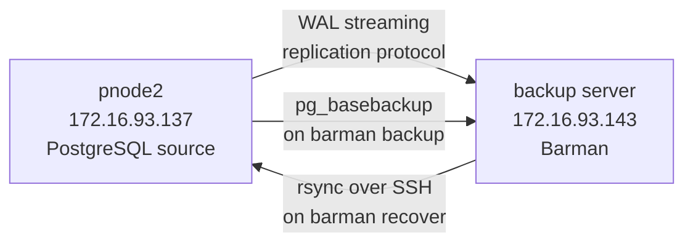

# Barman Backup

## Concept First

### What is Barman?

Barman (Backup and Recovery Manager) is a dedicated PostgreSQL backup management tool by EDB. Like pgBackRest, it handles backups, WAL archiving, and PITR — but with a centralized approach.

Instead of the PostgreSQL node pushing WAL to a repository (like pgBackRest does), Barman sits on a dedicated backup server and **pulls** WAL from PostgreSQL using streaming replication. It also handles base backups via `pg_basebackup` internally.

One Barman server can manage backups for multiple PostgreSQL servers — each defined as a separate "server" in Barman config.

### Barman vs pgBackRest

| Aspect | Barman | pgBackRest |
|--------|--------|------------|
| Language | Python | C |
| WAL collection | Streaming (pull) | Archive push (PostgreSQL pushes) |
| Base backup | pg_basebackup internally | Own binary protocol |
| Multi-server | Yes — one Barman, many servers | Separate stanza per server |
| SSH requirement | Yes — for remote restore | Yes — for repo host |

### How Barman Works in This Lab



**Two connections Barman maintains:**
- `conninfo` — regular PostgreSQL connection for monitoring and backup control
- `streaming_conninfo` — replication connection for continuous WAL streaming

**Restore direction is reversed:** Barman pushes the backup back to the PostgreSQL server via rsync over SSH.

---

## Lab Environment

| Host | IP | Role |
|------|----|------|
| pnode2 | 172.16.93.137 | PostgreSQL source (user: `pnode2`, postgres OS user) |
| backup server | 172.16.93.143 | Barman server (user: `restore`, barman OS user) |

---

## Setup

### Step 1 — Stop Patroni on pnode2

Patroni manages PostgreSQL lifecycle. If running, it interferes with manual PostgreSQL management.

```bash
# On pnode2
sudo systemctl stop patroni
sudo systemctl status patroni   # Expected: inactive (dead)
ps aux | grep postgres          # No patroni or postgres process should remain
```

### Step 2 — Verify Barman is installed (backup server)

```bash
# On backup server
barman --version
```

Barman installation also creates the `barman` OS user and `/var/lib/barman/` as its home directory.

```bash
id barman
ls /var/lib/barman/
```

---

## SSH Key Exchange

Barman needs **passwordless SSH** in both directions:

- **barman → postgres@pnode2** — for `barman recover` (rsync pushes backup files)
- **postgres@pnode2 → barman@backup** — for WAL archive via SSH (if using SSH archiving)

### Step 3 — Generate barman's SSH key (backup server)

```bash
sudo su - barman
ssh-keygen -t rsa -b 4096 -N "" -f ~/.ssh/id_rsa
# -t rsa        → RSA key type
# -b 4096       → 4096 bit key strength
# -N ""         → no passphrase (required for passwordless auth)
# -f ~/.ssh/id_rsa → save to this path

cat ~/.ssh/id_rsa.pub   # Copy this output
exit
```

### Step 4 — Add barman's public key to postgres@pnode2 (pnode2)

```bash
sudo su - postgres
mkdir -p ~/.ssh
chmod 700 ~/.ssh
# chmod 700 → only owner can read/write/execute
# SSH refuses to use keys if .ssh directory has loose permissions

echo "PASTE_BARMAN_PUBLIC_KEY_HERE" >> ~/.ssh/authorized_keys
chmod 600 ~/.ssh/authorized_keys
# chmod 600 → only owner can read/write
# SSH refuses to use authorized_keys with loose permissions
exit
```

> **SELinux issue on Rocky Linux:** The postgres user's home is `/var/lib/pgsql/` which gets the SELinux context `postgresql_db_t` by default. SSH daemon cannot read `authorized_keys` with this context — it needs `ssh_home_t`. Fix this after adding the key:

```bash
# On pnode2
sudo dnf install -y policycoreutils-python-utils

sudo semanage fcontext -a -t ssh_home_t "/var/lib/pgsql/.ssh(/.*)?"
# semanage fcontext -a  → add a new file context rule
# -t ssh_home_t         → set this SELinux type
# "/var/lib/pgsql/.ssh(/.*)?" → apply to .ssh dir and everything inside

sudo restorecon -Rv /var/lib/pgsql/.ssh/
# restorecon → apply the SELinux context rules to actual files
# -R → recursive (apply to all files inside)
# -v → verbose (show what was changed)

sudo ls -laZ /var/lib/pgsql/.ssh/
# Verify: context should now show ssh_home_t instead of postgresql_db_t
```

### Step 5 — Generate postgres's SSH key (pnode2)

```bash
sudo su - postgres
ssh-keygen -t rsa -b 4096 -N "" -f ~/.ssh/id_rsa
cat ~/.ssh/id_rsa.pub   # Copy this output
exit
```

### Step 6 — Add postgres's public key to barman@backup (backup server)

```bash
sudo su - barman
echo "PASTE_POSTGRES_PUBLIC_KEY_HERE" >> ~/.ssh/authorized_keys
chmod 600 ~/.ssh/authorized_keys
exit
```

### Step 7 — Test SSH in both directions

```bash
# From backup server → pnode2 (no password prompt = success)
sudo -u barman ssh postgres@172.16.93.137 "echo SSH OK from barman to postgres"

# From pnode2 → backup server (no password prompt = success)
sudo -u postgres ssh barman@172.16.93.143 "echo SSH OK from postgres to barman"
```

If password is prompted, SSH key auth is not working. Check:
1. Correct public key in `authorized_keys`
2. `.ssh/` permission is `700`, `authorized_keys` permission is `600`
3. SELinux context is `ssh_home_t` (on Rocky Linux)

---

## PostgreSQL Configuration (pnode2)

### Step 8 — Create Barman users in PostgreSQL

```bash
# On pnode2
sudo -u postgres psql << 'EOF'
CREATE USER barman SUPERUSER PASSWORD 'barman123';
CREATE USER streaming_barman REPLICATION PASSWORD 'barman123';
EOF
```

**Why two users?**
- `barman` — superuser for backup control, monitoring, and pg_basebackup
- `streaming_barman` — replication-only user for WAL streaming. Principle of least privilege — WAL streaming only needs `REPLICATION` attribute, not superuser.

### Step 9 — Allow backup server connections in pg_hba.conf

```bash
# On pnode2
sudo -u postgres bash -c "cat >> /data/patroni/pg_hba.conf << 'EOF'
host all barman 172.16.93.143/32 md5
host replication streaming_barman 172.16.93.143/32 md5
EOF"
```

**Breaking this command down:**

`sudo -u postgres` — run as postgres OS user because pg_hba.conf is owned by postgres

`bash -c "..."` — open a new bash shell to execute the string inside. Required here because the heredoc (`<< 'EOF'`) needs to be interpreted by a shell, and `sudo` alone doesn't expand heredocs.

`cat >> /data/patroni/pg_hba.conf` — `cat` reads from stdin and `>>` appends to the file (not overwrites — `>` would overwrite)

`<< 'EOF' ... EOF` — heredoc syntax. Everything between the two `EOF` markers is sent as stdin to `cat`. The single quotes around `'EOF'` prevent variable expansion inside — what you write is exactly what gets written.

**The two lines added:**

`host all barman 172.16.93.143/32 md5`
- `host` → TCP/IP connection (not unix socket)
- `all` → any database
- `barman` → only this user
- `172.16.93.143/32` → only from this exact IP (`/32` = single host, not a range)
- `md5` → password authentication

`host replication streaming_barman 172.16.93.143/32 md5`
- `replication` → special keyword, not a database name. Allows replication connections only — used for WAL streaming.
- `streaming_barman` → only this user can use replication connections from this IP

```bash
# Reload pg_hba.conf — no restart needed for hba changes
sudo -u postgres /usr/pgsql-16/bin/pg_ctl -D /data/patroni reload
```

### Step 10 — Create replication slot on pnode2

```bash
# On pnode2
sudo -u postgres psql -c "SELECT pg_create_physical_replication_slot('barman_pnode2');"
sudo -u postgres psql -c "SELECT slot_name, slot_type, active FROM pg_replication_slots;"
```

**Why a replication slot?**
Without a slot, PostgreSQL can recycle WAL segments that Barman hasn't streamed yet — causing gaps in WAL and making PITR impossible. A replication slot tells PostgreSQL: "don't recycle WAL until this consumer (barman) has received it."

> **Important:** Replication slots must be created on the PostgreSQL server (pnode2), not on the backup server.

---

## Barman Configuration (backup server)

### Step 11 — Configure .pgpass for passwordless connections

```bash
# On backup server, as barman user
sudo su - barman
cat > ~/.pgpass << 'EOF'
172.16.93.137:5432:*:barman:barman123
172.16.93.137:5432:*:streaming_barman:barman123
EOF
chmod 600 ~/.pgpass
exit
```

`.pgpass` format: `hostname:port:database:username:password`

The `*` for database means "any database" — Barman connects to different databases depending on the operation. `chmod 600` is required — PostgreSQL ignores `.pgpass` if permissions are too open.

### Step 12 — Create Barman global config

```bash
# On backup server
sudo bash -c "cat > /etc/barman.conf << 'EOF'
[barman]
barman_user = barman
barman_home = /var/lib/barman
log_file = /var/log/barman/barman.log
log_level = INFO
compression = gzip
configuration_files_directory = /etc/barman.d
path_prefix = /usr/pgsql-16/bin
EOF"
```

**Key settings:**

`barman_home = /var/lib/barman` — all backup data, WAL segments, and metadata stored here. Each server gets a subdirectory: `/var/lib/barman/pnode2/`

`configuration_files_directory = /etc/barman.d` — Barman reads server-specific configs from this directory. Without this, Barman only reads `/etc/barman.conf` and doesn't know about any servers.

`path_prefix = /usr/pgsql-16/bin` — Barman needs `pg_basebackup`, `pg_receivewal` etc. These are in `/usr/pgsql-16/bin/` which is not in the default PATH when running as `sudo -u barman`. This tells Barman exactly where to find PostgreSQL tools.

### Step 13 — Create server config for pnode2

```bash
sudo bash -c "cat > /etc/barman.d/pnode2.conf << 'EOF'
[pnode2]
description = pnode2 standalone PostgreSQL
conninfo = host=172.16.93.137 user=barman dbname=postgres
streaming_conninfo = host=172.16.93.137 user=streaming_barman
backup_method = postgres
streaming_archiver = on
slot_name = barman_pnode2
retention_policy = RECOVERY WINDOW OF 7 DAYS
EOF"
```

**Breaking down each parameter:**

`conninfo` — standard libpq connection string for regular PostgreSQL connection. Barman uses this for monitoring, backup initiation, and pg_basebackup. Uses the `barman` superuser.

`streaming_conninfo` — connection string for the WAL streaming replication connection. Uses `streaming_barman` which only has `REPLICATION` privilege. Barman maintains a persistent streaming connection using `pg_receivewal` internally.

`backup_method = postgres` — use `pg_basebackup` for base backups. Alternative is `rsync` which uses SSH directly.

`streaming_archiver = on` — enable WAL collection via streaming replication (instead of requiring PostgreSQL to push WAL via `archive_command`). This is what makes Barman's approach different — PostgreSQL config doesn't need `archive_command` changes.

`slot_name = barman_pnode2` — the replication slot name to use. Must match the slot created in Step 10.

`retention_policy = RECOVERY WINDOW OF 7 DAYS` — keep enough backups and WAL to recover to any point within the last 7 days. Barman automatically manages which old backups to delete.

---

## Running Barman

### Step 14 — Check server status

```bash
# On backup server
sudo -u barman barman check pnode2
```

This checks every component — PostgreSQL connectivity, streaming connectivity, WAL level, replication slot, pg_basebackup availability, etc. Everything should show `OK`.

Common failures and causes:

| Failure | Cause |
|---------|-------|
| `PostgreSQL: FAILED` | Wrong conninfo, pg_hba missing, wrong password in .pgpass |
| `PostgreSQL streaming: FAILED` | Wrong streaming_conninfo, streaming_barman user missing |
| `replication slot: FAILED` | Slot not created on pnode2, or receive-wal not running |
| `pg_receivexlog: FAILED` | `path_prefix` not set, PostgreSQL tools not found |
| `receive-wal running: FAILED` | `barman receive-wal` process not started |
| `WAL archive: FAILED` | receive-wal not streaming yet |

### Step 15 — Start WAL streaming

```bash
# On backup server — run in background
sudo -u barman barman receive-wal pnode2 &

# Verify WAL is being received
sleep 5
sudo ls /var/lib/barman/pnode2/streaming/
# Should show a .partial file — WAL segment being streamed
```

`barman receive-wal` starts a persistent `pg_receivewal` process that streams WAL from pnode2's replication slot. The `.partial` extension means the current segment is still being written to — it becomes a complete file when the segment fills up or `pg_switch_wal()` is called.

In production, this would be managed by `barman-cron` running as a systemd service or cron job — not manually like this.

### Step 16 — Take a base backup

```bash
sudo -u barman barman backup pnode2 --wait
# --wait → block until backup AND the required WAL segments are received
# Without --wait, the command returns immediately but WAL processing continues in background
```

Barman internally runs `pg_basebackup`, transfers the data, then waits for WAL up to the backup end LSN to be streamed and stored.

```bash
# List all backups
sudo -u barman barman list-backups pnode2

# Detailed info about a specific backup
sudo -u barman barman show-backup pnode2 latest
```

---

## PITR with Barman

### Step 17 — Create data, note timestamp, simulate accident

```bash
# On pnode2
sudo -u postgres psql -d pitr_test -c \
  "INSERT INTO employees (name, department) VALUES ('Eve', 'Finance');"

# Note this timestamp — this is your recovery target
sudo -u postgres psql -d pitr_test -c "SELECT now();"

# The accident
sudo -u postgres psql -d pitr_test -c "DROP TABLE employees;"
```

### Step 18 — Force WAL archive and stop PostgreSQL

```bash
# On pnode2
# Force current WAL segment to be streamed to Barman
sudo -u postgres psql -c "SELECT pg_switch_wal();"

# Stop PostgreSQL — required before restore
sudo -u postgres /usr/pgsql-16/bin/pg_ctl -D /data/patroni stop
```

`pg_switch_wal()` closes the current WAL segment and starts a new one. The closed segment gets picked up by `receive-wal` immediately. Without this, the last WAL segment containing the DROP TABLE may still be `.partial` and not yet in Barman's archive — causing incomplete recovery.

### Step 19 — Restore with Barman

```bash
# On backup server
sudo -u barman barman recover \
  --target-time "2026-03-26 17:40:30+06" \
  --remote-ssh-command "ssh postgres@172.16.93.137" \
  pnode2 \
  latest \
  /data/patroni
```

**Breaking down this command:**

`barman recover` — restore a backup and configure it for recovery

`--target-time "2026-03-26 17:40:30+06"` — stop WAL replay at this timestamp. Same concept as `recovery_target_time` in postgresql.conf.

`--remote-ssh-command "ssh postgres@172.16.93.137"` — Barman pushes the backup to pnode2 via rsync over SSH. This SSH command is what rsync uses to connect. This is why barman → postgres SSH key exchange was required.

`pnode2` — which Barman server config to use

`latest` — use the most recent backup. Can also specify a backup ID from `barman list-backups`.

`/data/patroni` — destination directory on pnode2. Must be empty before restore.

**What Barman does during recover:**
1. Copies base backup files to pnode2 via rsync over SSH
2. Copies required WAL segments from `/var/lib/barman/pnode2/wals/`
3. Writes `postgresql.conf` recovery settings (`restore_command`, `recovery_target_time`)
4. Creates `recovery.signal` on pnode2

> **Note:** Barman overrides some existing `postgresql.conf` settings during recover — it sets `archive_command = false` and clears previous recovery targets to prevent conflicts.

### Step 20 — Start PostgreSQL and complete recovery

```bash
# On pnode2
sudo chmod 700 /data/patroni
# Required because rsync sometimes changes directory permission bits

sudo -u postgres /usr/pgsql-16/bin/pg_ctl \
  -D /data/patroni \
  -l /data/patroni/log/postgresql.log \
  start

# Watch recovery progress
sudo tail -30 /data/patroni/log/postgresql-$(date +%a).log
```

Key log lines to look for:
```
starting point-in-time recovery to 2026-03-26 17:40:30+06
restored log file "..." from archive
recovery stopping before commit of transaction ...
pausing at the end of recovery
HINT: Execute pg_wal_replay_resume() to promote.
```

**Why does it pause?**
Barman sets `recovery_target_action` to pause by default (it clears the existing value). When PostgreSQL reaches the target time, it pauses and waits for manual promotion — giving you a chance to verify the recovered state before making it writable.

```bash
# Promote to standalone primary
sudo -u postgres psql -c "SELECT pg_wal_replay_resume();"
```

### Step 21 — Verify

```bash
sudo -u postgres psql -c "SELECT pg_is_in_recovery();"
# Expected: f — standalone primary, recovery complete

sudo -u postgres psql -d pitr_test -c "SELECT * FROM employees;"
# Expected: rows up to recovery target time, DROP TABLE undone
```

---

## Troubleshooting

### SSH key auth not working — password still prompted

On Rocky Linux with SELinux enforcing, the postgres user's `.ssh/` directory gets the SELinux context `postgresql_db_t`. SSH daemon cannot read `authorized_keys` with this context.

```bash
# Check current context
sudo ls -laZ /var/lib/pgsql/.ssh/

# Fix — relabel to ssh_home_t
sudo dnf install -y policycoreutils-python-utils
sudo semanage fcontext -a -t ssh_home_t "/var/lib/pgsql/.ssh(/.*)?"
sudo restorecon -Rv /var/lib/pgsql/.ssh/
```

### barman check — Unknown server

Barman cannot find the server config. Either `configuration_files_directory` is missing from `/etc/barman.conf`, or the config file has a syntax error.

```bash
sudo -u barman barman list-servers   # Should list pnode2
cat /etc/barman.conf                 # Verify configuration_files_directory is set
cat /etc/barman.d/pnode2.conf        # Verify file exists and has correct content
```

### barman recover — destination not empty

```
ERROR: The restore operation cannot proceed because the destination folder is not empty.
```

Barman refuses to overwrite existing data to prevent accidental loss. Clear the directory first:

```bash
# On pnode2
sudo bash -c "rm -rf /data/patroni/*"
```

### barman recover — rsync not found

```
bash: line 1: rsync: command not found
```

rsync must be installed on the **target server** (pnode2), not the Barman server.

```bash
# On pnode2
sudo dnf install -y rsync
```

### Recovery pauses instead of promoting

Barman clears `recovery_target_action` from `postgresql.conf` during restore. PostgreSQL defaults to `pause` when it reaches the recovery target. Manually promote:

```bash
sudo -u postgres psql -c "SELECT pg_wal_replay_resume();"
```

---

## Key Concepts Summary

```
Barman essentials:

1. Centralized backup server — one Barman manages multiple PostgreSQL servers
2. Two connections required:
   - conninfo → regular connection (monitoring, backup control)
   - streaming_conninfo → replication connection (WAL streaming)
3. Two users required:
   - barman (SUPERUSER) → backup and monitoring
   - streaming_barman (REPLICATION) → WAL streaming only
4. SSH required in both directions:
   - barman → postgres@source: for rsync during recover
   - postgres@source → barman@backup: for SSH archiving (optional with streaming)
5. SELinux on Rocky Linux requires ssh_home_t context on postgres .ssh/
6. Replication slot prevents WAL recycling before Barman receives it
7. path_prefix in barman.conf tells Barman where PostgreSQL tools are
8. configuration_files_directory tells Barman where server configs are
9. streaming_archiver = on → Barman pulls WAL (no archive_command needed on PostgreSQL)
10. barman recover pushes backup to target via rsync over SSH
11. Recovery pauses at target time by default — use pg_wal_replay_resume() to promote
12. pg_switch_wal() before stopping PostgreSQL ensures last WAL segment is archived
```
