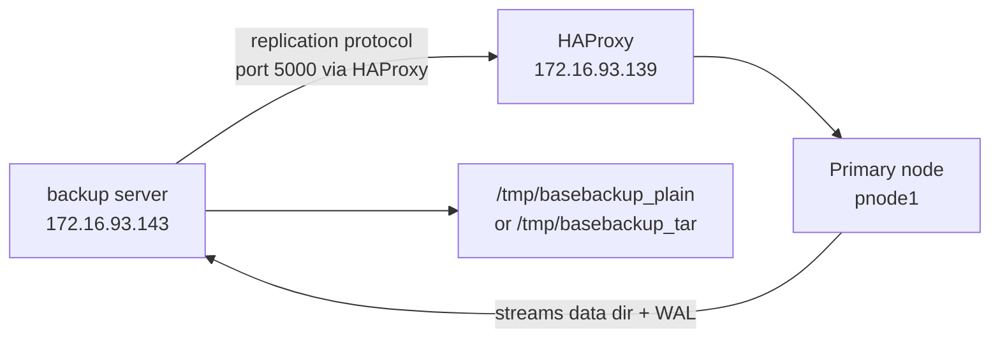

# pg_basebackup

## What is pg_basebackup?

`pg_basebackup` is PostgreSQL's built-in physical backup tool. While `pg_dump` creates a logical backup (SQL statements that reconstruct your data), `pg_basebackup` takes a binary-level copy of the entire PostgreSQL data directory — every file, exactly as it is on disk.

This means it copies everything inside `/data/patroni/` (on cluster nodes) — the base directory, WAL files, config files, system catalogs — all of it.

### pg_dump vs pg_basebackup

| Aspect | pg_dump | pg_basebackup |
|--------|---------|---------------|
| Type | Logical | Physical |
| Output | SQL or binary dump | Full data directory copy |
| Restore method | `psql` or `pg_restore` | Copy files, then start PostgreSQL |
| PITR possible | No | Yes (with WAL) |
| Selective restore | Yes (table/schema level) | No (entire cluster only) |
| Cross-version | Yes | No (same major version required) |
| Speed | Slower (SQL generation overhead) | Faster (raw file copy) |
| Can seed a replica | No | Yes (`-R` flag) |
| Source DB must be running | Yes | Yes (online backup) |

### How it works internally

When you run `pg_basebackup`, PostgreSQL does the following internally:

```
1. Forces a checkpoint      → flushes all dirty pages to disk
2. Enters backup mode       → starts writing special WAL records to keep backup consistent
3. Streams data files       → copies files over the replication protocol
4. Streams WAL              → captures all WAL generated during the backup
5. Exits backup mode        → backup is complete and consistent
```

This is why `pg_basebackup` requires a **replication connection**, not a regular database connection — it uses the same streaming protocol that replicas use.

### When is it used?

- **Disaster recovery** — full server loss, restore from physical backup
- **New replica setup** — Patroni itself uses `pg_basebackup` internally to clone replicas
- **PITR base** — combined with WAL archiving, enables point-in-time recovery

---

## Architecture Overview



The backup server connects to the primary through HAProxy (port 5000). HAProxy always routes port 5000 to the current primary — so even if a failover happens and the primary changes, the backup command does not need to change.

---

## Lab Environment

| Host | IP | Role |
|------|----|------|
| backup server | 172.16.93.143 | Where we run pg_basebackup (user: `restore`) |
| HAProxy | 172.16.93.139 | Routes port 5000 → current primary |
| pnode1/pnode4 | 172.16.93.136 / .142 | PostgreSQL cluster nodes (primary rotates) |

All hands-on commands in this guide are run on the **backup server** unless explicitly stated otherwise.

---

## Prerequisites

### Step 1 — Verify pg_basebackup is available

```bash
pg_basebackup --version
```

Expected output:
```
pg_basebackup (PostgreSQL) 16.x
```

If the command is not found, add the PostgreSQL bin directory to your PATH:
```bash
export PATH=/usr/pgsql-16/bin:$PATH
```

### Step 2 — Verify replication permission on the cluster

`pg_basebackup` uses the replication protocol, so the `replicator` user needs replication access from the backup server's subnet.

**On the current primary node** (check which node is primary first via `patronictl` or HAProxy stats):

```bash
# Run this on the primary cluster node
psql -U postgres -c "SELECT type, database, user_name, address, auth_method FROM pg_hba_file_rules WHERE database = '{replication}';"
```

Look for an entry covering `172.16.93.0/24` — this covers the backup server (`.143`). If it exists, you are good to proceed.

### Step 3 — Test connectivity from backup server

Run these on the **backup server**:

```bash
# Test via HAProxy (recommended — always hits the current primary regardless of failovers)
psql -h 172.16.93.139 -p 5000 -U replicator -d postgres -c "SELECT 1;"
```

Password: `replicator123`

If this returns `1`, the backup server can reach the primary. If it fails, check pg_hba.conf on the cluster.

---

## Part 1 — Plain Format Backup

Plain format (`-Fp`) copies the data directory as-is — same file structure, directly usable without extraction.

```bash
# Run on backup server
mkdir -p /tmp/basebackup_plain

pg_basebackup \
  -h 172.16.93.139 \
  -p 5000 \
  -U replicator \
  -D /tmp/basebackup_plain \
  -Fp \
  -Xs \
  -P \
  -v
```

**What each flag does:**

| Flag | Full form | Purpose |
|------|-----------|---------|
| `-h 172.16.93.139` | `--host` | Connect through HAProxy — always routes to current primary |
| `-p 5000` | `--port` | HAProxy port 5000 = primary (writes) |
| `-U replicator` | `--username` | Must use a user with replication privilege — not `postgres` |
| `-D /tmp/basebackup_plain` | `--pgdata` | Destination directory for the backup |
| `-Fp` | `--format=plain` | Copy files as-is (plain directory structure) |
| `-Xs` | `--wal-method=stream` | Stream WAL concurrently during backup — most reliable method |
| `-P` | `--progress` | Show percentage progress |
| `-v` | `--verbose` | Show each file being copied |

Password when prompted: `replicator123`

**Expected output:**
```
pg_basebackup: initiating base backup, waiting for checkpoint to complete
pg_basebackup: checkpoint completed
pg_basebackup: write-ahead log start point: 0/64000028 on timeline 26
pg_basebackup: starting background WAL receiver
pg_basebackup: created temporary replication slot "pg_basebackup_XXXX"
39842/39842 kB (100%), 1/1 tablespace
pg_basebackup: write-ahead log end point: 0/64000100
pg_basebackup: waiting for background process to finish streaming ...
pg_basebackup: syncing data to disk ...
pg_basebackup: renaming backup_manifest.tmp to backup_manifest
pg_basebackup: base backup completed
```

**Verify backup contents:**

```bash
ls -lh /tmp/basebackup_plain/
```

You will see the full PostgreSQL data directory structure:

```
backup_label          ← marks this as a valid base backup
backup_manifest       ← checksum manifest for integrity verification (PG13+)
base/                 ← actual database files
global/               ← cluster-wide tables (pg_database, pg_roles, etc.)
pg_hba.conf           ← copied from source
pg_wal/               ← WAL files captured during backup (-Xs)
postgresql.conf       ← Patroni-managed config
postgresql.base.conf  ← base config included by postgresql.conf
PG_VERSION            ← PostgreSQL major version number
patroni.dynamic.json  ← Patroni state file (not needed for standalone restore)
...
```

> **Note:** `postgresql.conf` will say `# Do not edit this file manually! It will be overwritten by Patroni!` — this is normal, it is Patroni's managed config from the source node.

---

## Part 2 — WAL Method Explained

The `-X` flag controls how WAL is handled during backup:

| Method | What it does | When to use |
|--------|-------------|-------------|
| `-Xn` (none) | Does not include WAL | Only if WAL is archived separately |
| `-Xf` (fetch) | Fetches WAL after backup completes | Simple setups |
| `-Xs` (stream) | Streams WAL concurrently during backup | **Recommended — most reliable** |

With `-Xs`, a background WAL receiver runs alongside the backup. This ensures no WAL is missed even on a busy server. With `-Xf`, WAL must still be available in `pg_wal/` when the backup finishes — which may not be the case on a busy server with WAL recycling.

---

## Part 3 — Exploring the Backup

Before restoring, understand what was captured:

```bash
# Check PostgreSQL version of the backup
cat /tmp/basebackup_plain/PG_VERSION

# See what config came from the source node
cat /tmp/basebackup_plain/postgresql.conf

# Check the backup label — shows when backup started and WAL position
cat /tmp/basebackup_plain/backup_label
```

**Inspect the config files — this is important:**

```bash
# See which settings will cause problems on a different server
grep -E "listen_addresses|archive_mode|archive_command|restore_command|hba_file|ident_file|primary_conninfo" \
  /tmp/basebackup_plain/postgresql.conf
```

You will see settings like:
```
listen_addresses = '172.16.93.136'        ← source node's IP — not valid on backup server
archive_mode = 'on'                        ← needs pgBackRest configured
archive_command = 'pgbackrest ...'         ← will fail if pgBackRest stanza is not set up
hba_file = '/data/patroni/pg_hba.conf'    ← path does not exist on backup server
ident_file = '/data/patroni/pg_ident.conf' ← same problem
primary_conninfo = '...'                   ← replica connection info — not needed for standalone
restore_command = 'pgbackrest ...'         ← WAL restore from archive — not needed for fresh start
```

These settings are fine for the source Patroni node — but will cause startup failures on the backup server. They must be fixed before starting PostgreSQL from this backup.

---

## Part 4 — Verify Backup Integrity

PostgreSQL 13+ generates a `backup_manifest` file with checksums for every file in the backup. Use `pg_verifybackup` to confirm the backup is intact:

```bash
/usr/pgsql-16/bin/pg_verifybackup /tmp/basebackup_plain/
```

Expected output:
```
backup successfully verified
```

If any file is corrupted or missing, it will report exactly which file failed and why.

---

## Part 5 — Restore: Start a Standalone Instance from the Backup

This simulates a disaster recovery scenario — starting a working PostgreSQL from the physical backup on a different server.

The strategy here is to start the restored instance on **port 5433** — leaving the existing PostgreSQL service on port 5432 untouched. This avoids disrupting anything already running.

### Step 5.1 — Fix config before starting

The backup contains `postgresql.conf` from the source Patroni node. Several settings will prevent PostgreSQL from starting on the backup server. Fix them with `sed`:

```bash
cd /tmp/basebackup_plain

# listen_addresses: source node's IP does not exist on backup server
# PostgreSQL tries to bind to this IP at startup — fails if IP is not on any interface
sed -i "s|listen_addresses = '172.16.93.136'|listen_addresses = '*'|" postgresql.conf

# archive_mode: pgBackRest stanza (postgres-cluster) is not configured on backup server
# Leaving this 'on' means every WAL segment triggers archive_command — which will fail
sed -i "s|archive_mode = 'on'|archive_mode = off|" postgresql.conf

# archive_command: comment out since archive_mode is now off
sed -i "s|^archive_command|#archive_command|" postgresql.conf

# hba_file and ident_file: these point to /data/patroni/ which does not exist here
# Commenting them out makes PostgreSQL use default location (inside the data directory itself)
sed -i "s|^hba_file|#hba_file|" postgresql.conf
sed -i "s|^ident_file|#ident_file|" postgresql.conf

# primary_conninfo: this was a replica — it knows where to connect for replication
# Not needed for a standalone instance
sed -i "s|^primary_conninfo|#primary_conninfo|" postgresql.conf

# primary_slot_name: replication slot name on the primary — not relevant for standalone
sed -i "s|^primary_slot_name|#primary_slot_name|" postgresql.conf

# restore_command: tells PostgreSQL where to fetch missing WAL from archive
# Not needed here — we are not doing PITR, just a fresh standalone start
sed -i "s|^restore_command|#restore_command|" postgresql.conf
```

**Verify all changes applied correctly:**

```bash
grep -E "listen_addresses|archive_mode|archive_command|restore_command|hba_file|ident_file|primary_conninfo|primary_slot_name" \
  postgresql.conf
```

Expected output — all problematic settings should be off or commented:
```
#archive_command = '...'
archive_mode = off
listen_addresses = '*'
#hba_file = '...'
#ident_file = '...'
#primary_conninfo = '...'
#primary_slot_name = '...'
#restore_command = '...'
```

### Step 5.2 — Fix ownership and permissions

PostgreSQL refuses to start if the data directory is not owned by the `postgres` user, or if permissions are too open:

```bash
sudo chown -R postgres:postgres /tmp/basebackup_plain
sudo chmod 700 /tmp/basebackup_plain
```

`chmod 700` means only the owner (`postgres`) can read/write/execute — PostgreSQL enforces this as a security requirement.

### Step 5.3 — Remove Patroni state file

```bash
sudo rm -f /tmp/basebackup_plain/patroni.dynamic.json
```

This file is used by Patroni to track cluster state. It has no meaning for a standalone PostgreSQL instance and can be safely removed.

### Step 5.4 — Start PostgreSQL on port 5433

```bash
sudo -u postgres /usr/pgsql-16/bin/pg_ctl start \
  -D /tmp/basebackup_plain \
  -o "-p 5433" \
  -l /tmp/basebackup_restored.log
```

**What each part does:**

| Part | Purpose |
|------|---------|
| `sudo -u postgres` | Run as the postgres OS user — required for PostgreSQL |
| `/usr/pgsql-16/bin/pg_ctl` | Full path to pg_ctl (PostgreSQL control utility) |
| `start` | Start the server |
| `-D /tmp/basebackup_plain` | Data directory to use |
| `-o "-p 5433"` | Pass `-p 5433` to the postgres process — override port |
| `-l /tmp/basebackup_restored.log` | Write startup log to this file |

**Check the log:**

```bash
cat /tmp/basebackup_restored.log
```

Look for:
```
database system was shut down at ...
database system is ready to accept connections
```

If you see errors instead, the most common causes are covered in the Troubleshooting section below.

### Step 5.5 — Verify the restored instance

```bash
# Is this a standby/replica or a standalone primary?
psql -h 127.0.0.1 -p 5433 -U postgres -c "SELECT pg_is_in_recovery();"
# Expected: f (false) — standalone primary, not a replica

# List all databases — practicedb should be here
psql -h 127.0.0.1 -p 5433 -U postgres -c "\l"

# Confirm data is intact
psql -h 127.0.0.1 -p 5433 -U postgres -d practicedb \
  -c "SELECT count(*) FROM app_schema.employees;"
```

### Step 5.6 — Stop the restored instance

```bash
sudo -u postgres /usr/pgsql-16/bin/pg_ctl stop \
  -D /tmp/basebackup_plain
```

---

## Part 6 — Compressed TAR Format Backup

In production, plain format backups consume a lot of disk space. TAR + gzip compression significantly reduces backup size.

```bash
mkdir -p /tmp/basebackup_tar

pg_basebackup \
  -h 172.16.93.139 \
  -p 5000 \
  -U replicator \
  -D /tmp/basebackup_tar \
  -Ft \
  -z \
  -Xs \
  -P \
  -v
```

**New flags:**

| Flag | Purpose |
|------|---------|
| `-Ft` | `--format=tar` — output as tar archives instead of plain files |
| `-z` | `--gzip` — compress with gzip |

```bash
# See what was created
ls -lh /tmp/basebackup_tar/
```

Output:
```
base.tar.gz       ← compressed data directory
pg_wal.tar.gz     ← compressed WAL files
backup_manifest   ← integrity manifest (not compressed)
```

**Compare sizes:**

```bash
du -sh /tmp/basebackup_plain/
du -sh /tmp/basebackup_tar/
```

The tar backup will be significantly smaller.

### Restoring from TAR format

TAR backups must be extracted before use:

```bash
mkdir -p /tmp/basebackup_tar_extracted

# Extract main data directory
tar xzf /tmp/basebackup_tar/base.tar.gz -C /tmp/basebackup_tar_extracted/

# Extract WAL files into pg_wal/ subdirectory
mkdir -p /tmp/basebackup_tar_extracted/pg_wal
tar xzf /tmp/basebackup_tar/pg_wal.tar.gz -C /tmp/basebackup_tar_extracted/pg_wal/
```

After extraction, the restore process is identical to Part 5 — fix config, fix permissions, start PostgreSQL.

---

## Part 7 — The -R Flag (Standby Seeding)

The `-R` flag is used when the backup is intended to become a replica, not a standalone instance.

```bash
pg_basebackup \
  -h 172.16.93.139 \
  -p 5000 \
  -U replicator \
  -D /tmp/basebackup_replica_seed \
  -Fp \
  -Xs \
  -R \
  -P \
  -v
```

With `-R`, pg_basebackup automatically creates two things:

**`standby.signal`** — an empty file whose presence tells PostgreSQL to start in standby (replica) mode

**`postgresql.auto.conf`** — contains the replication connection info:
```
primary_conninfo = 'host=172.16.93.139 port=5000 user=replicator ...'
```

```bash
# See what -R created
cat /tmp/basebackup_replica_seed/postgresql.auto.conf
ls /tmp/basebackup_replica_seed/standby.signal
```

If you want to use this as a **standalone** instance instead of a replica, remove these:

```bash
rm -f /tmp/basebackup_replica_seed/standby.signal
sed -i '/primary_conninfo/d' /tmp/basebackup_replica_seed/postgresql.auto.conf
```

> **Note:** Patroni uses `pg_basebackup -R` internally when bootstrapping a new replica node. The `-R` flag is what makes the cloned node automatically start streaming from the primary after being initialized.

---

## Troubleshooting

### Error: directory is not empty

```
pg_basebackup: error: directory "/tmp/basebackup_plain" exists but is not empty
```

`pg_basebackup` refuses to write into a non-empty directory. Remove it first:

```bash
rm -rf /tmp/basebackup_plain
```

### PostgreSQL fails to start — listen_addresses

**Symptom in log:**
```
FATAL: could not bind IPv4 address "172.16.93.136": Cannot assign requested address
```

**Cause:** `postgresql.conf` has the source node's IP in `listen_addresses`. The backup server does not have that IP on any network interface, so PostgreSQL cannot bind to it.

**Fix:**
```bash
sed -i "s|listen_addresses = '172.16.93.136'|listen_addresses = '*'|" \
  /tmp/basebackup_plain/postgresql.conf
```

### PostgreSQL fails to start — hba_file / ident_file

**Symptom in log:**
```
FATAL: could not open file "/data/patroni/pg_hba.conf": No such file or directory
```

**Cause:** Patroni writes `hba_file` and `ident_file` pointing to `/data/patroni/` which is the cluster node's data directory path — not present on the backup server.

**Fix:** Comment out both lines so PostgreSQL uses default paths (inside the data directory):
```bash
sed -i "s|^hba_file|#hba_file|" /tmp/basebackup_plain/postgresql.conf
sed -i "s|^ident_file|#ident_file|" /tmp/basebackup_plain/postgresql.conf
```

### PostgreSQL fails to start — archive_mode

**Symptom in log:**
```
FATAL: archive_command is not set but archive_mode is enabled
```
or pgBackRest errors about missing stanza configuration.

**Cause:** `archive_mode = on` tells PostgreSQL to archive every WAL segment using `archive_command`. If pgBackRest is not configured (or the stanza does not exist on this server), archiving fails and PostgreSQL refuses to continue.

**Fix:**
```bash
sed -i "s|archive_mode = 'on'|archive_mode = off|" /tmp/basebackup_plain/postgresql.conf
sed -i "s|^archive_command|#archive_command|" /tmp/basebackup_plain/postgresql.conf
```

### Permission denied on data directory

**Symptom in log:**
```
FATAL: data directory "/tmp/basebackup_plain" has wrong ownership
```

**Fix:**
```bash
sudo chown -R postgres:postgres /tmp/basebackup_plain
sudo chmod 700 /tmp/basebackup_plain
```

### Instance starts as replica instead of standalone

**Symptom:** `SELECT pg_is_in_recovery()` returns `t` — instance is in recovery/replica mode and will not accept writes.

**Cause:** `standby.signal` file exists (created by `-R` flag) or `primary_conninfo` is active in the config.

**Fix:**
```bash
rm -f /tmp/basebackup_plain/standby.signal
sed -i "s|^primary_conninfo|#primary_conninfo|" /tmp/basebackup_plain/postgresql.conf
sed -i "s|^primary_slot_name|#primary_slot_name|" /tmp/basebackup_plain/postgresql.conf
```

Then restart the instance.

---

## Key Concepts Summary

```
pg_basebackup essentials:

1. Physical backup — binary copy of the data directory
2. Requires replication privilege — uses streaming replication protocol
3. Source PostgreSQL must be running — this is an online backup
4. WAL method:
   -Xn → no WAL included
   -Xf → WAL fetched after backup
   -Xs → WAL streamed during backup (recommended)
5. Output formats:
   Plain (-Fp) → directly usable directory
   TAR  (-Ft)  → must extract before use, but smaller with -z
6. backup_manifest → per-file checksums, verify with pg_verifybackup
7. -R flag → creates standby.signal + primary_conninfo for replica seeding
8. Restore on a different server requires config fixes:
   - listen_addresses → change to '*'
   - hba_file / ident_file → comment out (use default paths)
   - archive_mode → off (unless pgBackRest stanza is configured)
   - primary_conninfo / primary_slot_name → comment out for standalone
   - restore_command → comment out unless doing PITR
9. Patroni uses pg_basebackup -R internally to bootstrap new replicas
```

---

## pg_dump vs pg_basebackup — When to Use Which

| Situation | Tool |
|-----------|------|
| Migrate a specific database or table | pg_dump |
| Full server disaster recovery | pg_basebackup |
| Set up a new replica | pg_basebackup |
| PITR base backup | pg_basebackup |
| Cross-version PostgreSQL migration | pg_dump |
| Quick selective data export | pg_dump |
| Patroni replica bootstrapping (internal) | pg_basebackup |
