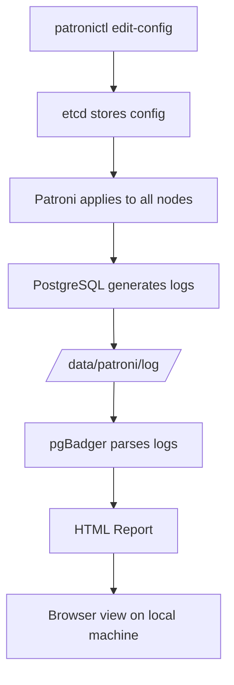
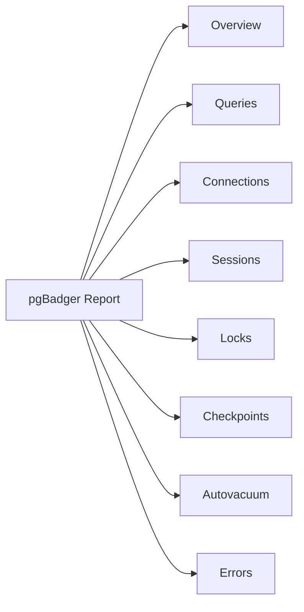

# pgBadger Practice Guide
## Patroni HA Cluster Setup (Rocky Linux 9 + PostgreSQL 16)

---

## What is pgBadger?

pgBadger is a standalone PostgreSQL log analyzer written in Perl. It parses PostgreSQL log files and generates a detailed HTML report containing:

- Slow query analysis (top queries by duration, frequency)
- Connection statistics (peaks, distribution by user/database/application)
- Lock wait events
- Checkpoint activity
- Error and warning summaries
- Autovacuum activity
- Temporary file usage

Senior DBAs use pgBadger to find performance bottlenecks, identify problematic queries before they cause incidents, and build evidence for query tuning decisions.

---

## Lab Environment Reference

| Hostname | IP | Role |
|----------|----|------|
| pnode1 | 172.16.93.136 | Primary (Leader) — pgBadger installed here |
| pnode4 | 172.16.93.137 | Replica |
| pnode5 | 172.16.93.144 | Replica |

**Key paths:**
- PostgreSQL data directory: `/data/patroni`
- PostgreSQL log directory: `/data/patroni/log/`
- Patroni config: `/etc/patroni/patroni.yml`

---

## Architecture Overview



> **Important:** In a Patroni cluster, PostgreSQL parameters are managed by Patroni — never edit `postgresql.conf` directly. All parameter changes go through `patronictl edit-config`, which stores them in etcd and distributes them to all nodes automatically.

---

## VMs to Start for This Practice

Only these two VMs are needed:

| VM | Reason |
|----|--------|
| **pnode1** | Primary — pgBadger installs here, main logs are here |
| **pnode4** | Replica — keeps the cluster healthy and active |

You do not need pnode2, pnode3, pnode5, haproxy, pmm, or backup for basic pgBadger practice.

---

## Step 1 — Install pgBadger

pgBadger is a standalone Perl script. Install it on **pnode1** from the EPEL repository.

**VM: pnode1**

```bash
sudo dnf install -y epel-release
sudo dnf install -y pgbadger
```

- `epel-release` enables the Extra Packages for Enterprise Linux repository — pgBadger is not in the default Rocky Linux repos.
- `pgbadger` installs the tool itself.

Verify the installation:

```bash
pgbadger --version
# Expected: pgBadger version 13.x
```

---

## Step 2 — Fix PATH for postgres User

pgBadger is installed at `/usr/bin/pgbadger`, but PostgreSQL binaries like `pgbench` and `psql` live at `/usr/pgsql-16/bin/`. By default, the `postgres` OS user does not have this directory in its PATH.

**Why this matters:** When you run `sudo -u postgres pgbench`, the shell uses the `postgres` user's environment, which does not include `/usr/pgsql-16/bin/`. This causes "command not found" errors even when the binary exists.

### Fix for pnode1 user (your login user)

**VM: pnode1**

```bash
sudo tee /etc/profile.d/pgsql16.sh << 'EOF'
export PATH=/usr/pgsql-16/bin:$PATH
EOF
```

- `tee` writes the content to the file and also prints it to the terminal.
- `/etc/profile.d/pgsql16.sh` — any `.sh` file placed here is sourced for all users on login. **Important:** the extension must be `.sh`, not `.d` or anything else, otherwise it will not be sourced automatically.

Apply to your current session:

```bash
source /etc/profile.d/pgsql16.sh
```

Verify:

```bash
which pgbench
# Expected: /usr/pgsql-16/bin/pgbench
```

### Fix for postgres OS user

```bash
sudo tee -a /var/lib/pgsql/.bash_profile << 'EOF'
export PATH=/usr/pgsql-16/bin:$PATH
EOF
```

- `-a` flag on `tee` means append — it adds to the end of the file without overwriting existing content.
- `/var/lib/pgsql/.bash_profile` is the postgres user's login profile. It already sources `/etc/profile`, so your system-wide fix above would also work, but adding it here is more explicit.

Verify:

```bash
sudo -u postgres bash -l -c 'which pgbench'
# Expected: /usr/pgsql-16/bin/pgbench
```

- `-l` (login) flag makes bash load the user's profile files (`.bash_profile`). Without `-l`, the PATH fix would not apply.

> **Note:** `sudo -u postgres somecommand` does NOT load `.bash_profile`. Always use `sudo -u postgres bash -l` when you need the full login environment, or switch to the postgres user with `sudo -u postgres bash -l` and run commands from there.

---

## Step 3 — Check and Configure PostgreSQL Logging

pgBadger needs specific logging parameters to produce useful reports. Before changing anything, check what is currently configured.

**VM: pnode1**

```bash
sudo -u postgres psql -c "SHOW log_destination;"
sudo -u postgres psql -c "SHOW logging_collector;"
sudo -u postgres psql -c "SHOW log_directory;"
sudo -u postgres psql -c "SHOW log_filename;"
sudo -u postgres psql -c "SHOW log_min_duration_statement;"
sudo -u postgres psql -c "SHOW log_line_prefix;"
```

Also check what Patroni currently has in the cluster config:

```bash
patronictl -c /etc/patroni/patroni.yml edit-config
```

This opens the cluster-wide config in an editor (vi by default). Press `:q` to exit without changes.

### Understanding the Parameters

| Parameter | What it does | Recommended for pgBadger |
|-----------|-------------|--------------------------|
| `log_destination` | Where logs go (stderr, csvlog, syslog) | `stderr` |
| `logging_collector` | Captures stderr output into log files | `on` |
| `log_directory` | Directory for log files (relative to data dir) | `log` → `/data/patroni/log/` |
| `log_filename` | Log file naming pattern | `postgresql-%Y-%m-%d.log` (daily files) |
| `log_min_duration_statement` | Log queries slower than N ms. `-1` = disabled, `0` = log everything | `0` for practice, `1000` for production |
| `log_line_prefix` | Prefix added to each log line — pgBadger parses this to extract metadata | See below |
| `log_connections` | Log each new connection | `on` |
| `log_disconnections` | Log when connections close | `on` |
| `log_lock_waits` | Log queries that waited for locks | `on` |
| `log_temp_files` | Log temp files larger than N KB. `0` = log all | `0` |
| `log_autovacuum_min_duration` | Log autovacuum runs longer than N ms. `0` = log all | `0` |
| `lc_messages` | Language for server messages — pgBadger requires English | `en_US.UTF-8` |

### About log_filename

The default `postgresql-%a.log` uses `%a` (weekday abbreviation — Mon, Tue...), which means only 7 files are ever created and they overwrite every week. This mixes multiple weeks' data in one file and makes historical analysis difficult.

For production, `postgresql-%Y-%m-%d.log` (daily files) is strongly preferred. For this practice session, the default weekday format is acceptable since we are only analyzing today's log.

### About log_line_prefix

pgBadger parses each log line's prefix to extract user, database, application, and client information. The prefix must include specific format codes:

| Code | Meaning |
|------|---------|
| `%t` | Timestamp with milliseconds |
| `%p` | Process ID |
| `%l` | Log line number per session |
| `%u` | Username |
| `%d` | Database name |
| `%a` | Application name |
| `%h` | Client hostname/IP |

**Required prefix for pgBadger:**
```
%t [%p]: [%l-1] user=%u,db=%d,app=%a,client=%h
```

Without `%a` and `%h`, pgBadger cannot produce application-level or client-level breakdowns.

### pgaudit Interaction

This cluster has `pgaudit` enabled with `pgaudit.log: ddl,write,role`. pgaudit logs every matching query with an `AUDIT:` prefix. When `log_min_duration_statement: 0` is also set, every single query appears in the log twice — once from pgaudit and once from the duration logging. This creates a very large log file in a short time.

For practice this is fine. In production, balance between `pgaudit` verbosity and `log_min_duration_statement` threshold carefully.

---

## Step 4 — Apply Logging Parameters via patronictl

**VM: pnode1**

```bash
patronictl -c /etc/patroni/patroni.yml edit-config
```

This opens the cluster-wide config. Locate the `parameters:` block and add or modify these entries:

```yaml
postgresql:
  parameters:
    # ... existing parameters stay as-is ...
    log_min_duration_statement: 0
    log_line_prefix: '%t [%p]: [%l-1] user=%u,db=%d,app=%a,client=%h '
    log_connections: 'on'
    log_disconnections: 'on'
    log_lock_waits: 'on'
    log_temp_files: 0
    log_autovacuum_min_duration: 0
    lc_messages: 'en_US.UTF-8'
```

Save and exit (`:wq` in vi). Patroni will ask:

```
Are you sure you want to apply these changes? [y/N]:
```

Type `y` and press Enter.

> **Why patronictl edit-config and not patroni.yml?**
> `patroni.yml` controls the Patroni daemon itself (etcd address, listen port, authentication). PostgreSQL parameters go into `patronictl edit-config`, which stores them in etcd and pushes them to all cluster nodes. If you edit `postgresql.conf` directly, Patroni will overwrite your changes at the next reload.

Verify the changes applied:

```bash
sudo -u postgres psql -c "SHOW log_min_duration_statement;"
sudo -u postgres psql -c "SHOW log_line_prefix;"
sudo -u postgres psql -c "SHOW log_connections;"
```

Expected output:
```
 log_min_duration_statement
----------------------------
 0
(1 row)

                 log_line_prefix
-------------------------------------------------
 %t [%p]: [%l-1] user=%u,db=%d,app=%a,client=%h
(1 row)

 log_connections
-----------------
 on
(1 row)
```

---

## Step 5 — Generate Workload

An empty or near-empty log produces a useless pgBadger report. You need realistic query traffic first.

### Check existing log files

**VM: pnode1**

```bash
sudo ls -lh /data/patroni/log/
```

Note which file corresponds to today (e.g., `postgresql-Sun.log` on a Sunday). This is the file you will feed to pgBadger.

### Switch to postgres user for convenience

```bash
sudo -u postgres bash -l
```

This switches your shell to the postgres user with a full login environment (PATH included). All subsequent commands in this section run as postgres.

### Initialize pgbench tables

```bash
pgbench -i -s 10 -d practicedb
```

- `-i` — initialize (create pgbench tables)
- `-s 10` — scale factor 10, which creates 1,000,000 rows in `pgbench_accounts`
- `-d practicedb` — use the practicedb database

This creates four tables: `pgbench_accounts`, `pgbench_branches`, `pgbench_tellers`, `pgbench_history`.

### Run load test

```bash
pgbench -d practicedb -c 5 -j 2 -T 60 -P 10
```

- `-c 5` — 5 concurrent client connections
- `-j 2` — 2 worker threads
- `-T 60` — run for 60 seconds
- `-P 10` — print progress every 10 seconds

This will produce approximately 40,000–50,000 transactions, all of which will appear in the log since `log_min_duration_statement: 0`.

Expected summary output:
```
number of transactions actually processed: 40173
latency average = 7.136 ms
tps = 669.445790
```

### Run additional slow queries

These manually crafted queries produce diverse log entries for pgBadger to analyze:

```bash
# Intentional slow queries using pg_sleep (simulates slow application queries)
psql -d practicedb -c "SELECT pg_sleep(0.2);"
psql -d practicedb -c "SELECT pg_sleep(0.15);"

# Join query across your existing tables
psql -d practicedb -c "SELECT * FROM app_schema.employees e JOIN app_schema.departments d ON e.department = d.name;"

# Aggregation query
psql -d practicedb -c "SELECT department, count(*), avg(salary) FROM app_schema.employees GROUP BY department ORDER BY avg DESC;"

# Filter query without index
psql -d practicedb -c "SELECT * FROM app_schema.employees WHERE salary > 50000 ORDER BY salary DESC;"
```

> **Note about the JOIN:** `employees.department` is `varchar` and `departments.name` is also `varchar`, so the join condition is `e.department = d.name`. Do not use `d.id` (which is `integer`) — PostgreSQL will throw a type mismatch error.

### Simulate a lock wait event

Open two terminal windows on pnode1. Run these simultaneously:

**Terminal 1:**
```bash
sudo -u postgres psql -d practicedb -c "
BEGIN;
UPDATE app_schema.employees SET salary = salary * 1.1 WHERE id = 1;
SELECT pg_sleep(5);
COMMIT;
"
```

**Terminal 2 (immediately after Terminal 1):**
```bash
sudo -u postgres psql -d practicedb -c "
UPDATE app_schema.employees SET salary = salary * 1.05 WHERE id = 1;
"
```

Terminal 2 will block waiting for Terminal 1's lock. After 5 seconds, Terminal 1 commits and Terminal 2 proceeds. This produces a `lock_wait` event in the log, which pgBadger will capture.

Exit the postgres shell when done:

```bash
exit
```

---

## Step 6 — Generate pgBadger Report

**VM: pnode1**

```bash
sudo pgbadger /data/patroni/log/postgresql-Sun.log \
  -o /tmp/pgbadger_report.html \
  --prefix '%t [%p]: [%l-1] user=%u,db=%d,app=%a,client=%h' \
  --timezone +6 \
  --verbose
```

- `/data/patroni/log/postgresql-Sun.log` — replace `Sun` with today's weekday abbreviation
- `-o /tmp/pgbadger_report.html` — output file location
- `--prefix` — must exactly match your `log_line_prefix` setting (without the trailing space)
- `--timezone +6` — your local timezone offset (Dhaka = UTC+6). Without this, timestamps in the report will be off
- `--verbose` — prints debug information including how many queries and events were parsed

### Expected verbose output

```
DEBUG: Autodetected log format 'default'
[========================>] Parsed 146295346 bytes (100.00%), queries: 281397, events: 8
LOG: Ok, generating html report...
```

If `queries:` shows a very low number (like 5), it means either:
- `log_min_duration_statement` was still at a high threshold when the workload ran — re-run the workload and regenerate
- The `--prefix` does not match your actual `log_line_prefix` — check for spacing differences

---

## Step 7 — View the Report

### Option A — Copy to local machine via SCP

On your **local machine** (Linux laptop):

```bash
scp pnode1@172.16.93.136:/tmp/pgbadger_report.html ~/Desktop/pgbadger_report.html
```

Then open in browser:
```bash
xdg-open ~/Desktop/pgbadger_report.html
```

### Option B — Serve directly from pnode1 via HTTP

**VM: pnode1 — open the firewall port first:**

```bash
sudo firewall-cmd --add-port=8080/tcp --zone=public
```

Then start a temporary HTTP server:

```bash
cd /tmp
python3 -m http.server 8080
```

On your local machine browser, navigate to:
```
http://172.16.93.136:8080/pgbadger_report.html
```

When done, stop the server (`Ctrl+C`) and remove the firewall rule:

```bash
sudo firewall-cmd --remove-port=8080/tcp --zone=public
```

> **Why remove the rule?** `--add-port` without `--permanent` only lasts until the next firewall reload or system reboot, but it is good practice to clean up temporary rules explicitly.

---

## Step 8 — Reading the Report

### Report Sections Overview



---

### Overview

The first thing you see when the report loads. Contains:

- **Global stats bar** — total queries parsed, total duration, unique normalized queries, number of events (errors/warnings)
- **Activity heatmap** — a grid showing query count by hour and day. Dark cells = heavy load periods. Use this to answer "when was the database busiest?"
- **Queries per second graph** — a time-series graph of QPS across the log period. Spikes here correspond to load test runs or application bursts
- **Top sections summary** — quick links to the top slow query, top error, top lock wait

**What to look for:** If the heatmap shows unexpected peaks at odd hours (e.g., 3am), that usually means a batch job, autovacuum storm, or backup activity is consuming resources during what should be a quiet window.

---

### Queries

The most valuable section for a DBA. Split into multiple sub-sections:

#### Slowest Queries
Lists the top N queries ranked by their single longest execution time. Each entry shows:
- The normalized query (parameter values replaced with `?` or `$1`)
- Max duration, min duration, average duration
- Number of times executed
- Which database and user ran it

**What to look for:** A query appearing here once with a very high max time but low average often means an occasional plan regression or lock wait inflated the duration. A query with consistently high average time needs index or rewrite attention.

#### Time-Consuming Queries (Most Important)
Ranks queries by **total cumulative time** = average duration × execution count.

This is more actionable than "slowest" in most cases. A query that takes 2ms but runs 500,000 times contributes 1,000 seconds of total DB time — far more impactful than a 10-second query that ran once.

**What to look for:** The top entries here are your optimization targets. Reducing the execution count (caching, deduplication) or reducing duration (indexing, rewriting) of these queries gives the most return.

#### Most Frequent Queries
Ranks by execution count regardless of duration. Useful for finding:
- Queries that could benefit from connection-side caching
- N+1 query patterns (an ORM running the same lookup in a loop)
- Health check queries hitting the DB too often

#### Queries by Type
Pie/bar chart breaking down SELECT vs INSERT vs UPDATE vs DELETE vs other. A write-heavy workload with very few SELECTs might indicate a background ETL or replication process dominating the log.

#### Normalized Query Detail
Clicking any query in the lists above shows a detail view with:
- Full normalized query text
- Duration histogram (distribution of fast vs slow executions)
- Timeline of when this query ran

---

### Connections

Shows connection activity over time.

- **Connections per hour graph** — peaks indicate application restarts, connection pool exhaustion events, or load spikes
- **Connections by database** — which databases are most active
- **Connections by user** — which users are connecting most frequently
- **Connections by application** — requires `%a` in `log_line_prefix` and `log_connections: on`. Shows which application (pgbench, psql, your app name set via `application_name`) is responsible for which traffic

**What to look for:** A large number of very short-lived connections (connect → 1 query → disconnect) is a connection pool misconfiguration. Connection counts should be relatively stable if a proper pool (PgBouncer, pgpool) is in front of the database.

**In your setup:** pgbench connections will show up here as `pgbench` application. HAProxy does not terminate connections itself — it proxies them — so the application name will still reflect the actual client.

---

### Sessions

Similar to Connections but focused on session duration rather than connection count.

- **Session time by database/user/application**
- **Average session duration** — very short sessions confirm the connection churn observation from the Connections section

---

### Locks

Populated only when `log_lock_waits: on` is set (which you configured).

- Lists every lock wait event: which query waited, which query held the lock, how long the wait lasted
- Shows the blocking query and the blocked query side by side
- Groups by table to show which tables are most contention-prone

**What to look for:** Frequent lock waits on the same table usually indicate missing indexes causing full table scans that hold locks longer, or application-level transaction design issues (long transactions holding locks while doing unrelated work).

**In your setup:** The lock scenario you ran (two concurrent UPDATEs on `employees WHERE id = 1`) will appear here with a ~5 second wait duration.

---

### Checkpoints

Populated when `log_checkpoints: on` is set.

- **Checkpoint frequency graph** — how often checkpoints occurred
- **Checkpoint duration** — how long each checkpoint took
- **Checkpoint type** — scheduled (timed) vs requested (forced by WAL pressure)

**What to look for:**

- If most checkpoints are "requested" rather than "scheduled", it means WAL is filling up faster than the checkpoint interval. Increase `max_wal_size` or reduce write load.
- Long checkpoint durations (tens of seconds) cause I/O spikes that affect query latency. Tune `checkpoint_completion_target` (default 0.9 is usually fine) and spread writes better.

**In your setup:** pgbench generates significant write activity, so you may see several checkpoints triggered during the load test.

---

### Autovacuum

Populated when `log_autovacuum_min_duration: 0` is set (which you configured).

- Lists every autovacuum and autoanalyze run: which table, how long it took, how many pages processed, how many dead tuples removed
- Shows tables sorted by autovacuum frequency

**What to look for:**

- A table being autovacuumed constantly means it has a very high update/delete rate and dead tuples are accumulating faster than autovacuum can clean. Consider tuning per-table autovacuum settings (`autovacuum_vacuum_scale_factor`, `autovacuum_vacuum_threshold`).
- Very long autovacuum runs on large tables can cause I/O pressure. If autovacuum is taking minutes on a table, check if it is being blocked by long-running transactions (autovacuum cannot remove tuples visible to any open transaction).

**In your setup:** `pgbench_accounts` (1 million rows, heavily updated by pgbench) will almost certainly appear here with frequent autovacuum activity.

---

### Errors / Events

All PostgreSQL log entries at level WARNING, ERROR, FATAL, or PANIC, grouped by normalized message.

- **Top errors by count** — most frequent error messages
- **Error timeline** — when errors occurred
- **Detail per error** — full message, database, user, application

**Common entries you might see:**

| Message | Meaning |
|---------|---------|
| `connection received` / `connection authorized` | Normal — from `log_connections: on` |
| `disconnection: session time` | Normal — from `log_disconnections: on` |
| `duration: X ms statement:` | Normal slow query log entries |
| `lock timeout` or `deadlock detected` | Application-level lock problems |
| `temporary file: size X` | Query spilled to disk — needs `work_mem` increase or query optimization |
| `checkpoint request` | WAL pressure causing forced checkpoints |
| `AUDIT:` prefixed lines | pgaudit entries — DDL/DML audit trail |

**In your setup:** pgaudit is active, so you will see many `AUDIT:` entries in the errors/events section. pgBadger does not have a dedicated pgaudit section — audit entries appear mixed in with other log events.

---

## Troubleshooting Reference

| Problem | Cause | Fix |
|---------|-------|-----|
| `sudo: pgbench: command not found` | `/usr/pgsql-16/bin` not in PATH | Use `sudo -u postgres bash -l` or full path |
| `pgbadger queries: 5` in output | `log_min_duration_statement` too high when workload ran | Set to `0`, re-run workload, regenerate report |
| `timezone not specified` warning | pgBadger cannot detect timezone from logs | Add `--timezone +6` to pgBadger command |
| `This site can't be reached` for HTTP server | Firewall blocking port 8080 | `sudo firewall-cmd --add-port=8080/tcp --zone=public` |
| `ERROR: operator does not exist: varchar = integer` | Wrong JOIN column — `departments.id` is int, `employees.department` is varchar | Join on `e.department = d.name` not `d.id` |
| `ERROR: column does not exist` | Assumed column names without checking schema | Always run `\d tablename` before writing queries against unfamiliar tables |
| Patroni overwrites `postgresql.conf` changes | Direct file edits are not supported in Patroni-managed clusters | Always use `patronictl edit-config` for PostgreSQL parameters |
| pgBadger report shows wrong times | Timezone mismatch | Add `--timezone +6` flag |
| `Permission denied` on log directory | Log files owned by postgres, readable only by postgres | Use `sudo pgbadger ...` or `sudo -u postgres pgbadger ...` |

---

## Key Takeaways

- pgBadger is a read-only log analyzer — it does not connect to PostgreSQL, it only reads log files.
- In a Patroni cluster, all PostgreSQL parameter changes must go through `patronictl edit-config`. Direct `postgresql.conf` edits will be overwritten.
- `log_min_duration_statement: 0` logs everything — useful for practice and debugging, but generates very large log files. Use a threshold (e.g., `1000` for 1 second) in production.
- The `--prefix` flag in the pgBadger command must exactly match your `log_line_prefix` setting. A mismatch causes pgBadger to fail to parse most log lines, resulting in near-zero query counts.
- `log_filename = postgresql-%a.log` (weekday rotation) mixes multiple weeks' data. For production use `postgresql-%Y-%m-%d.log` for clean daily files.
- pgaudit and `log_min_duration_statement: 0` together produce very high log volume. Each audited query appears twice in the log.
