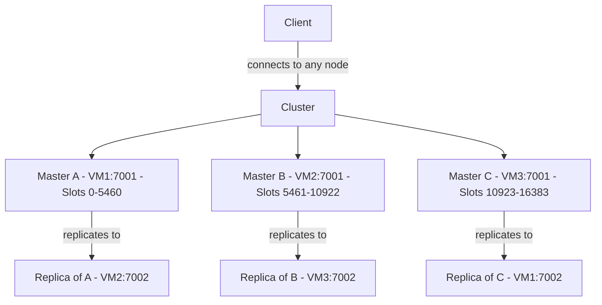
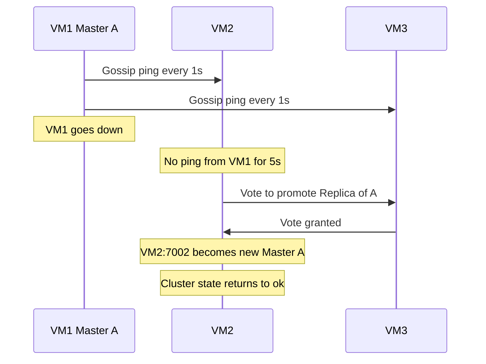

# Redis Cluster Setup Guide
## Ubuntu 24.04 LTS | 3-Node Cluster | 6 Instances

---

## Table of Contents
1. [Overview](#overview)
2. [Architecture](#architecture)
3. [Prerequisites](#prerequisites)
4. [Environment Details](#environment-details)
5. [Step 1 — System Preparation](#step-1--system-preparation)
6. [Step 2 — Directory Structure](#step-2--directory-structure)
7. [Step 3 — Configuration Files](#step-3--configuration-files)
8. [Step 4 — Fix Permissions](#step-4--fix-permissions)
9. [Step 5 — Firewall Configuration](#step-5--firewall-configuration)
10. [Step 6 — Start Redis Instances](#step-6--start-redis-instances)
11. [Step 7 — Create the Cluster](#step-7--create-the-cluster)
12. [Step 8 — Verify the Cluster](#step-8--verify-the-cluster)
13. [Step 9 — Test Data Sharding](#step-9--test-data-sharding)
14. [Step 10 — Failover Test](#step-10--failover-test)
15. [Step 11 — Systemd Service Setup](#step-11--systemd-service-setup)
16. [Step 12 — Auto-start on Reboot](#step-12--auto-start-on-reboot)
17. [Common Errors and Fixes](#common-errors-and-fixes)
18. [Quick Reference](#quick-reference)

---

## Overview

Redis Cluster is Redis's built-in distributed mode. It automatically **shards data** across multiple master nodes using hash slots. There are **16,384 hash slots** in total, divided equally among masters. Each key is assigned to a slot using `CRC16(key) % 16384`, and the master owning that slot handles the request.

The minimum setup requires **3 masters + 3 replicas = 6 nodes**. Each master has one replica on a different machine, so if any one VM goes down, its replica promotes itself to master and the cluster continues operating without data loss.

**Key concepts:**

- **Master** — Accepts read and write requests. Owns a range of hash slots.
- **Replica** — Mirrors a master's data in real time. Promotes to master on failover.
- **Hash Slot** — The unit of data distribution. 16,384 slots split across masters.
- **Gossip Protocol** — Nodes communicate health status every second using a separate port (`data port + 10000`).
- **Failover** — Automatic. When a master goes unreachable for `cluster-node-timeout` ms, remaining nodes vote to promote its replica.

---

## Architecture

### Cluster Layout

```
VM1 (172.16.93.146)          VM2 (172.16.93.147)          VM3 (172.16.93.148)
+------------------------+   +------------------------+   +------------------------+
|  Master A  :7001       |   |  Master B  :7001       |   |  Master C  :7001       |
|  Slots 0-5460          |   |  Slots 5461-10922      |   |  Slots 10923-16383     |
+------------------------+   +------------------------+   +------------------------+
|  Replica of C  :7002   |   |  Replica of A  :7002   |   |  Replica of B  :7002   |
+------------------------+   +------------------------+   +------------------------+
```

### Replication Direction

```
Master A (VM1:7001)  ──replicates to──>  Replica of A (VM2:7002)
Master B (VM2:7001)  ──replicates to──>  Replica of B (VM3:7002)
Master C (VM3:7001)  ──replicates to──>  Replica of C (VM1:7002)
```

> **Key rule:** A master and its replica are never on the same VM. If a VM goes down, its master is lost — but the replica on a different VM promotes automatically.

### Cluster Node Roles



### Failover Flow



---

## Prerequisites

- 3 VMs running **Ubuntu 24.04 LTS**
- Each VM: minimum **2GB RAM**, **2 vCPU**, **20GB disk**
- All VMs must reach each other over the network
- SSH access to all 3 VMs
- `sudo` privileges on all VMs

---

## Environment Details

| VM | Username | Hostname | IP Address |
|----|----------|----------|------------|
| VM1 | red-vm1 | ubls24-5 | 172.16.93.146 |
| VM2 | red-vm2 | ubls24-6 | 172.16.93.147 |
| VM3 | red-vm3 | ubls24-7 | 172.16.93.148 |

**Port allocation per VM:**

| Port | Purpose |
|------|---------|
| 7001 | Redis master instance (client connections) |
| 7002 | Redis replica instance (client connections) |
| 17001 | Gossip bus for port 7001 (auto-used by Redis) |
| 17002 | Gossip bus for port 7002 (auto-used by Redis) |
| 22 | SSH |

> Redis Cluster uses `data_port + 10000` automatically for inter-node gossip. You do not configure this — Redis handles it internally. But the firewall must allow it.

---

## Step 1 — System Preparation

**Run on all 3 VMs.**

### 1.1 Update the system

```bash
sudo apt update && sudo apt upgrade -y
```

### 1.2 Install Redis

```bash
sudo apt install redis-server -y
```

Verify:

```bash
redis-server --version
```

Expected: `Redis server v=7.0.x ...`

### 1.3 Stop and disable the default Redis service

Ubuntu starts a default Redis instance on port 6379 after installation. It must be stopped to avoid conflicts with our custom instances on ports 7001 and 7002.

```bash
sudo systemctl stop redis-server
sudo systemctl disable redis-server
```

Verify it is stopped:

```bash
sudo systemctl status redis-server
```

Should show `inactive (dead)`.

### 1.4 Verify network connectivity

**From VM1:**
```bash
ping -c 3 172.16.93.147
ping -c 3 172.16.93.148
```

**From VM2:**
```bash
ping -c 3 172.16.93.146
ping -c 3 172.16.93.148
```

**From VM3:**
```bash
ping -c 3 172.16.93.146
ping -c 3 172.16.93.147
```

All must succeed before proceeding.

---

## Step 2 — Directory Structure

**Run on all 3 VMs.**

```bash
sudo mkdir -p /etc/redis/cluster/7001
sudo mkdir -p /etc/redis/cluster/7002
sudo mkdir -p /var/lib/redis/7001
sudo mkdir -p /var/lib/redis/7002
sudo mkdir -p /var/log/redis
```

| Directory | Purpose |
|-----------|---------|
| `/etc/redis/cluster/7001/` | Config file and `nodes.conf` for the port 7001 instance |
| `/etc/redis/cluster/7002/` | Config file and `nodes.conf` for the port 7002 instance |
| `/var/lib/redis/7001/` | RDB snapshots and AOF files for port 7001 |
| `/var/lib/redis/7002/` | RDB snapshots and AOF files for port 7002 |
| `/var/log/redis/` | Log files for both instances |

> Each instance gets its own directory because Redis writes `nodes.conf` and data files there. Two instances sharing a directory would overwrite each other's files.

---

## Step 3 — Configuration Files

Each VM gets two config files — one per Redis instance. The only difference between VMs is the `bind` IP address.

### Configuration Parameters Explained

| Parameter | Meaning |
|-----------|---------|
| `port` | Port this instance listens on for client connections |
| `bind` | Which network interface to accept connections on. Using the VM's specific IP is more secure than `0.0.0.0` |
| `daemonize yes` | Run as a background process so the terminal is not blocked |
| `pidfile` | File where the process ID is stored. Used by systemd and `kill` commands to identify the process |
| `logfile` | Where this instance writes its logs |
| `dir` | Directory for RDB snapshot and AOF data files |
| `cluster-enabled yes` | Enable cluster mode. Without this Redis runs as a standalone single-node server |
| `cluster-config-file` | Redis auto-manages this file. It stores cluster topology — who is master, who is replica, which slots each node owns. Redis reads this on restart to rejoin the cluster without reconfiguration |
| `cluster-node-timeout 5000` | Milliseconds before a non-responding node is considered down and failover begins. 5000ms (5 seconds) is balanced — low enough to recover quickly, high enough to avoid false failovers |
| `appendonly yes` | Enable AOF persistence. Every write is logged to disk. On crash, Redis replays this log to recover data |
| `maxmemory 768mb` | Maximum RAM this instance can use. With 3GB RAM per VM and 2 instances, 768MB each leaves sufficient memory for the OS |
| `maxmemory-policy allkeys-lru` | When memory is full, evict the least recently used keys. Keeps Redis operational instead of refusing new writes |
| `loglevel notice` | Log important events only — not too verbose, not too silent |
| `requirepass` | Password required for any client or node connecting to this instance |
| `masterauth` | Password replicas use when authenticating with their master. Must match `requirepass` on all nodes so that after failover, the new replica can still connect to the promoted master |

### VM1 — Port 7001

```bash
sudo nano /etc/redis/cluster/7001/redis.conf
```

```
port 7001
bind 172.16.93.146
daemonize yes
pidfile /run/redis/redis_7001.pid
logfile /var/log/redis/redis_7001.log
dir /var/lib/redis/7001
cluster-enabled yes
cluster-config-file /etc/redis/cluster/7001/nodes.conf
cluster-node-timeout 5000
appendonly yes
appendfilename "appendonly.aof"
maxmemory 768mb
maxmemory-policy allkeys-lru
loglevel notice
requirepass redis123
masterauth redis123
```

### VM1 — Port 7002

```bash
sudo nano /etc/redis/cluster/7002/redis.conf
```

```
port 7002
bind 172.16.93.146
daemonize yes
pidfile /run/redis/redis_7002.pid
logfile /var/log/redis/redis_7002.log
dir /var/lib/redis/7002
cluster-enabled yes
cluster-config-file /etc/redis/cluster/7002/nodes.conf
cluster-node-timeout 5000
appendonly yes
appendfilename "appendonly.aof"
maxmemory 768mb
maxmemory-policy allkeys-lru
loglevel notice
requirepass redis123
masterauth redis123
```

### VM2 — Port 7001

Same as VM1 port 7001 config. Change only `bind`:

```
bind 172.16.93.147
```

### VM2 — Port 7002

Same as VM1 port 7002 config. Change only `bind`:

```
bind 172.16.93.147
```

### VM3 — Port 7001

Same as VM1 port 7001 config. Change only `bind`:

```
bind 172.16.93.148
```

### VM3 — Port 7002

Same as VM1 port 7002 config. Change only `bind`:

```
bind 172.16.93.148
```

---

## Step 4 — Fix Permissions

**Run on all 3 VMs.**

Redis runs as the `redis` system user. All directories it reads from or writes to must be owned by this user. If instances are ever started manually with `sudo`, the created files are owned by `root` and Redis as the `redis` user cannot access them.

```bash
sudo chown -R redis:redis /etc/redis/cluster
sudo chown -R redis:redis /var/lib/redis
sudo chown -R redis:redis /var/log/redis
sudo chmod -R 750 /etc/redis/cluster
sudo chmod -R 750 /var/lib/redis
sudo chmod -R 755 /var/log/redis
```

> Always run these permission commands after any manual interaction with Redis files, especially after starting instances with `sudo redis-server`.

---

## Step 5 — Firewall Configuration

**Run on all 3 VMs.**

```bash
sudo ufw allow 22/tcp
sudo ufw allow 7001/tcp
sudo ufw allow 7002/tcp
sudo ufw allow 17001/tcp
sudo ufw allow 17002/tcp
sudo ufw reload
```

| Port | Reason |
|------|--------|
| 22 | SSH — must be open or remote access is lost after reboot |
| 7001 | Redis client port for instance 1 |
| 7002 | Redis client port for instance 2 |
| 17001 | Cluster gossip port for instance 1 |
| 17002 | Cluster gossip port for instance 2 |

Verify:

```bash
sudo ufw status
```

> If UFW is inactive: `sudo ufw enable && sudo ufw reload`

---

## Step 6 — Start Redis Instances

**Run on all 3 VMs.**

```bash
sudo redis-server /etc/redis/cluster/7001/redis.conf
sudo redis-server /etc/redis/cluster/7002/redis.conf
```

Verify both processes are running:

```bash
ps aux | grep redis-server
```

You should see two `redis-server` processes per VM.

Check ports are listening:

```bash
sudo ss -tlnp | grep redis
```

Check logs for errors:

```bash
tail /var/log/redis/redis_7001.log
tail /var/log/redis/redis_7002.log
```

Both should end with `Ready to accept connections`.

---

## Step 7 — Create the Cluster

**Run once, from VM1 only.**

```bash
redis-cli --cluster create \
  172.16.93.146:7001 \
  172.16.93.147:7001 \
  172.16.93.148:7001 \
  172.16.93.146:7002 \
  172.16.93.147:7002 \
  172.16.93.148:7002 \
  --cluster-replicas 1 \
  -a redis123
```

**What happens:**

- The first three nodes become masters (Redis selects the first `N / (replicas + 1)` nodes)
- The remaining three become replicas
- `--cluster-replicas 1` means one replica per master
- Redis automatically assigns replicas to masters ensuring no master and replica share the same IP
- 16,384 hash slots are divided evenly: slots 0-5460, 5461-10922, 10923-16383

When prompted, type `yes` and press Enter.

Expected final output:
```
[OK] All nodes agree about slots configuration.
[OK] All 16384 slots covered.
```

---

## Step 8 — Verify the Cluster

### Cluster health

```bash
redis-cli -h 172.16.93.146 -p 7001 -a redis123 cluster info
```

| Field | Expected | Meaning |
|-------|----------|---------|
| `cluster_state` | ok | All nodes healthy |
| `cluster_slots_assigned` | 16384 | All slots assigned |
| `cluster_slots_ok` | 16384 | All slots operational |
| `cluster_slots_pfail` | 0 | No nodes in probably-failed state |
| `cluster_slots_fail` | 0 | No nodes confirmed failed |
| `cluster_known_nodes` | 6 | All 6 nodes discovered |
| `cluster_size` | 3 | 3 active masters |

### Node list

```bash
redis-cli -h 172.16.93.146 -p 7001 -a redis123 cluster nodes
```

Shows each node's ID, address, role (master/slave), master it replicates (for replicas), and slot range (for masters).

---

## Step 9 — Test Data Sharding

Connect in cluster mode — the `-c` flag enables automatic slot redirection:

```bash
redis-cli -c -h 172.16.93.146 -p 7001 -a redis123
```

Write keys:

```
SET name "Masud"
SET city "Dhaka"
SET task "Redis Cluster"
SET country "Bangladesh"
SET age "27"
```

You will see automatic redirects:

```
-> Redirected to slot [5798] located at 172.16.93.147:7001
OK
```

This confirms sharding is working. Each key's hash maps to a slot, and Redis routes the write to the correct master automatically. Without `-c`, this redirect would return a `MOVED` error instead.

Read back:

```
GET name
GET city
GET age
```

Type `exit` when done.

---

## Step 10 — Failover Test

### 10.1 Record current masters

```bash
redis-cli -h 172.16.93.146 -p 7001 -a redis123 cluster nodes | grep master
```

### 10.2 Kill Master A on VM1

```bash
sudo kill $(cat /run/redis/redis_7001.pid)
```

### 10.3 Wait 10 seconds, then check from VM2

```bash
redis-cli -h 172.16.93.147 -p 7001 -a redis123 cluster nodes
```

Expected changes:
- `172.16.93.146:7001` shows `master,fail`
- The node that was its replica now shows `master` with slots `0-5460`

### 10.4 Verify data is still accessible

```bash
redis-cli -c -h 172.16.93.147 -p 7001 -a redis123
GET name
GET city
GET age
```

Data should still be available — it was replicated before the master went down.

### 10.5 Bring Master A back

On VM1:

```bash
sudo redis-server /etc/redis/cluster/7001/redis.conf
```

Wait 10 seconds then check:

```bash
redis-cli -h 172.16.93.146 -p 7001 -a redis123 cluster nodes
```

VM1:7001 rejoins as a **slave** of the promoted master. Redis does not automatically failback — the promoted replica stays as master. This is intentional: automatic failback would trigger another election and brief instability.

---

## Step 11 — Systemd Service Setup

Systemd services ensure Redis starts automatically on boot and restarts if it crashes.

### 11.1 Create the tmpfiles rule

`/run/` is a tmpfs — it lives in RAM and is cleared on every reboot. Redis writes its PID file to `/run/redis/`. Without this rule the directory is gone after reboot and Redis fails its first start attempt.

**Run on all 3 VMs:**

```bash
sudo nano /etc/tmpfiles.d/redis.conf
```

```
d /run/redis 0755 redis redis -
```

Apply immediately:

```bash
sudo systemd-tmpfiles --create /etc/tmpfiles.d/redis.conf
```

Verify:

```bash
ls -la /run/redis
```

### 11.2 Service files

**VM1 — `/etc/systemd/system/redis-7001.service`**

```bash
sudo nano /etc/systemd/system/redis-7001.service
```

```ini
[Unit]
Description=Redis Cluster Node Port 7001
After=network.target

[Service]
Type=forking
ExecStart=/usr/bin/redis-server /etc/redis/cluster/7001/redis.conf
ExecStop=/usr/bin/redis-cli -h 172.16.93.146 -p 7001 -a redis123 shutdown
PIDFile=/run/redis/redis_7001.pid
User=redis
Group=redis
Restart=always
RestartSec=5
TimeoutStartSec=60

[Install]
WantedBy=multi-user.target
```

**VM1 — `/etc/systemd/system/redis-7002.service`**

```bash
sudo nano /etc/systemd/system/redis-7002.service
```

```ini
[Unit]
Description=Redis Cluster Node Port 7002
After=network.target

[Service]
Type=forking
ExecStart=/usr/bin/redis-server /etc/redis/cluster/7002/redis.conf
ExecStop=/usr/bin/redis-cli -h 172.16.93.146 -p 7002 -a redis123 shutdown
PIDFile=/run/redis/redis_7002.pid
User=redis
Group=redis
Restart=always
RestartSec=5
TimeoutStartSec=60

[Install]
WantedBy=multi-user.target
```

**VM2** — Same files. Change `ExecStop` IP to `172.16.93.147`

**VM3** — Same files. Change `ExecStop` IP to `172.16.93.148`

**Service parameters:**

| Parameter | Meaning |
|-----------|---------|
| `Type=forking` | Redis daemonizes itself. Systemd waits for the parent process to exit before marking the service as started |
| `ExecStop` | Gracefully shuts down Redis, flushing AOF to disk before stopping |
| `PIDFile` | Must match `pidfile` in redis.conf. Systemd uses this to track the process |
| `User=redis` | Run as the `redis` system user, not root |
| `Restart=always` | Restart automatically if the process exits for any reason |
| `RestartSec=5` | Wait 5 seconds before restarting |
| `TimeoutStartSec=60` | Allow up to 60 seconds to start before declaring failure |

### 11.3 Enable and start

**Run on all 3 VMs:**

```bash
sudo systemctl daemon-reload
sudo systemctl enable redis-7001
sudo systemctl enable redis-7002
sudo systemctl start redis-7001
sudo systemctl start redis-7002
```

Verify:

```bash
sudo systemctl status redis-7001
sudo systemctl status redis-7002
```

Both should show `Active: active (running)`.

---

## Step 12 — Auto-start on Reboot

Reboot a VM to confirm everything recovers automatically:

```bash
sudo reboot
```

After the VM is back up, SSH in and check:

```bash
sudo systemctl status redis-7001
sudo systemctl status redis-7002
redis-cli -h <VM_IP> -p 7001 -a redis123 cluster info
```

Expected: both services `active (running)`, `cluster_state:ok`.

> **Note on startup logs:** On first boot, systemd may log a `Failed to start` message before immediately retrying. This happens because `tmpfiles.d` creates `/run/redis/` slightly after systemd's first start attempt. The `Restart=always` directive causes an automatic retry which succeeds. If the final status is `active (running)`, the setup is correct.

---

## Common Errors and Fixes

### `DENIED Redis is running in protected mode`

**Cause:** No password set and Redis is bound to a specific IP. Redis blocks external connections as a safety measure.

**Fix:** Add `requirepass` and `masterauth` to all config files, then restart all instances. Do not use `protected-mode no` — setting a password is the correct and secure approach.

---

### `Can't open the log file: Permission denied`

**Cause:** Log directory or files are owned by `root` from a previous manual `sudo redis-server` start.

**Fix:**
```bash
sudo chown -R redis:redis /var/log/redis
sudo chown -R redis:redis /etc/redis/cluster
sudo chown -R redis:redis /var/lib/redis
```

---

### `Can't open nodes.conf in order to acquire a lock: Permission denied`

**Cause:** `nodes.conf` was created by root when Redis was started manually with `sudo`.

**Fix:** Same `chown` commands as above.

---

### `Can't open PID file /run/redis/redis_7001.pid: No such file or directory`

**Cause:** `/run/redis/` directory does not exist. The `/run/` filesystem is tmpfs and is cleared on every reboot.

**Fix:** Create the `tmpfiles.d` rule in Step 11.1 so systemd recreates this directory on every boot.

---

### SSH not accessible after reboot

**Cause:** UFW was active but port 22 was not allowed before enabling it.

**Fix:** From the VM console directly:
```bash
sudo ufw allow 22/tcp
sudo ufw reload
```

---

### Cluster creation fails with connection errors

**Cause:** One or more instances are not running, or firewall is blocking gossip ports.

**Fix:**
1. Verify all 6 instances are running: `ps aux | grep redis-server` on all 3 VMs
2. Check firewall: `sudo ufw status`
3. Check logs: `tail /var/log/redis/redis_7001.log`

---

## Quick Reference

```bash
# Connect to cluster (with auto-redirect)
redis-cli -c -h 172.16.93.146 -p 7001 -a redis123

# Cluster health
redis-cli -h 172.16.93.146 -p 7001 -a redis123 cluster info

# View all nodes and roles
redis-cli -h 172.16.93.146 -p 7001 -a redis123 cluster nodes

# View slot distribution
redis-cli -h 172.16.93.146 -p 7001 -a redis123 cluster shards

# Service status
sudo systemctl status redis-7001
sudo systemctl status redis-7002

# Live logs
tail -f /var/log/redis/redis_7001.log
tail -f /var/log/redis/redis_7002.log

# Restart a service
sudo systemctl restart redis-7001

# Stop all instances on a VM
sudo systemctl stop redis-7001
sudo systemctl stop redis-7002

# Manual failover (promote a replica back to master)
redis-cli -h <replica_ip> -p <replica_port> -a redis123 cluster failover
```

---

*Tested on Ubuntu 24.04 LTS | Redis 7.0.15 | VMware Workstation*
