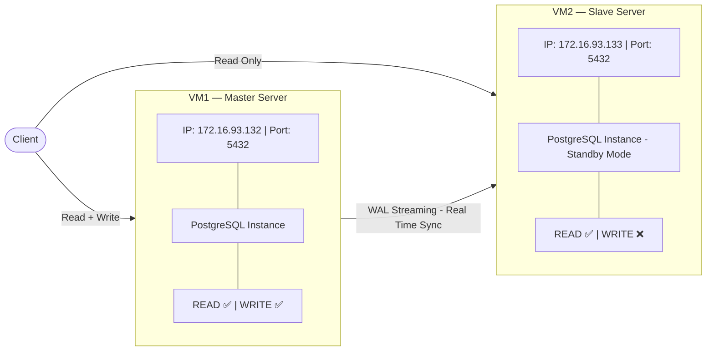
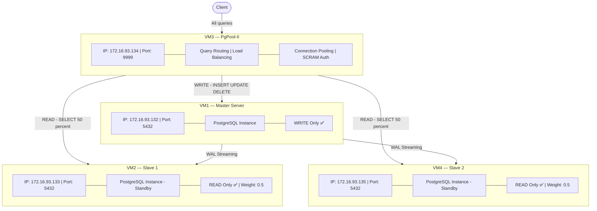
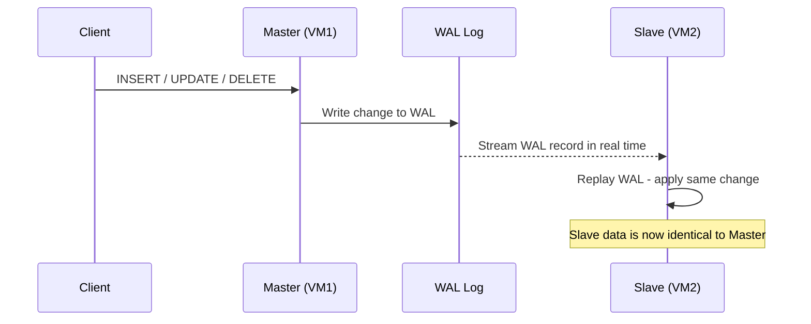
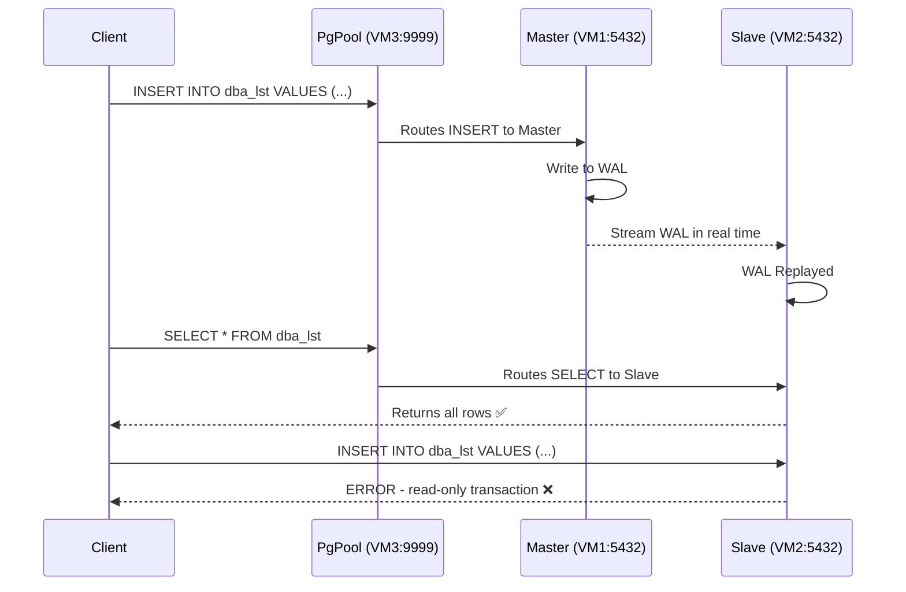
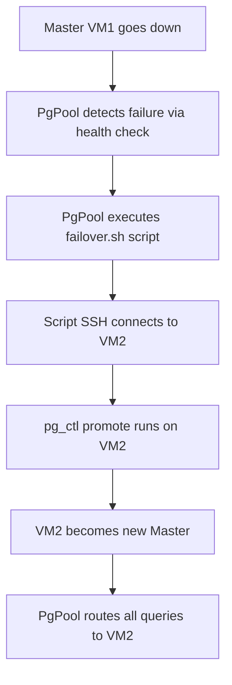

# PostgreSQL Master-Slave Streaming Replication with PgPool-II
## Complete Step-by-Step Guide

---

## Table of Contents

- [Overview](#overview)
- [Environment Setup](#environment-setup)
- [Architecture](#architecture)
- [PART 1 — Master-Slave Streaming Replication](#part-1--master-slave-streaming-replication)
  - [What is a PostgreSQL Cluster?](#what-is-a-postgresql-cluster)
  - [What is Streaming Replication?](#what-is-streaming-replication)
  - [MASTER SERVER Configuration](#master-server-configuration)
    - [Step 1 — Create Replication User](#step-1--create-replication-user)
    - [Step 2 — Configure postgresql.conf](#step-2--configure-postgresqlconf)
    - [Step 3 — Configure pg_hba.conf](#step-3--configure-pg_hbaconf)
    - [Step 4 — Open Firewall Port](#step-4--open-firewall-port)
    - [Step 5 — Restart Master PostgreSQL](#step-5--restart-master-postgresql)
    - [Step 6 — Verify Master Configuration](#step-6--verify-master-configuration)
  - [SLAVE SERVER Configuration](#slave-server-configuration)
    - [Step 7 — Stop PostgreSQL on Slave](#step-7--stop-postgresql-on-slave)
    - [Step 8 — Clear Slave Data Directory](#step-8--clear-slave-data-directory)
    - [Step 9 — Take Base Backup from Master](#step-9--take-base-backup-from-master)
    - [Step 10 — Verify Backup Files](#step-10--verify-backup-files)
    - [Step 11 — Start PostgreSQL on Slave](#step-11--start-postgresql-on-slave)
  - [Verify Replication](#verify-replication)
    - [Step 12 — Check Slave Connection on Master](#step-12--check-slave-connection-on-master)
    - [Step 13 — Check Slave is in Standby Mode](#step-13--check-slave-is-in-standby-mode)
  - [Test Replication](#test-replication)
    - [Step 14 — Create Database and Table on Master](#step-14--create-database-and-table-on-master)
    - [Step 15 — Read Data from Slave](#step-15--read-data-from-slave)
    - [Step 16 — Prove Slave is Read-Only](#step-16--prove-slave-is-read-only)
    - [Step 17 — Real-Time Sync Test](#step-17--real-time-sync-test)
- [PART 2 — PgPool-II Setup](#part-2--pgpool-ii-setup)
  - [What is PgPool-II?](#what-is-pgpool-ii)
  - [CREATE VM3](#create-vm3)
    - [Step 18 — Create New VM in VMware](#step-18--create-new-vm-in-vmware)
    - [Step 19 — Install PostgreSQL Client Tools on VM3](#step-19--install-postgresql-client-tools-on-vm3)
    - [Step 20 — Install PgPool-II on VM3](#step-20--install-pgpool-ii-on-vm3)
  - [Prepare Master VM1 for PgPool](#prepare-master-vm1-for-pgpool)
    - [Step 21 — Create Application User](#step-21--create-application-user)
    - [Step 22 — Create Dedicated PgPool User](#step-22--create-dedicated-pgpool-user)
    - [Step 23 — Update pg_hba.conf on Master to Allow VM3](#step-23--update-pg_hbaconf-on-master-to-allow-vm3)
    - [Step 24 — Change Password Encryption to md5 on Master](#step-24--change-password-encryption-to-md5-on-master)
    - [Step 25 — Update pg_hba.conf Auth Method to md5](#step-25--update-pg_hbaconf-auth-method-to-md5)
  - [Prepare Slave VM2 for PgPool](#prepare-slave-vm2-for-pgpool)
    - [Step 26 — Update pg_hba.conf on Slave to Allow VM3](#step-26--update-pg_hbaconf-on-slave-to-allow-vm3)
    - [Step 27 — Change Password Encryption to md5 on Slave](#step-27--change-password-encryption-to-md5-on-slave)
    - [Step 28 — Ensure listen_addresses is Correct on Slave](#step-28--ensure-listen_addresses-is-correct-on-slave)
  - [Configure PgPool on VM3](#configure-pgpool-on-vm3)
    - [Step 29 — Test Connectivity from VM3](#step-29--test-connectivity-from-vm3)
    - [Step 30 — Configure pgpool.conf](#step-30--configure-pgpoolconf)
    - [Step 31 — Configure pool_hba.conf for SCRAM Authentication](#step-31--configure-pool_hbaconf-for-scram-authentication)
    - [Step 32 — Create Encryption Key File](#step-32--create-encryption-key-file)
    - [Step 33 — Create PgPool Password File with AES Encryption](#step-33--create-pgpool-password-file-with-aes-encryption)
    - [Step 34 — Start and Enable PgPool](#step-34--start-and-enable-pgpool)
  - [Verify and Test PgPool](#verify-and-test-pgpool)
    - [Step 35 — Check PgPool Node Status](#step-35--check-pgpool-node-status)
    - [Step 36 — Create Test Database and Table via PgPool](#step-36--create-test-database-and-table-via-pgpool)
    - [Step 37 — Verify Replication via Slave](#step-37--verify-replication-via-slave)
    - [Step 38 — Verify Slave is Read-Only](#step-38--verify-slave-is-read-only)
    - [Step 39 — Verify Load Balancing](#step-39--verify-load-balancing)
    - [Step 40 — Real-Time Sync Test Through PgPool](#step-40--real-time-sync-test-through-pgpool)
- [PART 3 — Add Second Slave VM4](#part-3--add-second-slave-vm4)
  - [Step 41 — Create VM4 and Install PostgreSQL](#step-41--create-vm4-and-install-postgresql)
  - [Step 42 — Allow VM4 on Master](#step-42--allow-vm4-on-master)
  - [Step 43 — Set Up VM4 as Slave](#step-43--set-up-vm4-as-slave)
  - [Step 44 — Verify VM4 Replication](#step-44--verify-vm4-replication)
  - [Step 45 — Add VM4 to PgPool](#step-45--add-vm4-to-pgpool)
  - [Step 46 — Add appuser_bi with AES Encrypted Password](#step-46--add-appuser_bi-with-aes-encrypted-password)
  - [Step 47 — Verify Final Setup](#step-47--verify-final-setup)
- [OPTIONAL — Automatic Failover Setup](#optional--automatic-failover-setup)
- [Troubleshooting](#troubleshooting)

---

## Overview

This guide walks through three parts:

**Part 1** — Setting up PostgreSQL Master-Slave Streaming Replication across two servers so that any data written to Master is automatically synced to Slave in real time.

**Part 2** — Setting up PgPool-II on a third server to sit in front of the replication cluster, handling query routing, load balancing, connection pooling, and SCRAM authentication with AES encrypted passwords.

**Part 3** — Adding a second Slave server (VM4) for better read scalability and adding a BI user with separate authentication.

---

## Environment Setup

| Role | VM | IP Address | Port |
|------|----|------------|------|
| Master | VM1 | 172.16.93.132 | 5432 |
| Slave 1 | VM2 | 172.16.93.133 | 5432 |
| PgPool | VM3 | 172.16.93.134 | 9999 |
| Slave 2 | VM4 | 172.16.93.135 | 5432 |

> Replace all IP addresses with your actual IPs throughout this guide.

To find your IP on each VM:

```bash
ip a
```

Look under `ens33` for the `inet` value. **Never use `lo` (127.0.0.1)** — that is the loopback address, only works locally.

---

## Architecture

### Part 1 — Streaming Replication Only



### Part 2 and 3 — Final Architecture with PgPool and Two Slaves



---

# PART 1 — Master-Slave Streaming Replication

---

## What is a PostgreSQL Cluster?

In PostgreSQL, a **"cluster"** does not mean a group of machines. It refers to a **single PostgreSQL instance managing a single data directory**. When you install PostgreSQL, it automatically creates one cluster.

The data directory lives here on Ubuntu:

```
/var/lib/postgresql/16/main/
├── base/             ← actual database files
├── global/           ← cluster-wide data (roles, users)
├── pg_wal/           ← Write-Ahead Log files
├── postgresql.conf   ← main configuration file
├── pg_hba.conf       ← authentication/access rules
├── PG_VERSION        ← version number
└── postmaster.pid    ← running process ID
```

> **One Cluster = One Data Directory = One PostgreSQL Instance**

---

## What is Streaming Replication?

Every change in PostgreSQL (INSERT, UPDATE, DELETE) is first written to a **WAL (Write-Ahead Log)** file before being applied to actual data. In Streaming Replication:

1. Master writes changes to WAL
2. WAL is **streamed in real time** to the Slave
3. Slave **replays** the WAL — applies the same changes to its own data
4. Slave stays continuously in sync with Master



---

## MASTER SERVER Configuration

> All steps in this section are performed on **VM1 (Master)**

---

### Step 1 — Create Replication User

```bash
sudo -i -u postgres
psql
```

> - **`sudo -i -u postgres`** — switches to the `postgres` OS user who owns all PostgreSQL data files
> - **`psql`** — opens the PostgreSQL interactive terminal

```sql
CREATE ROLE replicator WITH REPLICATION LOGIN PASSWORD 'replica123';
\du
\q
exit
```

> - **`WITH REPLICATION`** — grants permission to initiate WAL streaming
> - **`LOGIN`** — allows this role to log in
> - **`\du`** — lists all roles to verify creation

---

### Step 2 — Configure postgresql.conf

```bash
sudo nano /etc/postgresql/16/main/postgresql.conf
```

> Use `Ctrl+W` to search for each setting. Remove `#` to uncomment.

**`listen_addresses`**
```
listen_addresses = '*'
```
> Allows PostgreSQL to accept connections from any IP. Default `localhost` would block the Slave.

**`wal_level`**
```
wal_level = replica
```
> `replica` includes everything needed for streaming replication.

**`max_wal_senders`**
```
max_wal_senders = 10
```
> Maximum number of Slave servers that can connect simultaneously.

**`wal_keep_size`**
```
wal_keep_size = 64
```
> Minimum MB of WAL files to keep on disk so lagging Slaves can catch up.

Save: `Ctrl+X` → `Y` → `Enter`

---

### Step 3 — Configure pg_hba.conf

```bash
sudo nano /etc/postgresql/16/main/pg_hba.conf
```

Add at the bottom:

```
host    replication     replicator      172.16.93.133/32        md5
```

> | Field | Meaning |
> |-------|---------|
> | `replication` | for WAL streaming connections only |
> | `replicator` | only this username is allowed |
> | `172.16.93.133/32` | only from this exact Slave IP |
> | `md5` | password-based authentication |
>
> `/32` means only this single exact IP. More secure than `/24` which allows the entire subnet.

Save and exit.

---

### Step 4 — Open Firewall Port

```bash
sudo ufw allow 5432/tcp
sudo ufw reload
```

> Opens port 5432 so the Slave can connect. Skip if `ufw` is inactive (`sudo ufw status` to check).

---

### Step 5 — Restart Master PostgreSQL

```bash
sudo systemctl restart postgresql
sudo pg_lsclusters
```

Expected:
```
Ver  Cluster  Port  Status  Owner
16   main     5432  online  postgres
```

> `online` = running correctly. `active (exited)` in `systemctl status` is normal on Ubuntu — what matters is `pg_lsclusters` shows `online`.

---

### Step 6 — Verify Master Configuration

```bash
sudo -i -u postgres
psql -c "SHOW wal_level;"
psql -c "SHOW listen_addresses;"
psql -c "SHOW max_wal_senders;"
exit
```

Should return `replica`, `*`, and `10` respectively ✅

---

## SLAVE SERVER Configuration

> All steps in this section are performed on **VM2 (Slave)**

---

### Step 7 — Stop PostgreSQL on Slave

```bash
sudo systemctl stop postgresql
sudo pg_lsclusters
```

Status should show `down` ✅

> Slave must be stopped before replacing its data directory with Master's copy.

---

### Step 8 — Clear Slave Data Directory

```bash
sudo -i -u postgres
rm -rf /var/lib/postgresql/16/main/*
ls /var/lib/postgresql/16/main/
```

No output = empty = correct ✅

> Removes the default empty cluster. Must be cleared before copying Master's data.

---

### Step 9 — Take Base Backup from Master

```bash
pg_basebackup -h 172.16.93.132 -U replicator -D /var/lib/postgresql/16/main/ -P -Xs -R
```

> | Flag | Meaning |
> |------|---------|
> | `-h 172.16.93.132` | Master's IP |
> | `-U replicator` | connect as this user |
> | `-D /var/lib/.../main/` | write backup to Slave's data directory |
> | `-P` | show progress percentage |
> | `-Xs` | stream WAL during backup so no changes are missed |
> | `-R` | auto-create `standby.signal` and write `primary_conninfo` to `postgresql.auto.conf` |

Password: `replica123`

```
30264/30264 kB (100%), 1/1 tablespace
```

```bash
exit
```

---

### Step 10 — Verify Backup Files

```bash
sudo -i -u postgres
ls /var/lib/postgresql/16/main/standby.signal
cat /var/lib/postgresql/16/main/postgresql.auto.conf
exit
```

> - **`standby.signal`** — empty file that tells PostgreSQL to run in read-only standby mode
> - **`primary_conninfo`** — connection string telling the Slave where the Master is

---

### Step 11 — Start PostgreSQL on Slave

```bash
sudo systemctl start postgresql
sudo pg_lsclusters
```

`online` = Slave is running ✅

---

## Verify Replication

---

### Step 12 — Check Slave Connection on Master

On **VM1 (Master)**:

```bash
sudo -i -u postgres
psql -c "SELECT * FROM pg_stat_replication;"
exit
```

Expected:
```
 client_addr   |   state
---------------+-----------
 172.16.93.133 | streaming
```

> `state: streaming` = WAL is actively being sent to Slave ✅

---

### Step 13 — Check Slave is in Standby Mode

On **VM2 (Slave)**:

```bash
sudo -i -u postgres
psql -c "SELECT pg_is_in_recovery();"
exit
```

Expected: `t` = Slave is correctly in standby mode ✅

---

## Test Replication

---

### Step 14 — Create Database and Table on Master

On **VM1 (Master)**:

```bash
sudo -i -u postgres
psql
```

```sql
CREATE DATABASE testdb;
\c testdb

CREATE TABLE employees (
    id         SERIAL PRIMARY KEY,
    name       VARCHAR(100),
    department VARCHAR(100)
);

INSERT INTO employees (name, department) VALUES
    ('Alice', 'Engineering'),
    ('Bob', 'Marketing'),
    ('Charlie', 'Finance');

SELECT * FROM employees;
```

Expected:
```
 id |  name   | department
----+---------+-------------
  1 | Alice   | Engineering
  2 | Bob     | Marketing
  3 | Charlie | Finance
```

---

### Step 15 — Read Data from Slave

On **VM2 (Slave)**:

```bash
sudo -i -u postgres
psql -d testdb -c "SELECT * FROM employees;"
exit
```

Same 3 rows appear ✅ — WAL streaming replication confirmed working.

---

### Step 16 — Prove Slave is Read-Only

On **VM2 (Slave)**:

```bash
sudo -i -u postgres
psql -d testdb
```

```sql
INSERT INTO employees (name, department) VALUES ('Hacker', 'Unknown');
```

Expected:
```
ERROR:  cannot execute INSERT in a read-only transaction
```

Slave is correctly read-only ✅

---

### Step 17 — Real-Time Sync Test

Open two terminals — one for Master (VM1), one for Slave (VM2).

**Slave terminal:**
```sql
SELECT * FROM employees;
-- Shows: Alice, Bob, Charlie
```

**Master terminal:**
```sql
INSERT INTO employees (name, department) VALUES ('David', 'HR');
```

**Slave terminal — run again immediately:**
```sql
SELECT * FROM employees;
-- Now shows David too ✅
```

Real-time WAL streaming replication confirmed ✅

---

# PART 2 — PgPool-II Setup

---

## What is PgPool-II?

PgPool-II is a **middleware** that sits between the Client and PostgreSQL servers. The Client connects to PgPool — PgPool then decides which PostgreSQL server to forward each query to.

> **PgPool does NOT do replication.** Replication is done by PostgreSQL (Part 1). PgPool manages the traffic on top of the already-replicated cluster.

| Feature | What it does |
|---------|-------------|
| **Query Routing** | Sends WRITE queries to Master, READ queries to Slaves |
| **Load Balancing** | Distributes SELECT queries between Slaves based on weight |
| **Connection Pooling** | Reuses existing connections efficiently |
| **Health Check** | Monitors all nodes every few seconds |
| **SCRAM Auth** | Secure password authentication between Client and PgPool |

---

## CREATE VM3

---

### Step 18 — Create New VM in VMware

Create a new Ubuntu Server VM. After installation:

```bash
ip a
```

Note the `ens33` inet IP as VM3's IP.

---

### Step 19 — Install PostgreSQL Client Tools on VM3

VM3 does **not** need a full PostgreSQL server — only client tools for PgPool's internal use.

```bash
sudo apt update
sudo apt install postgresql-client -y
psql --version
```

> **`postgresql-client`** — installs `psql` and `pg_isready` tools only. PgPool uses these for health checking.

---

### Step 20 — Install PgPool-II on VM3

```bash
sudo apt install pgpool2 -y
pgpool --version
```

---

## Prepare Master VM1 for PgPool

> All steps in this section are performed on **VM1 (Master)**

---

### Step 21 — Create Application User

```bash
sudo -i -u postgres
psql -c "CREATE ROLE appuser WITH SUPERUSER LOGIN PASSWORD 'appuser123';"
exit
```

> This is the main application user that clients will use to connect through PgPool. Since PostgreSQL converts all unquoted names to lowercase, `appuser` will be stored as `appuser`.

---

### Step 22 — Create Dedicated PgPool User

```bash
sudo -i -u postgres
psql
```

```sql
CREATE ROLE pgpool WITH LOGIN PASSWORD 'pgpool123';
GRANT pg_monitor TO pgpool;
\q
exit
```

> - **`pgpool` role** — PgPool uses this user for health checks every 10 seconds
> - **`pg_monitor`** — allows this user to read server status data

> **Note:** No need to create these users on VM2. Since VM2 replicates from VM1, all user changes automatically sync via WAL streaming.

---

### Step 23 — Update pg_hba.conf on Master to Allow VM3

```bash
sudo nano /etc/postgresql/16/main/pg_hba.conf
```

Add at the bottom:

```
host    all    pgpool      172.16.93.134/32    md5
host    all    all         172.16.93.134/32    md5
```

> Allows PgPool (VM3) to connect to Master for health checks and query routing.

---

### Step 24 — Change Password Encryption to md5 on Master

By default, newer PostgreSQL uses `scram-sha-256`. PgPool's password file uses `md5`. They must match, otherwise you get:

```
ERROR: failed to authenticate with backend using SCRAM
```

```bash
sudo nano /etc/postgresql/16/main/postgresql.conf
```

Find and change:
```
password_encryption = md5
```

Restart and re-set passwords so they store in md5 format:

```bash
sudo systemctl restart postgresql
sudo -i -u postgres
psql -c "ALTER USER postgres PASSWORD 'postgres123';"
psql -c "ALTER USER pgpool PASSWORD 'pgpool123';"
psql -c "ALTER USER appuser PASSWORD 'appuser123';"
exit
```

> **Why re-set passwords?** Changing `password_encryption` only affects new passwords. Existing ones stay in old format. Re-setting forces md5 storage.

---

### Step 25 — Update pg_hba.conf Auth Method to md5

```bash
sudo nano /etc/postgresql/16/main/pg_hba.conf
```

Change any `scram-sha-256` entries to `md5`:

```
host    all    all    127.0.0.1/32    md5
host    all    all    ::1/128         md5
```

Reload:

```bash
sudo systemctl reload postgresql
```

---

## Prepare Slave VM2 for PgPool

> All steps in this section are performed on **VM2 (Slave)**

---

### Step 26 — Update pg_hba.conf on Slave to Allow VM3

```bash
sudo nano /etc/postgresql/16/main/pg_hba.conf
```

Add at the bottom:

```
host    all    pgpool      172.16.93.134/32    md5
host    all    all         172.16.93.134/32    md5
```

Also change any `scram-sha-256` entries to `md5`.

```bash
sudo systemctl reload postgresql
```

---

### Step 27 — Change Password Encryption to md5 on Slave

```bash
sudo nano /etc/postgresql/16/main/postgresql.conf
```

```
password_encryption = md5
```

```bash
sudo systemctl restart postgresql
```

> No need to run `ALTER USER` on Slave — passwords were already replicated from Master via WAL.

---

### Step 28 — Ensure listen_addresses is Correct on Slave

```bash
sudo grep listen_addresses /etc/postgresql/16/main/postgresql.conf
```

If it shows `localhost`, change it:

```bash
sudo nano /etc/postgresql/16/main/postgresql.conf
```

```
listen_addresses = '*'
```

```bash
sudo systemctl reload postgresql
```

---

## Configure PgPool on VM3

> All steps in this section are performed on **VM3 (PgPool)**

---

### Step 29 — Test Connectivity from VM3

```bash
psql -h 172.16.93.132 -p 5432 -U pgpool -d postgres
```

Password: `pgpool123` → `postgres=#` prompt = success ✅ → `\q`

```bash
psql -h 172.16.93.133 -p 5432 -U pgpool -d postgres
```

Password: `pgpool123` → `postgres=#` prompt = success ✅ → `\q`

Both must connect before proceeding.

---

### Step 30 — Configure pgpool.conf

```bash
sudo nano /etc/pgpool2/pgpool.conf
```

Use `Ctrl+W` to find each setting:

**Listening port:**
```
listen_addresses = '*'
port = 9999
```

**Backend 0 — Master (Write only, no SELECT):**
```
backend_hostname0 = '172.16.93.132'
backend_port0 = 5432
backend_weight0 = 0
backend_data_directory0 = '/var/lib/postgresql/16/main'
backend_flag0 = 'ALLOW_TO_FAILOVER'
```

> `backend_weight0 = 0` — Master receives NO SELECT queries. All reads go to Slaves.

**Backend 1 — Slave 1:**
```
backend_hostname1 = '172.16.93.133'
backend_port1 = 5432
backend_weight1 = 1
backend_data_directory1 = '/var/lib/postgresql/16/main'
backend_flag1 = 'ALLOW_TO_FAILOVER'
```

**Load balancing:**
```
load_balance_mode = on
```

**Clustering mode:**
```
backend_clustering_mode = 'streaming_replication'
```

**Connection pooling:**
```
num_init_children = 32
max_pool = 4
child_life_time = 300
connection_life_time = 600
```

**Health check:**
```
health_check_period = 10
health_check_timeout = 20
health_check_user = 'pgpool'
health_check_password = 'pgpool123'
health_check_database = 'postgres'
health_check_max_retries = 3
health_check_retry_delay = 1
```

**Streaming replication check:**
```
sr_check_period = 10
sr_check_user = 'pgpool'
sr_check_password = 'pgpool123'
sr_check_database = 'postgres'
```

**Password file — must be uncommented:**
```
pool_passwd = 'pool_passwd'
```

Save: `Ctrl+X` → `Y` → `Enter`

---

### Step 31 — Configure pool_hba.conf for SCRAM Authentication

This is PgPool's own authentication file — controls who can connect INTO PgPool from clients.

```bash
sudo nano /etc/pgpool2/pool_hba.conf
```

Add at the bottom:

```
host    all    all    0.0.0.0/0    scram-sha-256
```

> **Why SCRAM?** SCRAM-SHA-256 is more secure than md5. Passwords are never sent over the network — only a cryptographic proof is exchanged. This protects against password interception attacks.

> **Important:** This only affects Client → PgPool connections. PgPool → Backend (VM1/VM2) still uses md5 internally.

Save and exit.

---

### Step 32 — Create Encryption Key File

PgPool uses AES encryption to store passwords securely in the `pool_passwd` file. An encryption key file is needed.

```bash
echo "your_secret_key" | sudo tee /var/lib/postgresql/.pgpoolkey
sudo chmod 600 /var/lib/postgresql/.pgpoolkey
sudo chown postgres:postgres /var/lib/postgresql/.pgpoolkey
```

> - **`/var/lib/postgresql/.pgpoolkey`** — this is the default path where PgPool looks for the key file. Always use this path to avoid issues.
> - **`chmod 600`** — only the owner can read/write this file. Critical for security.
> - **`chown postgres:postgres`** — PgPool runs as `postgres` user, so it must own this file.

Verify:

```bash
sudo cat /var/lib/postgresql/.pgpoolkey
```

Shows your key ✅

---

### Step 33 — Create PgPool Password File with AES Encryption

Now create encrypted password entries for all users. Since SCRAM is used for Client → PgPool, passwords must be stored as AES encrypted (not md5 hash) in `pool_passwd`.

```bash
sudo -u postgres pg_enc -m -f /etc/pgpool2/pgpool.conf -k /var/lib/postgresql/.pgpoolkey -u postgres postgres123
sudo -u postgres pg_enc -m -f /etc/pgpool2/pgpool.conf -k /var/lib/postgresql/.pgpoolkey -u pgpool pgpool123
sudo -u postgres pg_enc -m -f /etc/pgpool2/pgpool.conf -k /var/lib/postgresql/.pgpoolkey -u appuser appuser123
```

> **Why `sudo -u postgres`?** The key file is owned by `postgres` user. Running as `postgres` ensures the same key file is used for both encryption and decryption.

> Each part of the command:
> | Part | Meaning |
> |------|---------|
> | `pg_enc` | PgPool's AES password encryption tool |
> | `-m` | write encrypted password to `pool_passwd` file |
> | `-f /etc/pgpool2/pgpool.conf` | pgpool.conf location |
> | `-k /var/lib/postgresql/.pgpoolkey` | explicitly specify key file path |
> | `-u postgres` | username this password belongs to |
> | `postgres123` | plain-text password — stored as AES encrypted |

Verify:

```bash
sudo cat /etc/pgpool2/pool_passwd
```

Expected:
```
postgres:AESxxxxxxxxxxxxxx
pgpool:AESxxxxxxxxxxxxxx
appuser:AESxxxxxxxxxxxxxx
```

> All passwords start with `AES` — encrypted ✅

---

### Step 34 — Start and Enable PgPool

```bash
sudo systemctl start pgpool2
sudo systemctl enable pgpool2
sudo systemctl status pgpool2
```

> After `enable` you may see:
> ```
> Synchronizing state of pgpool2.service with SysV service script...
> ```
> This is **completely normal** — not an error.

`active (running)` = PgPool is running ✅

---

## Verify and Test PgPool

---

### Step 35 — Check PgPool Node Status

```bash
psql -h 172.16.93.134 -p 9999 -U appuser -c "SHOW pool_nodes;"
```

Password: `appuser123`

Expected:
```
 node_id | hostname       | port | status | lb_weight |  role   | select_cnt
---------+----------------+------+--------+-----------+---------+------------
 0       | 172.16.93.132  | 5432 | up     | 0.000000  | primary | 0
 1       | 172.16.93.133  | 5432 | up     | 1.000000  | standby | 0
```

> | Field | Expected | Meaning |
> |-------|----------|---------|
> | `status` | `up` | server is alive |
> | `role` | `primary / standby` | PgPool correctly identified roles |
> | `lb_weight` | `0.000 / 1.000` | Master gets no SELECT, Slave gets all |

---

### Step 36 — Create Test Database and Table via PgPool

```bash
psql -h 172.16.93.134 -p 9999 -U appuser -d postgres
```

```sql
CREATE DATABASE tsl_dba;
\c tsl_dba

CREATE TABLE dba_lst (
    id        SERIAL PRIMARY KEY,
    name      VARCHAR(100),
    role      VARCHAR(100),
    joined    DATE
);

INSERT INTO dba_lst (name, role, joined) VALUES
    ('Abdullah', 'DBA Intern', '2026-01-01'),
    ('Masud', 'DBA Intern', '2026-01-01'),
    ('Intern3', 'DBA Intern', '2026-01-01');

SELECT * FROM dba_lst;
```

> **Note:** PostgreSQL converts all unquoted names to lowercase. `TSL_DBA` becomes `tsl_dba`, `DBA_LST` becomes `dba_lst`.

---

### Step 37 — Verify Replication via Slave

On **VM2 (Slave)**:

```bash
sudo -i -u postgres
psql -d tsl_dba -c "SELECT * FROM dba_lst;"
exit
```

Same data appears ✅ — Replication working end-to-end through PgPool.

---

### Step 38 — Verify Slave is Read-Only

On **VM2 (Slave)**:

```bash
sudo -i -u postgres
psql -d tsl_dba
```

```sql
INSERT INTO dba_lst (name, role, joined) VALUES ('Hacker', 'Test', '2026-01-01');
```

Expected:
```
ERROR:  cannot execute INSERT in a read-only transaction
```

✅

---

### Step 39 — Verify Load Balancing

Run multiple SELECT queries through PgPool:

```bash
psql -h 172.16.93.134 -p 9999 -U appuser -d tsl_dba -c "SELECT * FROM dba_lst;"
psql -h 172.16.93.134 -p 9999 -U appuser -d tsl_dba -c "SELECT * FROM dba_lst;"
psql -h 172.16.93.134 -p 9999 -U appuser -d tsl_dba -c "SELECT * FROM dba_lst;"
psql -h 172.16.93.134 -p 9999 -U appuser -c "SHOW pool_nodes;"
```

Expected:
```
 node_id | hostname       | role    | select_cnt
---------+----------------+---------+------------
 0       | 172.16.93.132  | primary | 0          ← Master: no SELECT ✅
 1       | 172.16.93.133  | standby | 3          ← Slave: all SELECT ✅
```

Master `select_cnt` stays 0 — all reads go to Slave ✅

---

### Step 40 — Real-Time Sync Test Through PgPool



Open two terminals — one for Master (VM1), one for Slave (VM2).

**Slave terminal:**
```sql
SELECT * FROM dba_lst;
-- existing rows only
```

**Master terminal:**
```sql
INSERT INTO dba_lst (name, role, joined) VALUES ('NewIntern', 'DBA Intern', '2026-01-01');
```

**Slave terminal — immediately:**
```sql
SELECT * FROM dba_lst;
-- NewIntern appears instantly ✅
```

---

# PART 3 — Add Second Slave VM4

---

### Step 41 — Create VM4 and Install PostgreSQL

Create a new Ubuntu Server VM. After installation:

```bash
sudo apt update
sudo apt install postgresql -y
sudo pg_lsclusters
```

Note VM4's IP (`172.16.93.135`).

---

### Step 42 — Allow VM4 on Master

On **VM1 (Master)**:

```bash
sudo nano /etc/postgresql/16/main/pg_hba.conf
```

Add:

```
host    replication     replicator      172.16.93.135/32        md5
```

> Only replication entry needed — VM4 is just a Slave, not a query router like PgPool.

```bash
sudo systemctl reload postgresql
```

---

### Step 43 — Set Up VM4 as Slave

On **VM4**:

```bash
sudo systemctl stop postgresql
sudo -i -u postgres
rm -rf /var/lib/postgresql/16/main/*
pg_basebackup -h 172.16.93.132 -U replicator -D /var/lib/postgresql/16/main/ -P -Xs -R
exit
sudo systemctl start postgresql
sudo pg_lsclusters
```

Password: `replica123`

`online,recovery` = VM4 is running as Slave ✅

Verify:

```bash
sudo -i -u postgres
psql -c "SELECT pg_is_in_recovery();"
exit
```

`t` = Slave mode confirmed ✅

---

### Step 44 — Verify VM4 Replication

On **VM1 (Master)**:

```bash
sudo -i -u postgres
psql -c "SELECT client_addr, state FROM pg_stat_replication;"
exit
```

Expected:
```
  client_addr  |   state
---------------+-----------
 172.16.93.133 | streaming  ← VM2
 172.16.93.135 | streaming  ← VM4
```

Both Slaves streaming ✅

---

### Step 45 — Add VM4 to PgPool

**First stop PgPool to avoid accidental failover:**

```bash
sudo systemctl stop pgpool2
```

Add VM4 to `pgpool.conf`:

```bash
sudo nano /etc/pgpool2/pgpool.conf
```

After `backend_flag1` add:

```
backend_hostname2 = '172.16.93.135'
backend_port2 = 5432
backend_weight2 = 1
backend_data_directory2 = '/var/lib/postgresql/16/main'
backend_flag2 = 'ALLOW_TO_FAILOVER'
```

> Now weight is 0:1:1 — Master gets no SELECT, VM2 and VM4 each get 50% of SELECT queries.

Reset status file for 3 nodes and restart:

```bash
sudo rm -f /var/log/postgresql/pgpool_status
echo -e "up\nup\nup" | sudo tee /var/log/postgresql/pgpool_status
sudo systemctl start pgpool2
```

Check:

```bash
psql -h 172.16.93.134 -p 9999 -U appuser -c "SHOW pool_nodes;"
```

Expected:
```
 node_id | hostname       | lb_weight |  role
---------+----------------+-----------+---------
 0       | 172.16.93.132  | 0.000000  | primary  ← Write only
 1       | 172.16.93.133  | 0.500000  | standby  ← 50% reads
 2       | 172.16.93.135  | 0.500000  | standby  ← 50% reads
```

✅

---

### Step 46 — Add appuser_bi with AES Encrypted Password

**Create user on Master (VM1):**

```bash
sudo -i -u postgres
psql -c "CREATE ROLE appuser_bi WITH SUPERUSER LOGIN PASSWORD 'appuser_bi123';"
exit
```

> This user is for BI (Business Intelligence) reporting — read-heavy workload.

**Add AES encrypted password to pool_passwd (VM3):**

```bash
sudo -u postgres pg_enc -m -f /etc/pgpool2/pgpool.conf -k /var/lib/postgresql/.pgpoolkey -u appuser_bi appuser_bi123
sudo cat /etc/pgpool2/pool_passwd
```

`appuser_bi:AES...` দেখালে ✅

**Restart PgPool:**

```bash
sudo systemctl restart pgpool2
```

**Test appuser_bi connection:**

```bash
psql -h 172.16.93.134 -p 9999 -U appuser_bi -d tsl_dba
```

Password: `appuser_bi123`

Connect হলে ✅

---

### Step 47 — Verify Final Setup

**Load balancing with two slaves:**

```bash
psql -h 172.16.93.134 -p 9999 -U appuser -d tsl_dba -c "SELECT * FROM dba_lst;"
psql -h 172.16.93.134 -p 9999 -U appuser -d tsl_dba -c "SELECT * FROM dba_lst;"
psql -h 172.16.93.134 -p 9999 -U appuser -d tsl_dba -c "SELECT * FROM dba_lst;"
psql -h 172.16.93.134 -p 9999 -U appuser -d tsl_dba -c "SELECT * FROM dba_lst;"
psql -h 172.16.93.134 -p 9999 -U appuser -c "SHOW pool_nodes;"
```

Expected: VM2 and VM4 `select_cnt` roughly equal, Master stays at 0 ✅

**Replication on VM4:**

```bash
sudo -i -u postgres
psql -d tsl_dba -c "SELECT * FROM dba_lst;"
exit
```

Same data as Master ✅

---

# OPTIONAL — Automatic Failover Setup

> This section is optional. Failover allows PgPool to automatically promote a Slave to Master when the Master goes down — without any manual intervention.



---

### Failover Step 1 — Set postgres OS User Password on VM2

PgPool's failover script connects to VM2 via SSH. The `postgres` OS user needs a password for the initial SSH key setup.

On **VM2**:

```bash
sudo passwd postgres
```

Set a password (e.g., `pg123`). This is only needed once for SSH key setup.

---

### Failover Step 2 — Create Failover Script on VM3

```bash
sudo nano /etc/pgpool2/failover.sh
```

```bash
#!/bin/bash

FAILED_NODE_HOST=$1
FAILED_NODE_PORT=$2
FAILED_NODE_ID=$3
NEW_MASTER_HOST=$4
NEW_MASTER_PORT=$5
NEW_MASTER_ID=$6

LOG="/var/log/pgpool2/failover.log"
NEW_MASTER_DATA="/var/lib/postgresql/16/main"

echo "$(date): Failover triggered" >> $LOG
echo "$(date): Failed node: $FAILED_NODE_HOST (ID: $FAILED_NODE_ID)" >> $LOG
echo "$(date): Promoting: $NEW_MASTER_HOST (ID: $NEW_MASTER_ID)" >> $LOG

ssh -T -o StrictHostKeyChecking=no postgres@$NEW_MASTER_HOST \
    "/usr/lib/postgresql/16/bin/pg_ctl promote -D $NEW_MASTER_DATA"

echo "$(date): Promotion command sent to $NEW_MASTER_HOST" >> $LOG
```

> Each variable PgPool sends to the script:
> | Variable | Value | Meaning |
> |----------|-------|---------|
> | `$1` | `172.16.93.132` | Failed node's IP |
> | `$4` | `172.16.93.133` | New master's IP |
> | `$6` | `1` | New master's node ID |

Save: `Ctrl+X` → `Y` → `Enter`

---

### Failover Step 3 — Set Permissions and Create Log Directory

```bash
sudo chmod +x /etc/pgpool2/failover.sh
sudo chown postgres:postgres /etc/pgpool2/failover.sh
sudo mkdir -p /var/log/pgpool2
sudo chown postgres:postgres /var/log/pgpool2
```

---

### Failover Step 4 — Set Up SSH Key (VM3 → VM2)

On **VM3**, switch to `postgres` user:

```bash
sudo -i -u postgres
```

Generate SSH key:

```bash
ssh-keygen -t rsa -N "" -f ~/.ssh/id_rsa
```

Copy key to VM2:

```bash
ssh-copy-id postgres@172.16.93.133
```

Enter VM2's `postgres` OS password when prompted.

Test passwordless connection:

```bash
ssh postgres@172.16.93.133 "echo SSH connection successful"
```

`SSH connection successful` = key setup done ✅

```bash
exit
```

---

### Failover Step 5 — Add failover_command to pgpool.conf

```bash
sudo nano /etc/pgpool2/pgpool.conf
```

Find `failover_command` and set:

```
failover_command = '/etc/pgpool2/failover.sh %h %p %d %H %P %m'
```

> | Parameter | Meaning |
> |-----------|---------|
> | `%h` | Failed node IP |
> | `%p` | Failed node port |
> | `%d` | Failed node ID |
> | `%H` | New master IP |
> | `%P` | New master port |
> | `%m` | New master ID |

Save and restart:

```bash
sudo systemctl restart pgpool2
```

---

### Failover Step 6 — Test Failover

Open two terminals.

**Terminal 1 — Watch PgPool logs:**
```bash
sudo journalctl -u pgpool2 -f
```

**Terminal 2 — Stop Master PostgreSQL:**
```bash
sudo systemctl stop postgresql
```

**Terminal 1 should show:**
```
failover_command is executed
waiting for server to promote.... done
server promoted
find_primary_node: primary node is 1
failover done
```

**Check node status:**
```bash
psql -h 172.16.93.134 -p 9999 -U appuser -c "SHOW pool_nodes;"
```

```
node 0 | 172.16.93.132 | down    ← old Master
node 1 | 172.16.93.133 | primary ← new Master ✅
```

**Test write on new Master:**
```bash
psql -h 172.16.93.134 -p 9999 -U appuser -d tsl_dba
```

```sql
INSERT INTO dba_lst (name, role, joined) VALUES ('Failover Test', 'DevOps', '2026-01-01');
SELECT * FROM dba_lst;
```

Data inserted ✅ — Automatic Failover working!

---

### Failover Step 7 — Failback (Restore Original Master) — Optional

After failover, if you want to restore VM1 as Master again:

> ⚠️ **Before doing any `systemctl stop postgresql` on any server — always stop PgPool first** to prevent accidental failover triggering.

```bash
# VM3 — Stop PgPool first
sudo systemctl stop pgpool2

# VM1 — Start PostgreSQL
sudo systemctl start postgresql

# VM1 — Take fresh backup from VM2 (current Master)
sudo systemctl stop postgresql
sudo -i -u postgres
rm -rf /var/lib/postgresql/16/main/*
pg_basebackup -h 172.16.93.133 -U replicator -D /var/lib/postgresql/16/main/ -P -Xs -R
exit
sudo systemctl start postgresql

# VM1 — Verify it is in Slave mode
sudo -i -u postgres
psql -c "SELECT pg_is_in_recovery();"
# Should return: t
exit

# VM1 — Promote to Master
sudo -i -u postgres
/usr/lib/postgresql/16/bin/pg_ctl promote -D /var/lib/postgresql/16/main/
psql -c "SELECT pg_is_in_recovery();"
# Should return: f (Master confirmed)
exit

# VM2 — Make it Slave again
sudo systemctl stop postgresql
sudo -i -u postgres
rm -rf /var/lib/postgresql/16/main/*
pg_basebackup -h 172.16.93.132 -U replicator -D /var/lib/postgresql/16/main/ -P -Xs -R
exit
sudo systemctl start postgresql

# VM3 — Reset PgPool status and restart
sudo rm -f /var/log/postgresql/pgpool_status
echo -e "up\nup\nup" | sudo tee /var/log/postgresql/pgpool_status
sudo systemctl start pgpool2

# Verify
psql -h 172.16.93.134 -p 9999 -U appuser -c "SHOW pool_nodes;"
```

VM1 `primary`, VM2 and VM4 `standby` = original state restored ✅

---

# Troubleshooting

## Replication Issues

| Problem | Fix |
|---------|-----|
| `pg_stat_replication` is empty | Check Slave logs: `sudo tail -30 /var/log/postgresql/postgresql-16-main.log` |
| `pg_basebackup` fails with "Connection refused" | Check `listen_addresses = '*'` and `pg_hba.conf` on Master |
| `pg_is_in_recovery()` returns `f` on Slave | `standby.signal` missing — `touch /var/lib/postgresql/16/main/standby.signal` then restart |
| `max_wal_senders` mismatch error | Set `max_wal_senders = 10` on all servers |
| Timeline mismatch on Slave | Delete data dir and re-run `pg_basebackup` from current Master |
| `active (exited)` in systemctl | Normal on Ubuntu — check `sudo pg_lsclusters` instead |

## PgPool Issues

| Error | Cause | Fix |
|-------|-------|-----|
| `unable to decrypt password` | Key file wrong path or wrong owner | Ensure key file is at `/var/lib/postgresql/.pgpoolkey` owned by `postgres` |
| `failed to authenticate using SCRAM` | PostgreSQL backend using scram-sha-256 | Set `password_encryption = md5` in postgresql.conf and re-set passwords |
| `no pg_hba.conf entry for host` | VM3 IP not in pg_hba.conf | Add `host all all 172.16.93.134/32 md5` and reload |
| `Connection refused` on port 5432 | `listen_addresses = localhost` on Slave | Change to `listen_addresses = '*'` and restart |
| Slave shows `down` in pool_nodes | Old pgpool_status file | `sudo rm /var/log/postgresql/pgpool_status` then restart |
| `valid password not found` | `pool_passwd` setting commented out | Uncomment `pool_passwd = 'pool_passwd'` in pgpool.conf |

## Important Rules to Remember

| Situation | What to do |
|-----------|-----------|
| Editing `pg_hba.conf` | Use `systemctl reload` — no downtime |
| Editing `postgresql.conf` | Use `systemctl restart` — but stop PgPool first |
| Any PostgreSQL restart | Stop PgPool first to prevent accidental failover |
| Adding new Slave to PgPool | Stop PgPool, edit config, reset status file, start PgPool |

## Quick Reference Commands

| Command | Purpose |
|---------|---------|
| `SHOW pool_nodes;` | View all node status, roles, weights |
| `SHOW pool_processes;` | View PgPool worker processes |
| `SHOW pool_pools;` | View connection pool state |
| `sudo pg_enc -m -k /var/lib/postgresql/.pgpoolkey -u user pass` | Add/update AES encrypted password |
| `sudo systemctl restart pgpool2` | Restart PgPool |
| `sudo journalctl -u pgpool2 --no-pager \| tail -30` | View PgPool logs |
| `sudo pg_lsclusters` | Check PostgreSQL cluster status |
| `SELECT pg_is_in_recovery();` | Check if server is Slave (t) or Master (f) |
| `SELECT * FROM pg_stat_replication;` | Check connected Slaves on Master |

---

*Guide covers PostgreSQL 16 and PgPool-II 4.3 on Ubuntu Server with VMware. Adjust version numbers in paths as needed.*
